## Про синхронизацию конфигов устройств EVE-NG и локального компьютера

### Цель:  
Облегчить работу по однотипной настройке нескольких устройств, добавить версионирование изменений:

- Организивать выгрузку конфигов со стенда с EVE-NG на локальный компьютер. Это нужно для удобного внесения в них изменений и сохранения в репозиторий.
- Организивать загрузку конфигов с локального компьютера на стенд. Устройства EVE-NG должны загружатся с этих конфигов.
WEB-интерфейс EVE-NG должен отображать изменения в этих конфигах.

<details>
<summary>Сразу спойлер, что получилось</summary>

### Usage:

1. Скачивание конфигов с eve-ng стенда:  


2. Редактирование (в моем случае через IDE Pycharm):
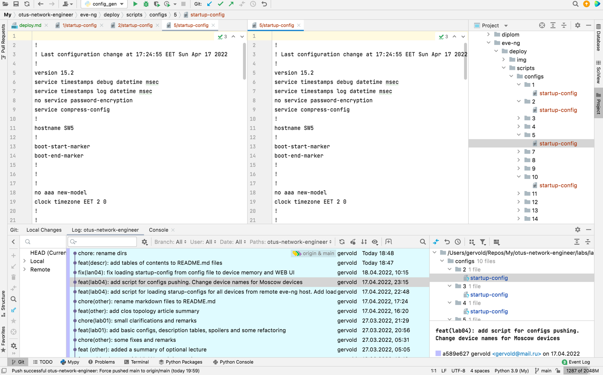

3. Разливка на eve-ng:  
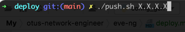
4. Коммит в git и публикация на github:
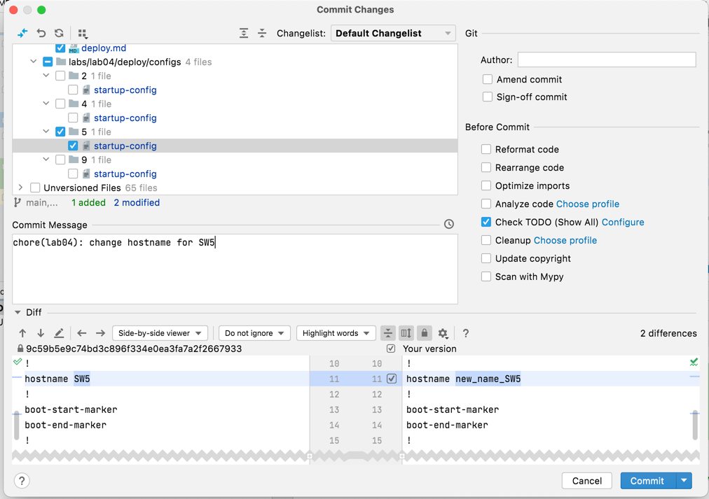
5. История изменения конфигураций 
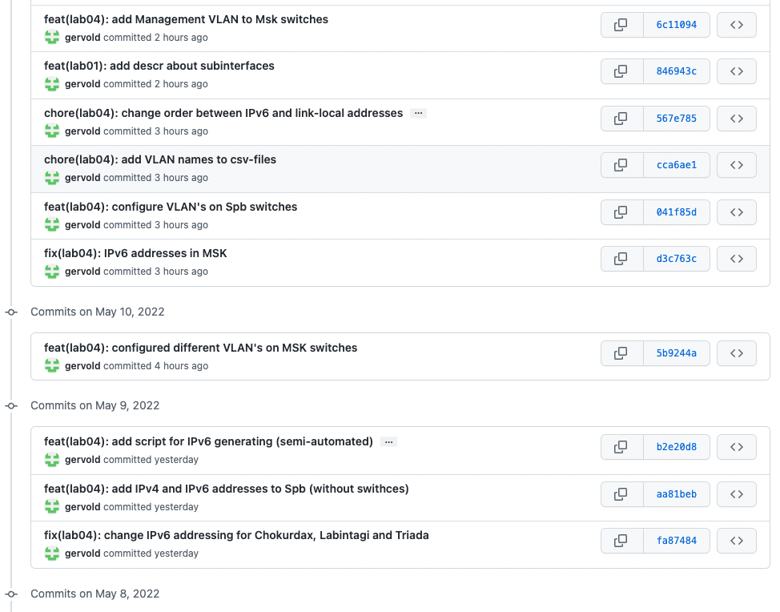
</details>

### План:

1. Добавить в лабу устройства и настроить их для загрузки со startup-config. Отобразить startup-config'и для всех устройств.
2. Написать скрипт для выгрузки конфигов – pull.sh
3. Написать скрипт для загрузки конфигов в EVE-NG – push.sh


Для начала можно посмотреть [видео про работу с конфигами](https://www.eve-ng.net/index.php/documentation/howtos-video/operate-with-eve-initial-configurations/)


### 1. Настройка устройств для загрузки со startup-configs и их экспорт   

Для понимания процесса полезно знать схему загрузки устройства:


Схема стырена [отсюда](https://xakep.ru/2021/08/09/eve-ng/)

Нам необходимо включить устройство, сохранить конфиг в NVRAM и экспортировать `running-config` в `stratup-config`.

Самый простой способ заэкспортировать конфиги – сделать это через WEB UI.     
Например, в меню _Nodes_

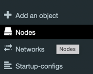

Для каждого устройства есть _Actions_ с возможностью экспорта конфига:  
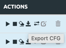

После экспорта конфиг начнет отображаться в _Startup-configs_:  
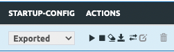


Если мы хотим сделать тоже самое для всех устройств, то можем нажать _Export all CFGs_.

Можно сразу выгрузить конфиги для всех устройств:

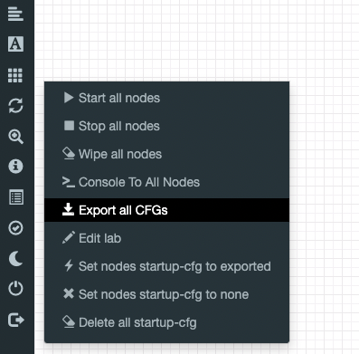

Заметим, что для того, чтобы все конфиги заэкспортились – устройства должны быть включены и с _**инициализированными**_ конфигами.

Для записи информации о VLAN с коммутаторов в 

<details>

<summary>Другие нюансы при экспорте</summary>

- коммутаторы – выгрузились сразу
- маршрутизаторы – для экспорта пришлось зайти на каждый маршрутизатор и подождать пока он инициализируется и заполнит конфиг (первое включение)  

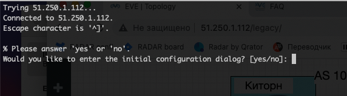

- VPC – не захотел экспортить пустые конфиги, пришлось ему задавать ip-шник и только потом сохранять  

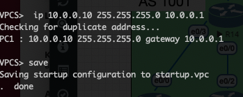

```
VPCS>  ip 10.0.0.10 255.255.255.0 10.0.0.1
Checking for duplicate address...
PC1 : 10.0.0.10 255.255.255.0 gateway 10.0.0.1

VPCS> save
Saving startup configuration to startup.vpc
.  done
```
</details>

Далее установим загрузку с конфигов:

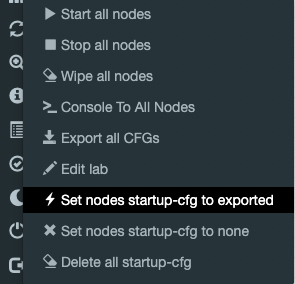

После этого появится значок молнии, который означает, что устройство будет загружено с этого конфига.


В итоге получается колбаса конфигов, с которых устройства будут управляться.
Для наших лаб – 31 штука.

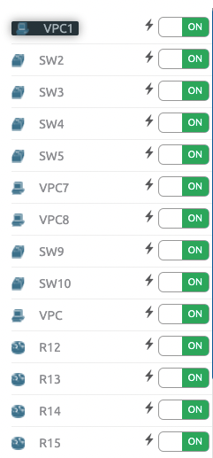

Теперь их можно выгружать к себе на локальный компьютер.

<details>

<summary><i>Полезные команды</i></summary>

##### Сохранение текущего конфига в NVRAM
Файл с NVRAM хранится в файловой системе. После перезапуска устройство будет пытаться грузиться с него.
Этот конфиг и будет потом отображаться в `running-config`.

Команды для записи конфигов в NVRAM для разных устройств:
```
wr – для Cisco  
commit – для Juniper  
save – для VPC  
```

#### Запись текущего running-config в startup-config:
```
Router#copy running-config startup-config
Destination filename [startup-config]?
Building configuration...
[OK]
```

</details>


### 2. Скрипт для выгрузки конфигов – pull.sh

Настройки лабы хранятся в `/opt/unetlab/labs/`, в том числе и конфиги устройств, но конфиги закодированы, 
поэтому далее будем обращаться во временную папку (`/opt/unetlab/tmp/`), в которой файлы хранятся plain-текстом.

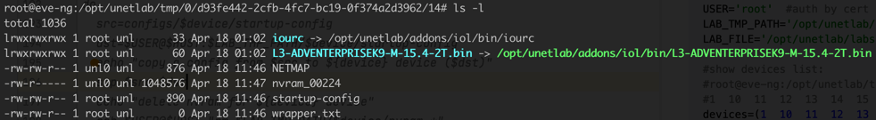

Далее напишем bash-скрипты для скачивания и разливки конфигов. 

pull.sh

```shell
#!/usr/bin/env bash

HOST=$1
USER='root'  #auth by cert
LAB_PATH='/opt/unetlab/tmp/0/d93fe442-2cfb-4fc7-bc19-0f374a2d3962'
LAB_FILE='/opt/unetlab/labs/lab04/ip.unl'

#root@eve-ng:/opt/unetlab/tmp/0/d93fe442-2cfb-4fc7-bc19-0f374a2d3962# ls
#1  10  11  12  13  14  15  16  17  18  19  2  20  21  22  23  24  25  26  27  28  29  3  30  31  32  4  5  7  8  9
devices=(1  10  11  12  13  14  15  16  17  18  19  2  20  21  22  23  24  25  26  27  28  29  3  30  31  32  4  5  7  8  9)

echo "export configs"
ssh $USER@$HOST "/opt/unetlab/wrappers/unl_wrapper -a export -F $LAB_FILE -T 0"

echo "wipe and start all devices. It's need for saving fresh startup-configs"
ssh $USER@$HOST "/opt/unetlab/wrappers/unl_wrapper -a wipe -F $LAB_FILE -T 0"
ssh $USER@$HOST "/opt/unetlab/wrappers/unl_wrapper -a start -F $LAB_FILE -T 0"

for device in ${devices[*]}
do
  src=$USER@$HOST:$LAB_PATH/$device/startup-config
  dst=configs/$device/.
  echo "copying a config for ${device} device from $src to "
  mkdir -p "configs/$device"
  scp $src $dst
done
```

Замечание: в `LAB_PATH` к лабе нужно будет указать Lab ID, который можно посмотреть в _Lab details_:

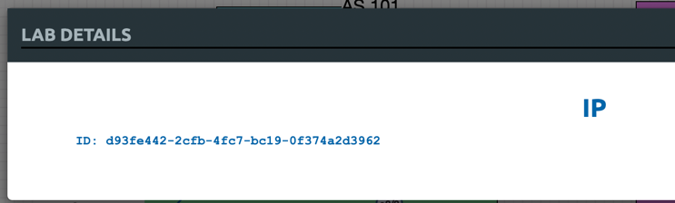

Так же можно посмотреть этот `ID` и в файловой системе, на хосте c EVE-NG

### 3. Скрипт для загрузки конфигов в EVE-NG – push.sh

Тут используется php-скрипт `unl_wrapper`, найденный в `/opt/unetlab/wrappers/`, который представляет собой CLI для программоного управления (функционал как у кнопочек WEB-формы).

Вообще говоря, с помощъю этого скрипта можно много, что еще поавтоматизировать :)

Далее вспоминаем схему загрузки (см. выше) и пишем скрипт опираясь на нее.

#### Алгоритм:
- выключаем все устройства
- для каждого: вайпим nvram и подменяем startup-config
- запускаем все устройства
  - устройство не находит файл с NVRAM
  - устройство находит загруженный нами startup-config
  - устройство с него загружается
- экспортим новые конфиги устройств для отображения в WEB и др.  

push.sh

```shell
#!/usr/bin/env bash

# Usage:
# .push.sh <host ip>

HOST=$1
USER='root'  #auth by cert
LAB_TMP_PATH='/opt/unetlab/tmp/0/d93fe442-2cfb-4fc7-bc19-0f374a2d3962'  # lab id (see "lab details" from left menu)
LAB_FILE='/opt/unetlab/labs/lab04/ip.unl'

#show devices list:
#root@eve-ng:/opt/unetlab/tmp/0/d93fe442-2cfb-4fc7-bc19-0f374a2d3962# ls
#1  10  11  12  13  14  15  16  17  18  19  2  20  21  22  23  24  25  26  27  28  29  3  30  31  32  4  5  7  8  9
devices=(1  10  11  12  13  14  15  16  17  18  19  2  20  21  22  23  24  25  26  27  28  29  3  30  31  32  4  5  7  8  9)

echo "stop all devices"
ssh $USER@$HOST "/opt/unetlab/wrappers/unl_wrapper -a stop -F $LAB_FILE -T 0"

for device in ${devices[*]}
do
  src=configs/$device/startup-config
  dst=$USER@$HOST:$LAB_TMP_PATH/$device/startup-config
  echo "copy a config from $src to ${device} device ($dst)"
  scp $src $dst
  echo "delete nvram for ${device} device"
  ssh $USER@$HOST "rm $LAB_TMP_PATH/$device/nvram_*"
  ssh $USER@$HOST "[[ -f $LAB_TMP_PATH/$device/startup.vpc ]] && cp $LAB_TMP_PATH/$device/startup-config $LAB_TMP_PATH/$device/startup.vpc"
done

echo "start all devices"
ssh $USER@$HOST "/opt/unetlab/wrappers/unl_wrapper -a start -F $LAB_FILE -T 0"

echo "export new configs"
ssh $USER@$HOST "/opt/unetlab/wrappers/unl_wrapper -a export -F $LAB_FILE -T 0"
```

Как-то так :)