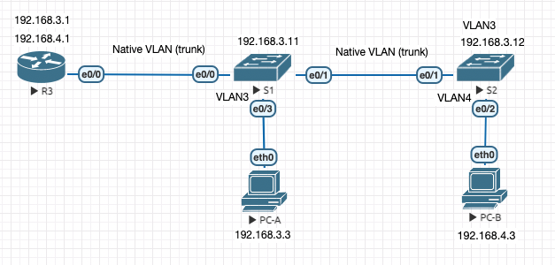
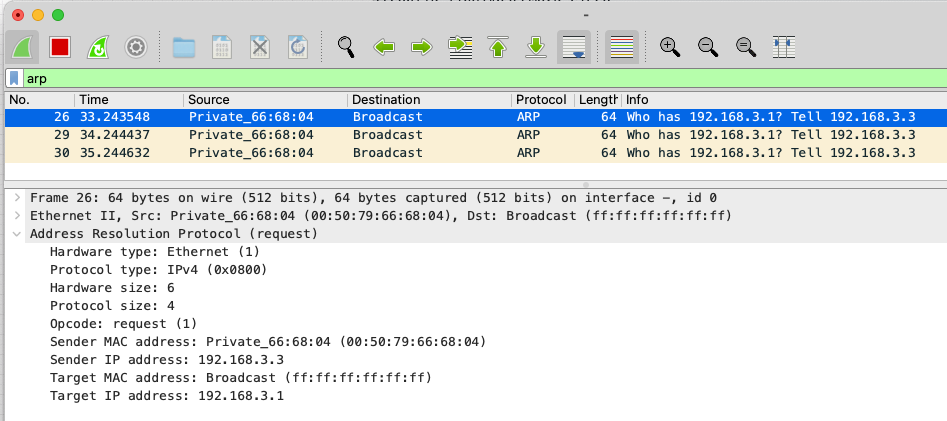

### Router-on-a-Stick Inter-VLAN Routing

### Цели
- Part 1: Build the Network and Configure Basic Device Settings
- Part 2: Create VLANs and Assign Switch Ports
- Part 3: Configure an 802.1Q Trunk between the Switches
- Part 4: Configure Inter-VLAN Routing on the Router
- Part 5: Verify Inter-VLAN Routing is working

### Реализовать схему



### Таблица адресов

|Device|Interface|IP Address|Subnet Mask|Default Gateway
|---|---|---|---|---|
S1|VLAN3|192.168.3.11|255.255.255.0|192.168.3.1
S2|VLAN3|192.168.3.12|255.255.255.0|192.168.3.1
R3|e0/0.3|192.168.3.1|255.255.255.0|N/A|
-|e0/0.4|192.168.4.1|255.255.255.0|N/A|
-|e0/0.8|N/A|N/A|N/A|
PC-A|NIC|192.168.3.3|255.255.255.0|192.168.3.1
PC-B|NIC|192.168.4.3|255.255.255.0|192.168.4.1

### VLAN Таблица

|VLAN|Название|Связанные интерфейсы|Описание
|---|---|---|---|
3|Managment|S1:VLAN3, S1:e0/3, S2:VLAN3|Управление свичами и роутерами по ssh/telnet
4|Operations|S2:VLAN4, S2:e0/2|Конечные пользователи
7|ParkingLot|S1:e0/2, S2:e0/0,e0/3|Парковка погашенных портов, во имя security
8|Native|N/A|Нетегированный трафик 802.1Q, by default это VLAN1


### Введение

**Коммутатор (Switch)** - используется для связи конечных **устройств** в локальной сети (LAN)<br> 
**Маршрутизатор (Router)** - используется для связи **подсетей**<br>

**VLAN** (Virtual Local Area Network) — группа устройств, имеющих возможность взаимодействовать между собой напрямую на канальном уровне, 
хотя физически при этом они могут быть подключены к разным сетевым коммутаторам. 

И наоборот, устройства, находящиеся в разных VLAN'ах, невидимы друг для друга на канальном уровне, даже если они подключены к одному коммутатору, и связь между этими устройствами возможна только на сетевом и более высоких уровнях.

Для маршрутизации **между различными VLAN** используют:

- **L3 коммутаторы** (через **SVI** (Switch VLAN Interface) шлюзы)
- схему **Router-on-a-Stick** (роутер на палочке)

## Router-on-a-Stick

#### Как работает "роутер на палочке"?

Роутер на палочке решает проблему доступа устройств из разных VLAN-ов друг к другу.

Чуть подробнее..<br>

Все датаграммы из одного VLAN пересылаются (broadcast, unicast) между портами устройств 
из этого VLAN, в том числе подключенных к разным свичам. У них нет шанса попасть на подсети из другово VLAN.
А нам нужно обращаться к устройствам за пределами нашей LAN.

Далее настроим маршрутизацию между различными VLAN, но выберем **свой путь**:

1) Воткнем коммутаторы и посмотрим на коммутацию, без настроек.
2) Добавим маршрутизатор, настроим связность между сетями через `default gateway`.
3) Посадим коммутатор S1 в VLAN, проверим, что связность провала.
4) Сделаем кривую схему маршрутизации, без trunk, поймем что-то.
5) Сделаем как надо.
6) Настройки по умолчанию (шаг №0).

### Подготовка стенда

#### Настройка PC-A

```
VPCS> ip 192.168.3.3 255.255.255.0 192.168.3.1
Checking for duplicate address...
PC1 : 192.168.3.3 255.255.255.0 gateway 192.168.3.1
```

<details>
<summary> Проверка: </summary>

```
VPCS> ping 192.168.3.3

192.168.3.3 icmp_seq=1 ttl=64 time=0.001 ms
192.168.3.3 icmp_seq=2 ttl=64 time=0.001 ms
192.168.3.3 icmp_seq=3 ttl=64 time=0.001 ms
192.168.3.3 icmp_seq=4 ttl=64 time=0.001 ms
192.168.3.3 icmp_seq=5 ttl=64 time=0.001 ms
```
Проверка параметров:
```
VPCS> show ip

NAME        : VPCS[1]
IP/MASK     : 192.168.3.3/24
GATEWAY     : 192.168.3.1
DNS         :
MAC         : 00:50:79:66:68:04
LPORT       : 20000
RHOST:PORT  : 127.0.0.1:30000
MTU         : 1500
```
</details>

Default gateway пока недоступен:
```
VPCS> ping 192.168.3.1
host (192.168.3.1) not reachable
```


#### Настройка PC-B

<details>
<summary> аналогично PC-A </summary>

```
VPCS> ip 192.168.4.3 255.255.255.0 192.168.4.1
Checking for duplicate address...
PC1 : 192.168.4.3 255.255.255.0 gateway 192.168.4.1

VPCS> ping 192.168.4.3

192.168.4.3 icmp_seq=1 ttl=64 time=0.001 ms
192.168.4.3 icmp_seq=2 ttl=64 time=0.001 ms
192.168.4.3 icmp_seq=3 ttl=64 time=0.001 ms
192.168.4.3 icmp_seq=4 ttl=64 time=0.001 ms
192.168.4.3 icmp_seq=5 ttl=64 time=0.001 ms
```

</details>

### 1. Проверка "свежевоткнутых" коммутаторов

По умолчанию на коммутаторах S1 и S2 интерфейсы – подняты. 
Тоесть трафик пойдет через них сразу, без дополнительной настройки. <br>


Давайте сделаем ping с PC-A на PC-B и посмотрим, что датаграммы идут.

PC-A:
```
VPCS> ping 192.168.4.3
host (192.168.3.1) not reachable
```

можно видеть, что на интерфейс PC-B `eth0`, через через S1 и S2, дошли ARP-бродкасты с просьбой вернуть `gateway`:<br>


Пакеты долетели без всяких IP-шников и настроек комммутаторов.

Заметим, что `not reachable` выдается в случае, если недоступен `default gateway`.<br>
Далее попробуем настроить на маршрутизаторе `default gateway`... каким-нибудь топорным способом.

### 2. Проверка коммутации между разными сетями (без настройки VLAN-ов и "роутера на палочке")

Начинаем велосипедить. Потому что можем :) <br>
Временно сделаем схему с двумя кабелями: <br><br>


Заметим, что, в отличии от коммутаторов, интерфейсы на роутерах выключены по умолчанию:
```
Router# show interfaces
Ethernet0/0 is administratively down, line protocol is down
  Hardware is AmdP2, address is aabb.cc00.3000 (bia aabb.cc00.3000)
  Internet address will be negotiated using DHCP
  ***
```

Добавим на интерфесы R3 две подсети:
```
Router#configure terminal

Router(config)#int Ethernet 0/0
Router(config-if)#ip address 192.168.3.1 255.255.255.0
Router(config-if)#no shutdown
Router(config-if)#end

Router(config)#int Ethernet 0/1
Router(config-if)#ip address 192.168.4.1 255.255.255.0
Router(config-if)#no shutdown
Router(config-if)#end
```
<details>
<summary> Проверка доступности <b>default gateway</b> и компа <b>PC-B</b>: </summary>

```
VPCS> show ip all

NAME   IP/MASK              GATEWAY           MAC                DNS
VPCS1  192.168.3.3/24       192.168.3.1       00:50:79:66:68:04

VPCS> ping 192.168.3.1

84 bytes from 192.168.3.1 icmp_seq=1 ttl=255 time=0.221 ms
84 bytes from 192.168.3.1 icmp_seq=2 ttl=255 time=0.423 ms
84 bytes from 192.168.3.1 icmp_seq=3 ttl=255 time=0.415 ms
84 bytes from 192.168.3.1 icmp_seq=4 ttl=255 time=0.452 ms
84 bytes from 192.168.3.1 icmp_seq=5 ttl=255 time=0.412 ms

VPCS> ping 192.168.4.3

84 bytes from 192.168.4.3 icmp_seq=1 ttl=63 time=1.773 ms
84 bytes from 192.168.4.3 icmp_seq=2 ttl=63 time=0.654 ms
84 bytes from 192.168.4.3 icmp_seq=3 ttl=63 time=0.610 ms
84 bytes from 192.168.4.3 icmp_seq=4 ttl=63 time=0.585 ms
84 bytes from 192.168.4.3 icmp_seq=5 ttl=63 time=1.144 ms
```
</details>

Заметим, что если недоступный хост в пределах LAN, то мы получим `not reachable`.<br>
Попробуем пингануть несуществующий хост **из нашей подсети**:<br>
```
VPCS> show ip all

NAME   IP/MASK              GATEWAY           MAC                DNS
VPCS1  192.168.3.3/24       192.168.3.1       00:50:79:66:68:04

VPCS> ping 192.168.3.99

host (192.168.3.99) not reachable
```

Если же недоступный хост находится в другом LAN, то мы получим `timeout`.<br>
Попробуем пингануть несуществующий хост **из соседней подсети**:
```
VPCS> show ip all

NAME   IP/MASK              GATEWAY           MAC                DNS
VPCS1  192.168.3.3/24       192.168.3.1       00:50:79:66:68:04

VPCS> ping 192.168.4.99

192.168.4.99 icmp_seq=1 timeout
192.168.4.99 icmp_seq=2 timeout
192.168.4.99 icmp_seq=3 timeout
192.168.4.99 icmp_seq=4 timeout
192.168.4.99 icmp_seq=5 timeout
```

### 3. Потрогаем за коммутатор. Первый VLAN

Первые настройки коммутатора.

Поместим PC-A в отдельный VLAN, проверим, что хост попал в изоляцию.  


**Настраиваем S1:**

По умолчанию на коммутаторе следующие предопределенные VLAN-ы:
```
Switch#show vlan brief

VLAN Name                             Status    Ports
---- -------------------------------- --------- -------------------------------
1    default                          active    Et0/0, Et0/1, Et0/2, Et0/3
1002 fddi-default                     act/unsup
1003 token-ring-default               act/unsup
1004 fddinet-default                  act/unsup
1005 trnet-default                    act/unsup
```

Добавим, для теста, Management VLAN:
```
Switch#configure terminal
Switch(config)#vlan 3
Switch(config-vlan)#name Management
Switch(config-vlan)#end
```
Командой `switchport` привяжем порт коммутатора (интерфейс) к VLAN:
```
Switch#configure terminal
Switch(config)#interface Ethernet 0/3
Switch(config-if)#switchport mode access
Switch(config-if)#switchport access vlan 3
Switch(config-if)#end
Switch#
```

<details>
<summary> Проверка, что VLAN создался и порт добавился </summary>

```
Switch#show vlan brief

VLAN Name                             Status    Ports
---- -------------------------------- --------- -------------------------------
1    default                          active    Et0/0, Et0/1, Et0/2
3    Management                       active    Et0/3
1002 fddi-default                     act/unsup
1003 token-ring-default               act/unsup
1004 fddinet-default                  act/unsup
1005 trnet-default                    act/unsup
```

</details>

Теперь всё, что висит на порту e0/3 будет попадать в VLAN3 и не выходить за его пределы.

Проверим, что с PC-A не можем достучаться до gateway (R3):
```
VPCS> show ip all

NAME   IP/MASK              GATEWAY           MAC                DNS
VPCS1  192.168.3.3/24       192.168.3.1       00:50:79:66:68:04

VPCS> ping 192.168.3.1

host (192.168.3.1) not reachable
```

Командой `no switchport` вернем порт в VLAN1 (default) и убедимся, что L2-связность восстановилась:
```
Switch#configure terminal
Switch(config)#interface Ethernet 0/3
Switch(config-if)#no switchport access vlan 3
Switch(config-if)#end
```
```
VPCS> show ip all
NAME   IP/MASK              GATEWAY           MAC                DNS
VPCS1  192.168.3.3/24       192.168.3.1       00:50:79:66:68:04

VPCS> ping 192.168.3.1
84 bytes from 192.168.3.1 icmp_seq=1 ttl=255 time=0.227 ms
84 bytes from 192.168.3.1 icmp_seq=2 ttl=255 time=0.412 ms
```


### 4. Настройка маршрутизации между VLAN (без trunk)

Добавим VLAN3 и VLAN4.<br>
Для настроики маршрутизации между VLAN3 и VALN4 через R3 
организуем L2-связность с R3:
- поменяем коммутатор S1 на S4, чтобы увеличить число портов;
- протянем провода.

Дополнительно усложним схему – добавим к коммутатору S2 хост **PC-C** из VLAN3. Мы это делаем, чтобы на S2 были хосты с разных VLAN-ов.


С увеличением числа портов становится удобно использовать диапозоны портов `interface range` для объединения их в VLAN-ы<br>
**S4:**
```
Switch#configure terminal

Switch(config)#vlan 3
Switch(config-vlan)#name Management
Switch(config-vlan)#exit
Switch(config)#vlan 4
Switch(config-vlan)#name Operations
Switch(config-vlan)#exit

Switch(config)#interface range Eth0/1-3
Switch(config-if-range)#switchport mode access
Switch(config-if-range)#switchport access vlan 3
Switch(config-if-range)#exit
Switch(config)#interface range Eth0/0, Eth1/0
Switch(config-if-range)#switchport mode access
Switch(config-if-range)#switchport access vlan 4
Switch(config-if-range)#exit
Switch(config)#exit

Switch#show vlan brief

VLAN Name                             Status    Ports
---- -------------------------------- --------- -------------------------------
1    default                          active    Et1/1, Et1/2, Et1/3
3    Management                       active    Et0/1, Et0/2, Et0/3
4    Operations                       active    Et0/0, Et1/0
1002 fddi-default                     act/unsup
1003 token-ring-default               act/unsup
1004 fddinet-default                  act/unsup
1005 trnet-default                    act/unsup
```
S2 – аналогично. 

<details>

<summary>На R3 проверяем привязку IP к интерфейсам на соответствие схеме:</summary>

```
Router#show ip interface brief
Interface                  IP-Address      OK? Method Status                Protocol
Ethernet0/0                192.168.4.1     YES manual up                    up
Ethernet0/1                192.168.3.1     YES manual up                    up
Ethernet0/2                unassigned      YES unset  administratively down down
Ethernet0/3                unassigned      YES unset  administratively down down
```
</details>

Тест с PC-C:
```
VPCS> ip 192.168.3.4 255.255.255.0 192.168.3.1
Checking for duplicate address...
PC1 : 192.168.3.4 255.255.255.0 gateway 192.168.3.1

VPCS> ping 192.168.4.3

84 bytes from 192.168.4.3 icmp_seq=1 ttl=63 time=1.613 ms
84 bytes from 192.168.4.3 icmp_seq=2 ttl=63 time=0.687 ms
```
С отстальных PC пингуется аналогично.

Видно, что данный подход плохо масштабируется:<br>
для включения каждого нового VLAN требуется выделять порты/обновлять оборудование и прокладывать L2-каналы связности до маршрутизатора.


### 5. Настройка маршрутизации с использованием trunk

Для масштабирования и упрощения схемы из предыдущего подхода воспользуемся агрегацией нескольких VLAN внутрь одного.
Для этого создадим **VLAN-магистраль** или транк (**trunk**).

В случае транка **все VLAN будут проходить через один порт**.<br>
_Заметим, что по умолчанию VLAN1 (default) уже является транком._

Далее для организации транков будем использовать подинтерфейсы.


**Подынтерфейсы** — это программные виртуальные интерфейсы, назначаемые физическим интерфейсам.
Нужны для экономии реальных интерфейсов в случае увеличения числа VLAN-ов.
Каждому подынтерфейсу назначается IP-адрес в соответствии с его подсетью или сетью VLAN. 
Кроме того, на подынтерфейсах настраивается, метку какой сети VLAN они будут присваивать кадрам. 
Таким образом, маршрутизатор может отделять трафик из каждого подчиненного интерфейса по мере его прохождения по магистральному каналу обратно на коммутатор.

Тут можно почитать что-то про [DTP](https://ru.wikipedia.org/wiki/DTP), [VTP](https://ru.wikipedia.org/wiki/VTP_(%D0%BF%D1%80%D0%BE%D1%82%D0%BE%D0%BA%D0%BE%D0%BB)).

Соберем заявленную схему:


Объединим подсети на R3:
```
Router#configure terminal
Router(config)#interface Ethernet0/0.3
Router(config-subif)#encapsulation dot1Q 3
Router(config-subif)#ip address 192.168.3.1 255.255.255.0
Router(config-subif)#no shutdown
Router(config-subif)#exit

Router(config)#interface Ethernet0/0.4
Router(config-subif)#encapsulation dot1Q 4
Router(config-subif)#ip address 192.168.4.1 255.255.255.0
Router(config-subif)#no shutdown
Router(config-subif)#exit

Router(config)#exit
```
Поднимаем настроенный интерфейс:
```
Router#configure terminal
Router(config)#interface Ethernet 0/0
Router(config-if)#no shutdown
Router(config-if)#end
```

На свиче в транке разрешаем только используемые сети 3,4,8.<br>
Parking (vlan 7) должна быть зафильтрована (не разрешена).

S1:
```
Switch#configure terminal
Switch(config)#hostname S1
S1(config)#vlan 3
S1(config-vlan)#name Management
S1(config-vlan)#vlan 4
S1(config-vlan)#name Operations
S1(config-vlan)#vlan 7
S1(config-vlan)#name ParkingLot
S1(config-vlan)#vlan 8
S1(config-vlan)#name Native

S1(config)#interface range ethernet 0/0, ethernet 0/1
S1(config-if-range)#switchport trunk encapsulation dot1q
S1(config-if-range)#switchport mode trunk
S1(config-if-range)#switchport trunk native vlan 8
S1(config-if-range)#switchport trunk allowed vlan 3,4,8
S1(config-if-range)#end

S1(config-if)#interface ethernet 0/2
S1(config-if)#switchport mode access
S1(config-if)#switchport access vlan 7

S1(config-if)#interface ethernet 0/3
S1(config-if)#switchport mode access
S1(config-if)#switchport access vlan 3
```

```
S1#show vlan brief

VLAN Name                             Status    Ports
---- -------------------------------- --------- -------------------------------
1    default                          active
3    Management                       active    Et0/3
4    Operations                       active
7    ParkingLot                       active    Et0/2
8    Native                           active
1002 fddi-default                     act/unsup
1003 token-ring-default               act/unsup
1004 fddinet-default                  act/unsup
1005 trnet-default                    act/unsup
```

и добавим IP-адрес на коммутатор:

S1:
```
S1#configure terminal
S1(config)#interface vlan 3
S1(config-if)#ip address 192.168.3.11 255.255.255.0
S1(config-if)#no shutdown
*Mar 13 13:40:42.838: %LINK-3-UPDOWN: Interface Vlan3, changed state to up
*Mar 13 13:40:43.842: %LINEPROTO-5-UPDOWN: Line protocol on Interface Vlan3, changed state to up
*Mar 13 13:40:46.565: %SYS-5-CONFIG_I: Configured from console by console
S1(config-if)#end
```

```
S1#show ip interface brief
Interface              IP-Address      OK? Method Status                Protocol
Ethernet0/0            unassigned      YES unset  up                    up
Ethernet0/1            unassigned      YES unset  up                    up
Ethernet0/2            unassigned      YES unset  up                    up
Ethernet0/3            unassigned      YES unset  up                    up
Vlan3                  192.168.3.11    YES manual up                    up
```

<details>
<summary> Аналогично делаем на S2 </summary>

```
Switch#configure terminal
Switch(config)#hostname S2

S2(config)#vlan 3
S2(config-vlan)#name Management
S2(config-vlan)#vlan 4
S2(config-vlan)#name Operations
S2(config-vlan)#vlan 7
S2(config-vlan)#name ParkingLot
S2(config-vlan)#vlan 8
S2(config-vlan)#name Native
S2(config-vlan)#exit

S2(config)#interface Ethernet 0/1
S2(config-if)#switchport trunk encapsulation dot1q
S2(config-if)#switchport mode trunk
S2(config-if)#switchport trunk native vlan 8
S2(config-if)#switchport trunk allowed vlan 3,4,8
S2(config-if)#exit

S2(config-if)#int Ethernet 0/2
S2(config-if)#switchport mode access
S2(config-if)#switchport access vlan 4
S2(config-if)#exit

S2(config)#interface range ethernet 0/0, ethernet 0/3
S2(config-if-range)#switchport mode access
S2(config-if-range)#switchport access vlan 7
S2(config-if-range)#end
```

```
S2#show vlan brief

VLAN Name                             Status    Ports
---- -------------------------------- --------- -------------------------------
1    default                          active
3    Management                       active
4    Operations                       active    Et0/2
7    ParkingLot                       active    Et0/0, Et0/3
8    Native                           active
1002 fddi-default                     act/unsup
1003 token-ring-default               act/unsup
1004 fddinet-default                  act/unsup
1005 trnet-default                    act/unsup
```

</details>

Проверка с PC-A:
```
VPCS> show ip all

NAME   IP/MASK              GATEWAY           MAC                DNS
VPCS1  192.168.3.3/24       192.168.3.1       00:50:79:66:68:04

VPCS> ping 192.168.4.1

84 bytes from 192.168.4.1 icmp_seq=1 ttl=255 time=0.443 ms
84 bytes from 192.168.4.1 icmp_seq=2 ttl=255 time=0.462 ms
^C
VPCS> ping 192.168.4.3

84 bytes from 192.168.4.3 icmp_seq=1 ttl=63 time=1.726 ms
84 bytes from 192.168.4.3 icmp_seq=2 ttl=63 time=0.636 ms
^C
VPCS> ping 192.168.3.1

84 bytes from 192.168.3.1 icmp_seq=1 ttl=255 time=0.491 ms
84 bytes from 192.168.3.1 icmp_seq=2 ttl=255 time=0.419 ms
```

Проверка с PC-B:
```
VPCS> show ip all

NAME   IP/MASK              GATEWAY           MAC                DNS
VPCS1  192.168.4.3/24       192.168.4.1       00:50:79:66:68:05

VPCS> ping 192.168.3.3

84 bytes from 192.168.3.3 icmp_seq=1 ttl=63 time=1.646 ms
84 bytes from 192.168.3.3 icmp_seq=2 ttl=63 time=0.594 ms
84 bytes from 192.168.3.3 icmp_seq=3 ttl=63 time=0.563 ms
^C
```

### 6. Базовые настройки

В самом начале должны были быть произведены базовые настройки оборудования <br> 
Это шаг 0.

Для маршрутизатора:
```
Router>enable
Router#configure terminal
Enter configuration commands, one per line.  End with CNTL/Z.
Router(config)#hostname R3
R3(config)#no ip domain-lookup
R3(config)#enable secret class
R3(config)#line console 0
R3(config-line)#password cisco
R3(config-line)#login
R3(config-line)#line vty 0 4
R3(config-line)#password cisco
R3(config-line)#login
R3(config-line)#service password-encryption
R3(config)#banner motd ^
Enter TEXT message.  End with the character '^'.
##########################################
#                                        #
#        Authorised Access Only          #
#                                        #
##########################################

^
R3(config)#end
R3#
*Mar 27 17:06:22.033: %SYS-5-CONFIG_I: Configured from console by console
```

Для коммутатора:
```
Switch>enable
Switch#configure terminal
Switch(config)#hostname S1
S1(config)#no ip domain-lookup
S1(config)#enable secret class
S1(config)#line console 0
S1(config-line)#password cisco
S1(config-line)#login
S1(config-line)#line vty 0 4
S1(config-line)#password cisco
S1(config-line)#login
S1(config-line)#service password-encryption
S1(config)#banner motd ^
Enter TEXT message.  End with the character '^'.
##########################################
#                                        #
#        Authorised Access Only          #
#                                        #
##########################################
^
S1(config)#end
```
После введенных настроек, **при подключении**, нас будет встречать приветствие и
<details>
<summary>требование ввести пароль</summary>

```
##########################################
#                                        #
#        Authorised Access Only          #
#                                        #
##########################################


User Access Verification

Password:
```
</details>

<details>
<summary>и при входе <b>в защищенный режим</b> – тоже попросят пароль</summary>

```
R1>enable
Password:
```
</details>