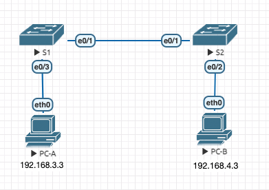
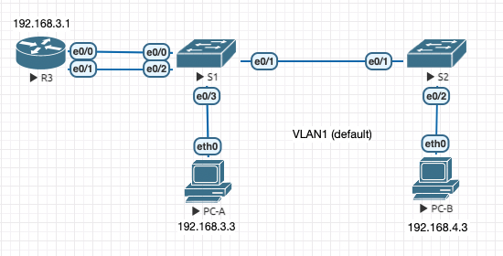
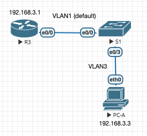
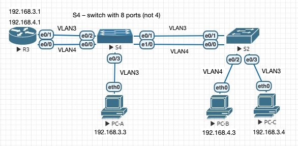
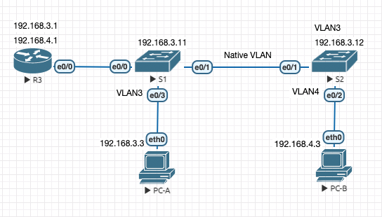

### Configure Router-on-a-Stick Inter-VLAN Routing


### Addressing Table


### VLAN Table


### Objectives
- Part 1: Build the Network and Configure Basic Device Settings
- Part 2: Create VLANs and Assign Switch Ports
- Part 3: Configure an 802.1Q Trunk between the Switches
- Part 4: Configure Inter-VLAN Routing on the Router
- Part 5: Verify Inter-VLAN Routing is working


#### Введение

**Коммутатор (Switch)** - используется для связи конечных **устройств** в локальной сети (LAN)<br> 
**Маршрутизатор (Router)** - используется для связи **подсетей**<br>

**VLAN** (Virtual Local Area Network) — группа устройств, имеющих возможность взаимодействовать между собой напрямую на канальном уровне, 
хотя физически при этом они могут быть подключены к разным сетевым коммутаторам. 

И наоборот, устройства, находящиеся в разных VLAN'ах, невидимы друг для друга на канальном уровне, даже если они подключены к одному коммутатору, и связь между этими устройствами возможна только на сетевом и более высоких уровнях.

Для маршрутизации **между различными VLAN** используют:

- **L3 коммутаторы** (через **SVI** (Switch VLAN Interface) шлюзы)
- схему **Router-on-a-Stick** (роутер на палочке)

#### Router-on-a-Stick

Как работает роутер "на палочке"?

Проблема<br>

Из VLAN1 нет связи с устройствами VLAN2.

Что это значит?<br>

Все датаграммы из VLAN1 пересылаются (broadcast, unicast) между портами устройств 
из VLAN1, пусть и подключенных к разным свичам. У них нет шанса попасть на подсети из другово VLAN2.
А нам иногда нужно обращаться к устройствам за пределами нашей LAN.

#### Задача <br>

Настроить таблицу маршрутизации между различными VLAN.

#### Основные команды:
`show vlan` - <br>
`interface vlan 1` - <br>
`interface Ethernet0/0` - <br>
`switchport mode access` - <br>

#### Настройка PC-A
```
VPCS> ip 192.168.3.3 255.255.255.0 192.168.3.1
Checking for duplicate address...
PC1 : 192.168.3.3 255.255.255.0 gateway 192.168.3.1
```
Проверка:
```
VPCS> ping 192.168.3.3

192.168.3.3 icmp_seq=1 ttl=64 time=0.001 ms
192.168.3.3 icmp_seq=2 ttl=64 time=0.001 ms
192.168.3.3 icmp_seq=3 ttl=64 time=0.001 ms
192.168.3.3 icmp_seq=4 ttl=64 time=0.001 ms
192.168.3.3 icmp_seq=5 ttl=64 time=0.001 ms
```
Проверка параметров:
```
VPCS> show ip

NAME        : VPCS[1]
IP/MASK     : 192.168.3.3/24
GATEWAY     : 192.168.3.1
DNS         :
MAC         : 00:50:79:66:68:04
LPORT       : 20000
RHOST:PORT  : 127.0.0.1:30000
MTU         : 1500
```

Default gateway пока недоступен:
```
VPCS> ping 192.168.3.1
host (192.168.3.1) not reachable
```

#### Настройка PC-B

Аналогично:
```
VPCS> ip 192.168.4.3 255.255.255.0 192.168.4.1
Checking for duplicate address...
PC1 : 192.168.4.3 255.255.255.0 gateway 192.168.4.1

VPCS> ping 192.168.4.3

192.168.4.3 icmp_seq=1 ttl=64 time=0.001 ms
192.168.4.3 icmp_seq=2 ttl=64 time=0.001 ms
192.168.4.3 icmp_seq=3 ttl=64 time=0.001 ms
192.168.4.3 icmp_seq=4 ttl=64 time=0.001 ms
192.168.4.3 icmp_seq=5 ttl=64 time=0.001 ms
```

#### Проверка "свежевоткнутых" коммутаторов

По умолчанию на коммутаторах S1 и S2 интерфейсы – подняты. 
Тоесть трафик пойдет через них сразу, без дополнительной настройки. <br>



Давайте сделаем ping с PC-A на PC-B и посмотрим, что датаграммы идут.

PC-A:
```
VPCS> ping 192.168.4.3
host (192.168.3.1) not reachable
```

можно видеть, что на интерфейс PC-B `eth0`, через через S1 и S2, дошли ARP-бродкасты с просьбой вернуть gateway:


Пакеты долетели без всяких IP-шников и настроек комммутаторов.

Заметим, что `not reachable` выдается в случае, если недоступен `default gateway`.<br>
Далее попробуем настроить на маршрутизаторе `default gateway`... каким-нибудь топорным способом.

#### Проверка коммутации между разными сетями (без настройки VLAN-ов и "роутера на палочке")

Временно сделаем тупую схему с двумя кабелями:


Заметим, что, в отличии от коммутаторов, интерфейсы на роутерах выключены по умолчанию:
```
Router# show interfaces
Ethernet0/0 is administratively down, line protocol is down
  Hardware is AmdP2, address is aabb.cc00.3000 (bia aabb.cc00.3000)
  Internet address will be negotiated using DHCP
  ***
```

Добавим на один интерфейс две подсети:
```
Router#configure terminal

Router(config)#int Ethernet 0/0
Router(config-if)#ip address 192.168.3.1 255.255.255.0
Router(config-if)#no shutdown
Router(config-if)#end

Router(config)#int Ethernet 0/1
Router(config-if)#ip address 192.168.4.1 255.255.255.0
Router(config-if)#no shutdown
Router(config-if)#end
```

Проверка доступности `default gateway` и компа PC-B:
```
VPCS> show ip all

NAME   IP/MASK              GATEWAY           MAC                DNS
VPCS1  192.168.3.3/24       192.168.3.1       00:50:79:66:68:04

VPCS> ping 192.168.3.1

84 bytes from 192.168.3.1 icmp_seq=1 ttl=255 time=0.221 ms
84 bytes from 192.168.3.1 icmp_seq=2 ttl=255 time=0.423 ms
84 bytes from 192.168.3.1 icmp_seq=3 ttl=255 time=0.415 ms
84 bytes from 192.168.3.1 icmp_seq=4 ttl=255 time=0.452 ms
84 bytes from 192.168.3.1 icmp_seq=5 ttl=255 time=0.412 ms

VPCS> ping 192.168.4.3

84 bytes from 192.168.4.3 icmp_seq=1 ttl=63 time=1.773 ms
84 bytes from 192.168.4.3 icmp_seq=2 ttl=63 time=0.654 ms
84 bytes from 192.168.4.3 icmp_seq=3 ttl=63 time=0.610 ms
84 bytes from 192.168.4.3 icmp_seq=4 ttl=63 time=0.585 ms
84 bytes from 192.168.4.3 icmp_seq=5 ttl=63 time=1.144 ms
```

Заметим, что если недоступный хост в пределах LAN, то мы получим `not reachable`:

```
VPCS> show ip all

NAME   IP/MASK              GATEWAY           MAC                DNS
VPCS1  192.168.3.3/24       192.168.3.1       00:50:79:66:68:04

VPCS> ping 192.168.3.99

host (192.168.3.99) not reachable
```

Если же недоступный хост находится в другом LAN, то мы получим 'timeout' 
```
VPCS> show ip all

NAME   IP/MASK              GATEWAY           MAC                DNS
VPCS1  192.168.3.3/24       192.168.3.1       00:50:79:66:68:04

VPCS> ping 192.168.4.99

192.168.4.99 icmp_seq=1 timeout
192.168.4.99 icmp_seq=2 timeout
192.168.4.99 icmp_seq=3 timeout
192.168.4.99 icmp_seq=4 timeout
192.168.4.99 icmp_seq=5 timeout
```

#### Потрогаем коммутатор. Первая настройка VLAN

Руки лезут на коммутатор...

Поместим PC-A в отдельный VLAN, проверим, что хост попал в "изоляцию".  



**Настраиваем S1:**

По умолчанию на коммутаторе следующие предопределенные VLAN-ы:
```
Switch#show vlan brief

VLAN Name                             Status    Ports
---- -------------------------------- --------- -------------------------------
1    default                          active    Et0/0, Et0/1, Et0/2, Et0/3
1002 fddi-default                     act/unsup
1003 token-ring-default               act/unsup
1004 fddinet-default                  act/unsup
1005 trnet-default                    act/unsup
```

Добавим Management VLAN:
```
Switch#configure terminal
Switch(config)#vlan 3
Switch(config-vlan)#name Management
Switch(config-vlan)#end
```
Привяжем порт (интерфейс) к VLAN:
```
Switch#configure terminal
Switch(config)#interface Ethernet 0/3
Switch(config-if)#switchport mode access
Switch(config-if)#switchport access vlan 3
Switch(config-if)#end
Switch#
```
Проверка, что VLAN создался и порт добавился:
```
Switch#show vlan brief

VLAN Name                             Status    Ports
---- -------------------------------- --------- -------------------------------
1    default                          active    Et0/0, Et0/1, Et0/2
3    Management                       active    Et0/3
1002 fddi-default                     act/unsup
1003 token-ring-default               act/unsup
1004 fddinet-default                  act/unsup
1005 trnet-default                    act/unsup
```

Теперь всё, что висит на порту e0/3 будет попадать в VLAN3 и не выходить за его пределы.

Проверим, что с PC-A не можем достучаться до gateway (R3):
```
VPCS> show ip all

NAME   IP/MASK              GATEWAY           MAC                DNS
VPCS1  192.168.3.3/24       192.168.3.1       00:50:79:66:68:04

VPCS> ping 192.168.3.1

host (192.168.3.1) not reachable
```

Командой `no switchport` вернем порт в VLAN1 (default) и убедимся, что L2-связность восстановилась:
```
Switch#configure terminal
Switch(config)#interface Ethernet 0/3
Switch(config-if)#no switchport access vlan 3
Switch(config-if)#end
```
```
VPCS> show ip all
NAME   IP/MASK              GATEWAY           MAC                DNS
VPCS1  192.168.3.3/24       192.168.3.1       00:50:79:66:68:04

VPCS> ping 192.168.3.1
84 bytes from 192.168.3.1 icmp_seq=1 ttl=255 time=0.227 ms
84 bytes from 192.168.3.1 icmp_seq=2 ttl=255 time=0.412 ms
```


#### Настройка маршрутизации между VLAN (без trunk)

Усложним схему, добавив к коммутатору S2 хост PC-C из VLAN3, чтобы на S2 были хосты с разных VLAN-ов.
Для настроики маршрутизации между VLAN3 и VALN4 через R3 
организуем L2-связность с R3:
- добавим провода;
- выделим порты, для этого придется поменять коммутатор S1, на S4 – коммутатор с большим числом портов.



С увеличением числа портов становится удобно использовать диапозоны портов `interface range` для объединения их в VLAN-ы<br>
**S4:**
```
Switch#configure terminal

Switch(config)#vlan 3
Switch(config-vlan)#name Management
Switch(config-vlan)#exit
Switch(config)#vlan 4
Switch(config-vlan)#name Operations
Switch(config-vlan)#exit

Switch(config)#interface range Eth0/1-3
Switch(config-if-range)#switchport mode access
Switch(config-if-range)#switchport access vlan 3
Switch(config-if-range)#exit
Switch(config)#interface range Eth0/0, Eth1/0
Switch(config-if-range)#switchport mode access
Switch(config-if-range)#switchport access vlan 4
Switch(config-if-range)#exit
Switch(config)#exit

Switch#show vlan brief

VLAN Name                             Status    Ports
---- -------------------------------- --------- -------------------------------
1    default                          active    Et1/1, Et1/2, Et1/3
3    Management                       active    Et0/1, Et0/2, Et0/3
4    Operations                       active    Et0/0, Et1/0
1002 fddi-default                     act/unsup
1003 token-ring-default               act/unsup
1004 fddinet-default                  act/unsup
1005 trnet-default                    act/unsup
```
S2 – аналогично. 

На R3 проверяем привязку IP к портам на соответствие схеме:
```
Router#show ip interface brief
Interface                  IP-Address      OK? Method Status                Protocol
Ethernet0/0                192.168.4.1     YES manual up                    up
Ethernet0/1                192.168.3.1     YES manual up                    up
Ethernet0/2                unassigned      YES unset  administratively down down
Ethernet0/3                unassigned      YES unset  administratively down down
```

Тест с PC-C:
```
VPCS> ip 192.168.3.4 255.255.255.0 192.168.3.1
Checking for duplicate address...
PC1 : 192.168.3.4 255.255.255.0 gateway 192.168.3.1

VPCS> ping 192.168.4.3

84 bytes from 192.168.4.3 icmp_seq=1 ttl=63 time=1.613 ms
84 bytes from 192.168.4.3 icmp_seq=2 ttl=63 time=0.687 ms
```
С отстальных PC пингуется аналогично.

Видно, что данный подход плохо масштабируется:<br>
для включения каждого нового VLAN требуется выделять порты/обновлять оборудование и прокладывать L2-каналы связности до маршрутизатора.


#### Настройка маршрутизации с использованием trunk

Для масштабирования и упрощения схемы из предыдущего подхода воспользуемся агрегацией нескольких VLAN внутрь одного.
Для этого создадим VLAN-магистраль или транк (trunk).

В случае транка несколько(все) VLAN будут проходить через один порт.
VLAN1 (default) является транком.

Соберем заявленную схему:

|VLAN|Название|Связанные интерфейсы|Описание
|---|---|---|---|
3|Managment|.|Управление свичами и роутерами по ssh/telnet
4|Operations|.|Конечные пользователи
7|ParkingLot|.|Склад для погашенных портов, всё ради безопасности
8|Native|.|Нетегированный трафик 802.1Q, by default это VLAN1




Объединим подсети на R1:
```
Router#configure terminal
Router(config)#interface Ethernet0/0.3
Router(config-subif)#encapsulation dot1Q 3
Router(config-subif)#ip address 192.168.3.1 255.255.255.0
Router(config-subif)#no shutdown
Router(config-subif)#exit

Router(config)#interface Ethernet0/0.4
Router(config-subif)#encapsulation dot1Q 4
Router(config-subif)#ip address 192.168.4.1 255.255.255.0
Router(config-subif)#no shutdown
Router(config-subif)#exit

Router(config)#exit
```
Поднимаем настроенный интерфейс:
```
Router#configure terminal
Router(config)#interface Ethernet 0/0
Router(config-if)#no shutdown
Router(config-if)#end
```

На свиче в транке разрешаем только используемые сети 3,4,8.
Parking (vlan 7) должна быть зафильтрована.

S1:
```
Switch#configure terminal
Switch(config)#hostname S1
S1(config)#vlan 3
S1(config-vlan)#name Management
S1(config-vlan)#vlan 4
S1(config-vlan)#name Operations
S1(config-vlan)#vlan 7
S1(config-vlan)#name ParkingLot
S1(config-vlan)#vlan 8
S1(config-vlan)#name Native

S1(config)#interface range ethernet 0/0, ethernet 0/1
S1(config-if-range)#switchport trunk encapsulation dot1q
S1(config-if-range)#switchport mode trunk
S1(config-if-range)#switchport trunk native vlan 8
S1(config-if-range)#switchport trunk allowed vlan 3,4,8
S1(config-if-range)#end

S1(config-if)#interface ethernet 0/2
S1(config-if)#switchport mode access
S1(config-if)#switchport access vlan 7

S1(config-if)#interface ethernet 0/3
S1(config-if)#switchport mode access
S1(config-if)#switchport access vlan 3
```

```
S1#show vlan brief

VLAN Name                             Status    Ports
---- -------------------------------- --------- -------------------------------
1    default                          active
3    Management                       active    Et0/3
4    Operations                       active
7    ParkingLot                       active    Et0/2
8    Native                           active
1002 fddi-default                     act/unsup
1003 token-ring-default               act/unsup
1004 fddinet-default                  act/unsup
1005 trnet-default                    act/unsup
```

S2:
```
Switch#configure terminal
Switch(config)#hostname S2

S2(config)#vlan 3
S2(config-vlan)#name Management
S2(config-vlan)#vlan 4
S2(config-vlan)#name Operations
S2(config-vlan)#vlan 7
S2(config-vlan)#name ParkingLot
S2(config-vlan)#vlan 8
S2(config-vlan)#name Native
S2(config-vlan)#exit

S2(config)#interface Ethernet 0/1
S2(config-if)#switchport trunk encapsulation dot1q
S2(config-if)#switchport mode trunk
S2(config-if)#switchport trunk native vlan 8
S2(config-if)#switchport trunk allowed vlan 3,4,8
S2(config-if)#exit

S2(config-if)#int Ethernet 0/2
S2(config-if)#switchport mode access
S2(config-if)#switchport access vlan 4
S2(config-if)#exit

S2(config)#interface range ethernet 0/0, ethernet 0/3
S2(config-if-range)#switchport mode access
S2(config-if-range)#switchport access vlan 7
S2(config-if-range)#end
```

```
S2#show vlan brief

VLAN Name                             Status    Ports
---- -------------------------------- --------- -------------------------------
1    default                          active
3    Management                       active
4    Operations                       active    Et0/2
7    ParkingLot                       active    Et0/0, Et0/3
8    Native                           active
1002 fddi-default                     act/unsup
1003 token-ring-default               act/unsup
1004 fddinet-default                  act/unsup
1005 trnet-default                    act/unsup
```

Проверка с PC-A:
```
VPCS> show ip all

NAME   IP/MASK              GATEWAY           MAC                DNS
VPCS1  192.168.3.3/24       192.168.3.1       00:50:79:66:68:04

VPCS> ping 192.168.4.1

84 bytes from 192.168.4.1 icmp_seq=1 ttl=255 time=0.443 ms
84 bytes from 192.168.4.1 icmp_seq=2 ttl=255 time=0.462 ms
^C
VPCS> ping 192.168.4.3

84 bytes from 192.168.4.3 icmp_seq=1 ttl=63 time=1.726 ms
84 bytes from 192.168.4.3 icmp_seq=2 ttl=63 time=0.636 ms
^C
VPCS> ping 192.168.3.1

84 bytes from 192.168.3.1 icmp_seq=1 ttl=255 time=0.491 ms
84 bytes from 192.168.3.1 icmp_seq=2 ttl=255 time=0.419 ms
```

Проверка с PC-B:
```
VPCS> show ip all

NAME   IP/MASK              GATEWAY           MAC                DNS
VPCS1  192.168.4.3/24       192.168.4.1       00:50:79:66:68:05

VPCS> ping 192.168.3.3

84 bytes from 192.168.3.3 icmp_seq=1 ttl=63 time=1.646 ms
84 bytes from 192.168.3.3 icmp_seq=2 ttl=63 time=0.594 ms
84 bytes from 192.168.3.3 icmp_seq=3 ttl=63 time=0.563 ms
^C
```

TODO:
Добавить IP-ки для коммутаторов.
Описание: VTP<br>
Описание: DTP<br>
