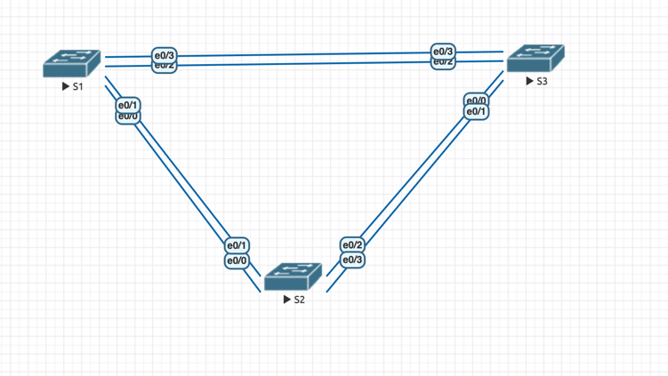
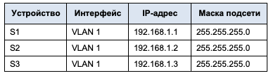
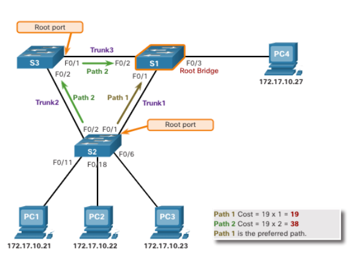
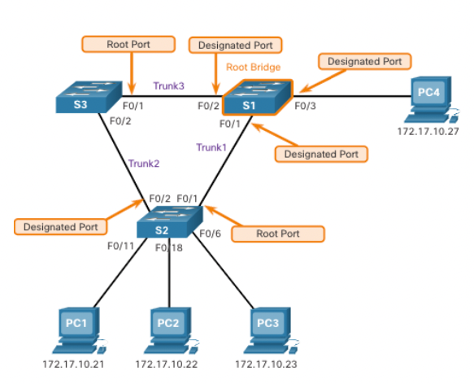

### Избыточность локальных сетей. STP 

### Цель:
- Создание сети и настройка основных параметров устройства.
- Выбор корневого моста.
- Наблюдение за процессом выбора протоколом STP порта, исходя из стоимости портов.
- Наблюдение за процессом выбора протоколом STP порта, исходя из приоритета портов.

### Описание/Пошаговая инструкция выполнения домашнего задания:

- Настроить топологию сети и основные параметры маршрутизаторов.
- Для каждого экземпляра протокола spanning-tree (коммутируемая сеть LAN или широковещательный домен) существует коммутатор, выделенный в качестве корневого моста.
- Наблюдение за процессом выбора протоколом STP порта, исходя из стоимости портов.
- Активировать избыточные пути до каждого из коммутаторов, просмотреть, каким образом протокол STP выбирает порт с учетом приоритета портов.

### Топология сети



### Таблица адресов




<details>

<summary> Общая информация </summary>

Протокол STP - протокол построения топологии без петель.

Основан на алгоритме построения остовного дерева.
Если линк выходит из строя, то сеть динамически перестраивает топологию и пускает трафик через альтернативные (заблокированные ранее порты).


_(скопированно из описания лабы)_

Избыточность позволяет увеличить доступность устройств в топологии сети за счёт устранения единой точки отказа. 
Избыточность в коммутируемой сети обеспечивается посредством использования нескольких коммутаторов или нескольких каналов между коммутаторами. 
Когда в проекте сети используется физическая избыточность, возможно возникновение петель и дублирование кадров.

Протокол spanning-tree (STP) был разработан как механизм предотвращения возникновения петель на 2-м уровне для избыточных каналов коммутируемой сети. 
Протокол STP обеспечивает наличие только одного логического пути между всеми узлами назначения в сети путем намеренного блокирования резервных путей, которые могли бы вызвать петлю.

В этой лабораторной работе команда show spanning-tree используется для наблюдения за процессом выбора протоколом STP корневого моста. 
Также вы будете наблюдать за процессом выбора портов с учетом стоимости и приоритета.

</details>


<details> 

<summary> Полезные команды </summary>

```
show spanning-tree 
show mac address-table

S1(config)# interface f0/2
S1(config-if)# spanning-tree cost 18

```

</details>


### Выполнение:

#### Базовая настройка

```
enable
configure terminal

hostname SW1
no ip domain-lookup
enable secret sexlovesecret

line console 0
password 123456789

login
logging synchronous
line vty 0 4
password 123456789

login
logging synchronous
service password-encryption
banner motd ### Authorised Access Only ###

interface vlan 1
ip address 192.168.1.1 255.255.255.0
no shutdown
end
```

Настройка транков на портах:
```
interface range e0/0-3
switchport trunk encapsulation dot1q
switchport mode trunk
exit
```

#### Выбор корневого моста

Корневой мост служит точкой привязки для всех расчётов протокола `spanning-tree`.

Выбирается коммутатор с **наименьшим** значением `идентификатора моста` – `BID`.

BID состоит из: 
  - значения приоритета моста (значение приоритета может находиться в диапазоне от 0 до 65535 с шагом 4096. По умолчанию используется значение **32768**)  
  - расширенного идентификатора системы (расширенным идентификатором системы всегда является номер сети VLAN)
  - MAC-адреса коммутатора

Тоесть: `BID = PriorityBridge + Vlan + MAC`

Выбор корневого порта складывается из:
`BID = Cost + Priority + PortNumber`, где `Priority = 128` по умолчанию

В результате портам выставляются роли: 
- Root
- Designate 
- Alternative (заблокированные/резервные)

Далее выведем результаты выполнения команды `show spanning-tree`

S1:
```
S1#show spanning-tree

VLAN0001
  Spanning tree enabled protocol ieee
  Root ID    Priority    32769
             Address     aabb.cc00.1000
             This bridge is the root
             Hello Time   2 sec  Max Age 20 sec  Forward Delay 15 sec

  Bridge ID  Priority    32769  (priority 32768 sys-id-ext 1)
             Address     aabb.cc00.1000
             Hello Time   2 sec  Max Age 20 sec  Forward Delay 15 sec
             Aging Time  15  sec

Interface           Role Sts Cost      Prio.Nbr Type
------------------- ---- --- --------- -------- --------------------------------
Et0/1               Desg FWD 100       128.2    Shr
Et0/3               Desg FWD 100       128.4    Shr

```

S2:
```
S2#show spanning-tree

VLAN0001
  Spanning tree enabled protocol ieee
  Root ID    Priority    32769
             Address     aabb.cc00.1000
             Cost        100
             Port        2 (Ethernet0/1)
             Hello Time   2 sec  Max Age 20 sec  Forward Delay 15 sec

  Bridge ID  Priority    32769  (priority 32768 sys-id-ext 1)
             Address     aabb.cc00.2000
             Hello Time   2 sec  Max Age 20 sec  Forward Delay 15 sec
             Aging Time  15  sec

Interface           Role Sts Cost      Prio.Nbr Type
------------------- ---- --- --------- -------- --------------------------------
Et0/1               Root FWD 100       128.2    Shr
Et0/3               Desg FWD 100       128.4    Shr

```

S3:
```
S3#show spanning-tree

VLAN0001
  Spanning tree enabled protocol ieee
  Root ID    Priority    32769
             Address     aabb.cc00.1000
             Cost        100
             Port        4 (Ethernet0/3)
             Hello Time   2 sec  Max Age 20 sec  Forward Delay 15 sec

  Bridge ID  Priority    32769  (priority 32768 sys-id-ext 1)
             Address     aabb.cc00.3000
             Hello Time   2 sec  Max Age 20 sec  Forward Delay 15 sec
             Aging Time  15  sec

Interface           Role Sts Cost      Prio.Nbr Type
------------------- ---- --- --------- -------- --------------------------------
Et0/1               Altn BLK 100       128.2    Shr
Et0/3               Root FWD 100       128.4    Shr

```

В примере ниже все три коммутатора имеют равные значения приоритета идентификатора моста 
(32769 = 32768 + 1, номер сети VLAN = 1)


**Ответы на вопросы:**

Q: Какой коммутатор является корневым мостом?  
A: SW1 (`This bridge is the root`)

Q: Почему этот коммутатор был выбран протоколом spanning-tree в качестве корневого моста?  
A: Одинкаовый Priority и наименьший MAC-адрес `aabb.cc00.1000`

Q: Какие порты на коммутаторе являются корневыми портами?  
A: Порты на **некорневых** коммутаторах в построенном дереве STP, **направленные в сторону корневого** коммутатора.



Q: Какие порты на коммутаторе являются `Designate` портами?  
A: Порты на всех коммутаторах в построенном дереве STP, направленные не на корневой коммутатор и не зарезервированные.

_Каждый сегмент между двумя коммутаторами будет иметь один назначенный порт. 
Назначенный порт — это порт в сегменте, который имеет стоимость внутреннего корневого пути к корневому мосту. 
Другими словами, назначенный порт имеет наилучший путь для приема трафика, ведущего к корневому мосту._




Q: Какой порт отображается в качестве альтернативного и в настоящее время заблокирован?  
A: `SW3 Et0/1`

Q: Почему протокол spanning-tree выбрал этот порт в качестве невыделенного (заблокированного) порта?  
A: Потому, что у SW3 при равном `cost` BID – выше, чем у остальных (за счет большего MAC).

_На сегментах между двумя коммутаторами, где ни один из коммутаторов не является корневым мостом, порт коммутатора с наименьшей стоимостью пути к корневому мосту является назначенным портом._

#### Выбор протоколом STP порта, исходя из стоимости портов

Поменяем стоимость на отключенном порту S3:
```
S3(config)#interface ethernet 0/3
S3(config-if)#spanning-tree cost 90
S3(config)#end
S3#
S3#show spanning-tree

VLAN0001
  Spanning tree enabled protocol ieee
  Root ID    Priority    32769
             Address     aabb.cc00.1000
             Cost        90
             Port        4 (Ethernet0/3)
             Hello Time   2 sec  Max Age 20 sec  Forward Delay 15 sec

  Bridge ID  Priority    32769  (priority 32768 sys-id-ext 1)
             Address     aabb.cc00.3000
             Hello Time   2 sec  Max Age 20 sec  Forward Delay 15 sec
             Aging Time  15  sec

Interface           Role Sts Cost      Prio.Nbr Type
------------------- ---- --- --------- -------- --------------------------------
Et0/1               Desg LRN 100       128.2    Shr
Et0/3               Root FWD 90        128.4    Shr
```
S2:
```
S2#show spanning-tree

VLAN0001
  Spanning tree enabled protocol ieee
  Root ID    Priority    32769
             Address     aabb.cc00.1000
             Cost        100
             Port        2 (Ethernet0/1)
             Hello Time   2 sec  Max Age 20 sec  Forward Delay 15 sec

  Bridge ID  Priority    32769  (priority 32768 sys-id-ext 1)
             Address     aabb.cc00.2000
             Hello Time   2 sec  Max Age 20 sec  Forward Delay 15 sec
             Aging Time  300 sec

Interface           Role Sts Cost      Prio.Nbr Type
------------------- ---- --- --------- -------- --------------------------------
Et0/1               Root FWD 100       128.2    Shr
Et0/3               Altn BLK 100       128.4    Shr
```

S1:
```
S1#show spanning-tree

VLAN0001
  Spanning tree enabled protocol ieee
  Root ID    Priority    32769
             Address     aabb.cc00.1000
             This bridge is the root
             Hello Time   2 sec  Max Age 20 sec  Forward Delay 15 sec

  Bridge ID  Priority    32769  (priority 32768 sys-id-ext 1)
             Address     aabb.cc00.1000
             Hello Time   2 sec  Max Age 20 sec  Forward Delay 15 sec
             Aging Time  300 sec

Interface           Role Sts Cost      Prio.Nbr Type
------------------- ---- --- --------- -------- --------------------------------
Et0/1               Desg FWD 100       128.2    Shr
Et0/3               Desg FWD 100       128.4    Shr
```

Видим, что топология перестроилась (пересчиталась) и ранее заблокированный порт стал назначенным.

Возвращаем все как было:
```
S3(config)#interface ethernet 0/3
S3(config-if)#QQspanning-tree cost 90
S3(config-if)#no spanning-tree cost 90
S3(config-if)#end
```

Порт `Et0/1` становится отключенным, снова.

#### Выбор протоколом STP порта, исходя из приоритета портов

Включаем на всех коммутаторах все порты:
```
interface range ethernet 0/0 , ethernet 0/2
no shutdown
```

Ждем 30 секунд и выполняем `show spanning-tree`.

S1:
```
S1#show spanning-tree

VLAN0001
  Spanning tree enabled protocol ieee
  Root ID    Priority    32769
             Address     aabb.cc00.1000
             This bridge is the root
             Hello Time   2 sec  Max Age 20 sec  Forward Delay 15 sec

  Bridge ID  Priority    32769  (priority 32768 sys-id-ext 1)
             Address     aabb.cc00.1000
             Hello Time   2 sec  Max Age 20 sec  Forward Delay 15 sec
             Aging Time  15  sec

Interface           Role Sts Cost      Prio.Nbr Type
------------------- ---- --- --------- -------- --------------------------------
Et0/0               Desg FWD 100       128.1    Shr
Et0/1               Desg FWD 100       128.2    Shr
Et0/2               Desg FWD 100       128.3    Shr
Et0/3               Desg FWD 100       128.4    Shr
```

S2:
```
S2#show spanning-tree

VLAN0001
  Spanning tree enabled protocol ieee
  Root ID    Priority    32769
             Address     aabb.cc00.1000
             Cost        100
             Port        1 (Ethernet0/0)
             Hello Time   2 sec  Max Age 20 sec  Forward Delay 15 sec

  Bridge ID  Priority    32769  (priority 32768 sys-id-ext 1)
             Address     aabb.cc00.2000
             Hello Time   2 sec  Max Age 20 sec  Forward Delay 15 sec
             Aging Time  15  sec

Interface           Role Sts Cost      Prio.Nbr Type
------------------- ---- --- --------- -------- --------------------------------
Et0/0               Root FWD 100       128.1    Shr
Et0/1               Altn BLK 100       128.2    Shr
Et0/2               Desg FWD 100       128.3    Shr
Et0/3               Desg FWD 100       128.4    Shr
```

S3:
```
S3#show spanning-tree

VLAN0001
  Spanning tree enabled protocol ieee
  Root ID    Priority    32769
             Address     aabb.cc00.1000
             Cost        100
             Port        3 (Ethernet0/2)
             Hello Time   2 sec  Max Age 20 sec  Forward Delay 15 sec

  Bridge ID  Priority    32769  (priority 32768 sys-id-ext 1)
             Address     aabb.cc00.3000
             Hello Time   2 sec  Max Age 20 sec  Forward Delay 15 sec
             Aging Time  15  sec

Interface           Role Sts Cost      Prio.Nbr Type
------------------- ---- --- --------- -------- --------------------------------
Et0/0               Altn BLK 100       128.1    Shr
Et0/1               Altn BLK 100       128.2    Shr
Et0/2               Root FWD 100       128.3    Shr
Et0/3               Altn BLK 100       128.4    Shr
```

Q: Какой порт выбран протоколом STP в качестве порта корневого моста на каждом коммутаторе некорневого моста?  
A: `SW2 e0/0`, `SW3 e0/2`.

Q: Почему протокол STP выбрал эти порты в качестве портов корневого моста на этих коммутаторах?  
A: Потому, что это порты с меньшим номером, что является более приоритетным.

**Вопросы для повторения:**

_(вопросы про выбор корневого порта)_

Q: Какое значение протокол STP использует первым после выбора корневого моста, чтобы определить выбор порта?  
A: Cost  

Q: Если первое значение на двух портах одинаково, какое следующее значение будет использовать протокол STP при выборе порта?  
A: Приоритет порта (по умолчанию 128)  

Q: Если оба значения на двух портах равны, каким будет следующее значение, которое использует протокол STP при выборе порта?  
A: Номер порта  


