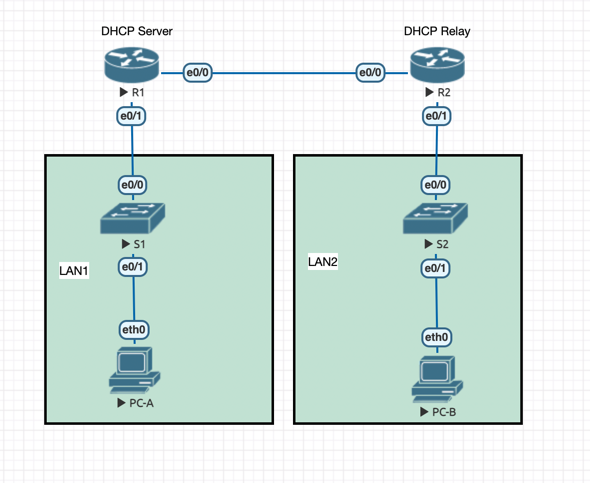
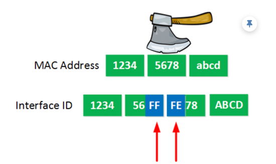

## Настройка DHCPv6: SLAAC, Stateless, Stateful, Relay

### Цели
- Настроить раздачу адресов при помощи `SLAAC` (Stateless Address Autoconfiguration) на R1
- Настроить `Stateless` DHCPv6 Server на R1
- Настроить `Stateful` DHCPv6 Server на R1
- Настроить DHCPv6 `Relay` на R2


### Топология



### Addressing Table

|Device|Interface|IPv6 Addresses|
|----|----|----|
|R1|e0/0|fe80::1, 2001:db8:acad:2::1/64|
| |e0/1|fe80::1, 2001:db8:acad:1::1/64|
|R2|e0/0|fe80::2, 2001:db8:acad:2::2/64|
| |e0/1|fe80::1, 2001:db8:acad:3::1/64|
|PC-A|NIC|DHCP|
|PC-B|NIC|DHCP|

<details>

<summary> Общая информация </summary>

Протокол DHCP раздает IP-адреса устройствам.

Общую информацию про устройство IPv6 адреса я описывал [тут](../../other/IPv6/README.md).

DHCPv6 может быть как `stateful` так и `stateless`. Флаги определяют какой тип использовать.

В результате генерации получается `GUA` (`Global Unicast Address`).

`GUA` можно поделить на две части: на префикс (/64) + на уникальный идентификатор (/64)

Уникальный идентификатор может быть сгенерирован как `случайное число` или при помощи алгоритма `EUI-64` (`Extended Unique Identifier`)

Кратко про `EUI-64`:



Использование `EUI-64` небезопасно, так как светим свой MAC.
Но `EUI-64` работает по умолчанию.


</details>

<details>

<summary> Полезные команды </summary>

```
show ip dhcp pool
show ip dhcp binding
show ip dhcp server statistics
ip dhcp -r
ipconfig /all
```

```
ip auto # Получение IPv6 GUA на PC-A через алгоритм SLAAC
ipv6 unicast-routing
ipv6 nd managed-config-flag # nd означает neighbour detection
ipv6 dhcp relay destination <ip> <int>
```


</details>

### Выполнение

R1:

```
ipv6 unicast-routing
interface ethernet 0/0
ipv6 address fe80::1 link-local
ipv6 address 2001:db8:acad:2::1/64
no shutdown

interface ethernet 0/1
ipv6 address fe80::1 link-local
ipv6 address 2001:db8:acad:1::1/64
ipv6 route ::/0 2001:db8:acad:2::2
no shutdown
```

R2:

```
ipv6 unicast-routing
interface ethernet 0/0
ipv6 address fe80::2 link-local
ipv6 address 2001:db8:acad:2::2/64
no shutdown

interface ethernet 0/1
ipv6 address fe80::1 link-local
ipv6 address 2001:db8:acad:3::1/64
ipv6 route ::/0 2001:db8:acad:2::1
no shutdown
```

Проверка связности:

```
R1#ping 2001:db8:acad:3::1
Type escape sequence to abort.
Sending 5, 100-byte ICMP Echos to 2001:DB8:ACAD:3::1, timeout is 2 seconds:
!!!!!
Success rate is 100 percent (5/5), round-trip min/avg/max = 1/4/17 ms
```

### Получение IPv6 GUA через SLAAC на PC-A

Метод `SLAAC` позволяет хостам создавать свой собственный `GUA` без использования DHCPv6 сервера.  
(`ip auto` - пытается получить IP используя `SLAAC`). 

```
VPCS> ip auto
GLOBAL SCOPE      : 2001:db8:acad:1:2050:79ff:fe66:6801/64
ROUTER LINK-LAYER : aa:bb:cc:00:30:10
```

В адресе: `2001:db8:acad:1:2050:79ff:fe66:6805`:

- `2001:db8:acad:1:` - получена свыше
- `2050:79ff:fe66:6801` - сгенерирована c помощью `EUI-64`


### Настройка Stateless DHCPv6 сервера на R1

```
ipv6 dhcp pool R1-STATELESS
  dns-server 2001:db8:acad::254
  domain-name STATELESS.com
  interface ethernet 0/1
  ipv6 nd other-config-flag
  ipv6 dhcp server R1-STATELESS
```

### Настройка Statefull DHCPv6 сервера на R1 для выдачи адресов в LAN R2

Настроим DHCP stateful сервер:

```
ipv6 dhcp pool R2-STATEFUL
  address prefix 2001:db8:acad:3:aaa::/80
  dns-server 2001:db8:acad::254
  domain-name STATEFUL.com

interface Ethernet0/0
  ipv6 dhcp server R2-STATEFUL
```

### Настройка и проверка DHCPv6 Relay на R2

`DHCPv6 Relay Agent` - маршрутизатор предоставляет услуги переадресации DHCPv6, когда клиент и сервер находятся в разных сетях.

```
interface Ethernet0/1
  ipv6 nd managed-config-flag
  ipv6 dhcp relay destination 2001:db8:acad:2::1 Ethernet0/0
```