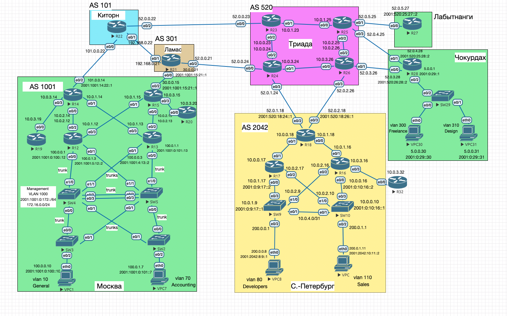
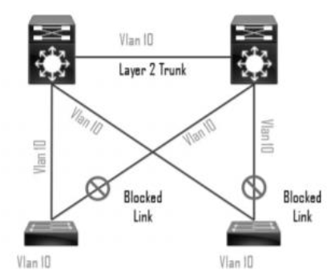
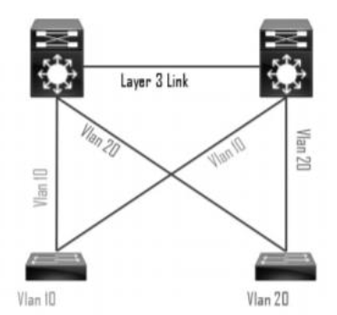
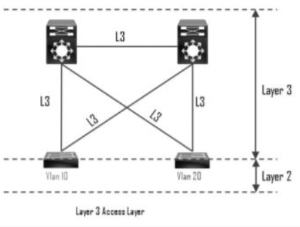

# Планирование адресного пространства. IPv4/6

#### Цель:
В данной самостоятельной работе необходимо распланировать адресное пространство.<br>
Настроить IP на всех активных портах для дальнейшей работы над проектом.<br>
Адресное пространство должно быть задокументировано.<br>

#### Описание/Пошаговая инструкция выполнения домашнего задания:

В этой самостоятельной работе мы ожидаем, что вы самостоятельно:

1) Разработаете и задокументируете адресное пространство для лабораторного стенда.
2) Настроите IP адреса на каждом активном порту.
3) Настроите каждый VPC в каждом офисе в своем VLAN.
4) Настроите VLAN управления для сетевых устройств. 
5) Настроите сети офисов так, чтобы не возникало broadcast штормов, а использование линков было максимально оптимизировано.


### Принципы назначения IP адресов

### Выдача IPv4 адресов 

Принципы выделения IPv4-адресов:
- для организации внутренней связности выдаем адреса из приватной сети `10.0.0.0/8`
- Management адреса коммутаторов из `172.16.0.0/12`
- последний октет адреса совпадает с номером устройства на схеме.  
предпоследний октет, по возможности, выбирается из номеров интерфейсов устройств линка.  Например для линка `R12 e0/2-e0/0 R14` будем выбирать номер предпоследнего октета из {0, 2}.  
Условие выбора - отсутствие конфликтов с другими IP.
- белые адреса выбираются похожими на номер AS, в которой они используются.
Например, провайдеры из Триады (AS `520`) выдают клиентам сети с первым октетом `52` (`52.0.0.24`).
- подсеть `192.168.0.0/16` буду использовать по мере необходимости далее. 


### Генерация IPv6 адресов

**IPv6** адреса будем генерировать, на основе на основе линков устройств (взяты из схемы лабораторной работы) и назначенных на предыдущем шаге IPv4 адресов.  

По правилу, описаному на языке python в `data/gen_ipv6.py`.
<details>

<summary> попытка генерации IPv6 </summary>

```python
def generate_ipv6(ipv4, provider_asn, link):
    a, b, c, d = ipv4.split('.')
    dev1, int1, _, int2, dev2 = link.split(' ')
    first_dev, second_dev = sort_dev_ids(device_id(dev1), device_id(dev2))
    position = 1 if device_id(dev1) == first_dev else 2
    if a == '10' and b == '0': # 10.0/16
        ipv6 = f"2001:0:{first_dev}:{second_dev}::{position}"  # internal
    else:
        ipv6 = f"2001:{provider_asn}:{first_dev}:{second_dev}::{position}"  # external
    link_local = "FE80::" + d
    return ipv6, link_local
```
</details>

К сожалению полностью автоматизировать ~~пока~~ не удалось, в итоге пришлось незначительно править выданные адреса вручную.

**Link-local** адреса будем выделять из `FE80::/10` по номеру устройства.  
Например для R22 адрес будет `FE80::22`.


#### Полезные ссылки:
- [RFC1918. Про выделение IPv4-адресов для приватных сетей](https://datatracker.ietf.org/doc/html/rfc1918)
- [RFC3021. Using 31-bit prefixes on IPv4 PTP Links](https://datatracker.ietf.org/doc/html/rfc3021). Сокращение кол-ва используемых IP.
- [RFC3849. Про использование 2001:DB8::/32 для документации](https://datatracker.ietf.org/doc/html/rfc3849)
- [Вдохновение можно поискать в СДСМ](https://linkmeup.ru/blog/1188/). Примеры L1, L2, L3 документации.
- [хороший конвертер Markdown в CSV](https://tableconvert.com/markdown-to-csv) 
- [хороший конвертер CSV в Markdown](https://www.convertcsv.com/csv-to-markdown.htm)


## Таблицы IP адресов

Далее распишем IP адреса по офисам.

### Москва (AS1001)

Большой и старый офис.

Реализована 3-х уровневая модель:
- Core layer – R14, R15  
- Distribution layer – SW4, SW5, R12, R13  
- Access layer – SW2, SW3, VPC1, VPC7  

Так как имеется много коммутаторов, ~~а мы ленивые и небогатые~~, то для организации проще использовать _STP based_ схему организации 
access layer.


|Device|Port|IPv4      |IPv6                                    |VLAN|Link              |Comment           |
|------|----|----------|----------------------------------------|----|------------------|------------------|
|VPC1  |eth0|100.0.0.1 |2001:1001:1:3::1                        |-   |VPC1 eth0 - e0/2 SW3|                 |
|VPC7  |eth0|100.0.1.7 |2001:1001:2:7::2                        |-   |VPC7 eth0 - e0/2 SW2|                 |
|SW2   |    |172.16.0.2|2001:1001:0:172::2                      |1000|                  |Management (VLAN)  |
|SW2   |e0/2|-         |-                                       |70  |SW2 e0/2 - eth0 VPC7|Accounting (VLAN)|
|SW3   |    |172.16.0.3|2001:1001:0:172::3                      |1000|                  |Management (VLAN)  |
|SW3   |e0/2|-         |-                                       |10  |SW3 e0/2 - eth0 VPC1|General (VLAN)   |
|SW4   |    |172.16.0.4|2001:1001:0:172::4                      |1000|                  |Management (VLAN)  |
|SW5   |    |172.16.0.5|2001:1001:0:172::5                      |1000|                  |Management (VLAN)  |
|R12   |e0/0|100.0.0.1 |2001:1001:4:12::2                       |-   |R12 e0/0 - e1/0 SW4|Connectivity      |
|R12   |e0/1|100.0.1.3 |2001:1001:5:12::2                       |-   |R12 e0/1 - e1/1 SW5|Robustness        |
|R12   |e0/2|10.0.2.12 |2001:0:12:14::1                         |-   |R12 e0/2 - e0/0 R14|Connectivity      |
|R12   |e0/3|10.0.1.12 |2001:0:12:15::1                         |-   |R12 e0/3 - e0/1 R15|Robustness        |
|R13   |e0/0|100.0.1.1 |2001:1001:5:13::2                       |-   |R13 e0/0 - e1/0 SW5|Connectivity      |
|R13   |e0/1|100.0.0.3 |2001:1001:4:13::2                       |-   |R13 e0/1 - e1/1 SW4|Robustness        |
|R13   |e0/2|10.0.2.13 |2001:0:13:15::1                         |-   |R13 e0/2 - e0/0 R15|Connectivity      |
|R13   |e0/3|10.0.1.13 |2001:0:13:14::1                         |-   |R13 e0/3 - e0/1 R14|Robustness        |
|R14   |e0/0|10.0.2.14 |2001:0:12:14::2                         |-   |R14 e0/0 - e0/2 R12|Connectivity      |
|R14   |e0/1|10.0.1.14 |2001:0:13:14::2                         |-   |R14 e0/1 - e0/3 R13|Robustness        |
|R14   |e0/2|101.0.0.14|2001:1001:14:22::1                      |-   |R14 e0/2 - e0/0 R22|BGP: Provider link|
|R14   |e0/3|10.0.3.14 |2001:0:14:19::1                         |-   |R14 e0/3 - e0/0 R19|Default (OSPF)    |
|R15   |e0/0|10.0.2.15 |2001:0:13:15::2                         |-   |R15 e0/0 - e0/2 R13|Connectivity      |
|R15   |e0/1|10.0.1.15 |2001:0:12:15::2                         |-   |R15 e0/1 - e0/3 R12|Robustness        |
|R15   |e0/2|30.0.0.15 |2001:1001:15:21::1                      |-   |R15 e0/2 - e0/0 R21|BGP: Provider link|
|R15   |e0/3|10.0.3.15 |2001:0:15:20::1                         |-   |R15 e0/3 - e0/0 R20|Default (OSPF)    |
|R19   |e0/0|10.0.3.19 |2001:0:14:19::2                         |-   |R19 e0/0 - e0/3 R14|Default (OSPF)    |
|R20   |e0/0|10.0.3.20 |2001:0:15:20::2                         |-   |R20 e0/0 - e0/3 R15|Default (OSPF)    |


### Питер (AS2042)

Современный офис.  
Офис меньше (т.е. не нужно настраивать много сетей), поэтому 
для организации уровня доступа будем использовать _L3 access layer_ схему 
~~(а потом сделаем из него ЦОД)~~.

|Device|Port|IPv4      |IPv6                                    |VLAN|Link              |Comment           |
|------|----|----------|----------------------------------------|----|------------------|------------------|
|VPC8  |eth0|200.0.0.8 |2001:2042:8:9::1                        |80  |VPC8 eth0 – e0/2 SW9|                  |
|VPC11 |eth0|200.0.1.11|2001:2042:10:11::2                      |110 |VPC11 eth0 – e0/2 SW10|                  |
|SW9   |    |172.16.0.9|                                        |1100|                  |Management        |
|SW9   |e0/2|200.0.0.1 |2001:2042:8:9::2                        |80  |SW9 e0/2 - eth0 VPC8|Developers (VLAN) |
|SW9   |    |10.0.1.9  |2001:0:9:17::1                          |-   |SW9 e0/3 - e0/0 R17|End Users         |
|SW10  |    |172.0.0.10|                                        |1100|                  |Management        |
|SW10  |e0/2|200.0.1.1 |2001:2042:10:11::1                      |110 |SW10 e0/2 - eth0 VPC11|Sales (VLAN)      |
|SW10  |    |10.0.0.10 |2001:0:10:16::1                         |-   |SW10 e0/3-e0/0 R16|End Users         |
|R16   |e0/0|10.0.0.16 |2001:0:10:16::2                         |-   |R16 e0/0 – e0/3 SW10|Connectivity      |
|R16   |e0/1|10.0.1.16 |2001:0:16:18::1                         |-   |R16 e0/1 – e0/0 R18|Connectivity      |
|R16   |e0/2|10.0.2.16 |2001:0:16:9::1                          |-   |R16 e0/2 – e1/0 SW9|Robustness        |
|R16   |e0/3|10.0.3.16 |2001:0:16:32::1                         |-   |R16 e0/3 – e0/0 R32|Default (EIGRP)   |
|R17   |e0/0|10.0.1.17 |2001:0:9:17::2                          |-   |R17 e0/0 – e0/3 SW9|Connectivity      |
|R17   |e0/1|10.0.0.17 |2001:0:17:18::1                         |-   |R17 e0/1 – e0/1 R18|Connectivity      |
|R17   |e0/2|10.0.2.17 |2001:0:10:17::2                         |-   |R17 e0/2 – e1/0 SW10|Robustness        |
|R18   |e0/0|10.0.1.18 |2001:0:16:18::2                         |-   |R18 e0/0 – e0/1 R16|Connectivity      |
|R18   |e0/1|10.0.0.18 |2001:0:17:18::2                         |-   |R18 e0/1 – e0/1 R17|Connectivity      |
|R18   |e0/2|52.0.1.18 |2001:520:18:24::1                       |-   |R18 e0/2 – e0/3 R24|BGP: Provider link|
|R18   |e0/3|52.0.2.18 |2001:520:18:26::1                       |-   |R18 e0/3 – e0/3 R26|BGP: Provider link|
|R32   |e0/0|10.0.3.32 |2001:0:16:32::2                         |-   |R32 e0/0 – e0/3 R16|Default (EIGRP)   |

### Ламас (AS301)

Московский провайдер  
Между Ламас и Киторн – серый пиринговый стык.  

|Device Name|Port|IPv4      |IPv6                                    |VLAN|Link              |Comment           |
|-----------|----|----------|----------------------------------------|----|------------------|------------------|
|R21        |e0/0|30.0.0.21 |2001:301:15:21::2                       |-   |R21 e0/0 – e0/2 R15|BGP: Customer link|
|R21        |e0/1|192.168.0.21|2001:0:21:22::1                         |-   |R21 e0/1 – e0/1 R22|BGP: Peering link |
|R21        |e0/2|52.0.0.21 |2001:520:21:24::1                       |-   |R21 e0/2 – e0/0 R24|BGP: Provider link|


### Киторн (AS101)

Московский провайдер

|Device Name|Port|IPv4      |IPv6                                    |VLAN|Link              |Comment           |
|-----------|----|----------|----------------------------------------|----|------------------|------------------|
|R22        |e0/0|101.0.0.22|2001:101:14:22::2                       |-   |R22 e0/0 – e0/2 R14|BGP: Customer link|
|R22        |e0/1|192.168.0.22|2001:0:21:22::2                         |-   |R22 e0/1 – e0/1 R21|BGP: Peering link |
|R22        |e0/2|52.0.0.22 |2001:520:22:23::1                       |-   |R22 e0/2 – e0/0 R23|BGP: Provider link|


### Триада (520)

"Ядро" Интернета

|Device Name|Port|IPv4      |IPv6                                    |VLAN|Link              |Comment           |
|-----------|----|----------|----------------------------------------|----|------------------|------------------|
|R23        |e0/0|52.0.0.23 |2001:520:22:23::2                       |-   |R23 e0/0 – e0/2 R22|BGP: Customer link|
|R23        |e0/1|10.0.1.23 |2001:0:23:25::1                         |-   |R23 e0/1 – e0/0 R25|Connectivity      |
|R23        |e0/2|10.0.0.23 |2001:0:23:24::1                         |-   |R23 e0/2 – e0/2 R24|Connectivity      |
|R24        |e0/0|52.0.0.24 |2001:520:21:24::2                       |-   |R24 e0/0 – e0/2 R21|BGP: Customer link|
|R24        |e0/1|10.0.3.24 |2001:0:24:26::1                         |-   |R24 e0/1 – e0/0 R26|Connectivity      |
|R24        |e0/2|10.0.0.24 |2001:0:23:24::2                         |-   |R24 e0/2 – e0/2 R23|Connectivity      |
|R24        |e0/3|52.0.1.24 |2001:520:18:24::2                       |-   |R24 e0/3 – e0/2 R18|BGP: Customer link|
|R25        |e0/0|10.0.1.25 |2001:0:23:25::2                         |-   |R25 e0/0 – e0/1 R23|Connectivity      |
|R25        |e0/1|52.0.5.25 |2001:520:25:27::1                       |-   |R25 e0/1 – e0/0 R27|BGP: Customer link|
|R25        |e0/2|10.0.2.25 |2001:0:25:26::1                         |-   |R25 e0/2 – e0/2 R26|Connectivity      |
|R25        |e0/3|52.0.4.25 |2001:520:25:28::1                       |-   |R25 e0/3 – e0/1 R28|BGP: Customer link|
|R26        |e0/0|10.0.3.26 |2001:0:24:26::2                         |-   |R26 e0/0 – e0/1 R24|Connectivity      |
|R26        |e0/1|52.0.3.26 |2001:520:26:28::1                       |-   |R26 e0/1 – e0/0 R28|BGP: Customer link|
|R26        |e0/2|10.0.2.26 |2001:0:25:26::2                         |-   |R26 e0/2 – e0/2 R25|Connectivity      |
|R26        |e0/3|52.0.2.26 |2001:520:18:26::2                       |-   |R26 e0/3 – e0/3 R18|BGP: Customer link|


### Лабынтаги (нет номера AS)

Какой-то офис.

|Device Name|Port|IPv4      |IPv6                                    |VLAN|Link              |Comment           |
|-----------|----|----------|----------------------------------------|----|------------------|------------------|
|R27        |e0/0|52.0.5.27 |2001:520:25:27::2                       |-   |R27 e0/0 – e0/1 R25|Default           |


### Чокурдах (нет номера AS)

Небольшой творческий офис. Пристанище для дизайнера и фрилансера.

|Device Name|Port|IPv4      |IPv6                                    |VLAN|Link              |Comment           |
|-----------|----|----------|----------------------------------------|----|------------------|------------------|
|R28        |e0/0|52.0.3.28 |2001:520:26:28::2                       |-   |R28 e0/0 – e0/1 R26|BGP: Provider link|
|R28        |e0/1|52.0.4.28 |2001:520:25:28::2                       |-   |R28 e0/1 – e0/3 R25|BGP: Provider link|
|R28        |e0/2|5.0.0.1   |2001:0:29::1                            |-   |R28 e0/2 – e0/2 SW29|Default (L2)      |
|SW29       |    |172.16.0.29|                                        |1100|-                 |Management        |
|SW29       |    |          |                                        |300 |-                 |Freelance (VLAN)  |
|SW29       |    |          |                                        |310 |-                 |Designer (VLAN)   |
|VPC30      |eth0|5.0.0.30  |2001:0:29::30                           |300 |VPC30 eth0 – e0/0 SW29|                  |
|VPC31      |eth0|5.0.0.31  |2001:0:29::31                           |310 |VPC31 eth0 – e0/1 SW29|                  |


## Итоговая схема




## Примеры конфигураций

Конфиги [тут](https://github.com/gervold/otus-network-engineer/tree/main/labs/lab04/deploy/configs).

При настройке использовались скрипты для синхронизации EVE-NG конфигов, поэтому можно [посмотреть](https://github.com/gervold/otus-network-engineer/commits) историю изменения для каждого конфига.

Про синхронизацию EVE-NG и git, а так же готовые скрипты [тут](https://github.com/gervold/otus-network-engineer/blob/main/eve-ng/deploy.md).

### Заметки:

#### про принципы построения access layer

<details>

<summary> Читать </summary>

Кусочек сети, между Distribution и Access, имеет некоторые особенности построения,  
связанные с повышением отказоустойчивости.  
На схемах ниже L2-коммутаторы это уровень доступа, L3-коммутаторы это уровень распределения.  

**L2 access layer** может быть представлен в 2-х вариантах:

1. **Полный L2** (**STP bassed**).  
Все линки - транки. Циклы разрываются через STP.  


После обрыва основного линка - сеть перестроится и заблокированные линки начнут работать. Придется немного подождать (см. значения таймаутов в STP). 
Из достоинств - можно использовать один и тот же VLAN (условно бухгалтерию) в разных зданиях.

2. **L2 с использованием L3-линка**.  
Разные VLAN-ы. Применяется L3 линк для разрыва цикла.  


Нет блокирующихся линков. Более современный подход.

3. **L3 access layer**  
Можно еще более углубиться в L3 и сделать почти все в L3.  


Этот дизайн используется в ЦОД и крупных сетях.  
Тут начинает работать ECMP.  
STP тут не нужен, так как циклов ~~быть не может~~ не должно быть.  
Нужно маршрутизировать больше сетей, просто L2-свичами не обойдешься.  
Дороже.

</details>


#### про организацию L2 связности

<details>
<summary> Читать </summary>

### Конфигурирование и назначение VLAN

Для внутреннего использования рекомендуется использовать номера VLAN > 1006.
Об этом говорит запись в конфиге:
```
vlan internal allocation policy ascending
```
В случае использования номера меньше – запись не занесется в `running-config`,
но будет храниться в специфичном файле `vlan.dat-XXXXX`.

Note: можно использовать и descending policy, тогда используемые номера нужно будет отсчитывать вниз от 4096.  
```
Layer-3 Catalysts use VLAN id's internally for a few things, one of these is routed interfaces (no switchport). 
By default the internal allocation policy is ascending - that means it will use VLAN 1006 and upwards for internal usage. 
If you change this to descending it starts at 4094 and goes down.
```
[источник](https://community.cisco.com/t5/network-management/vlan-internal-allocation-policy-ascending-descending/td-p/530198#:~:text=By%20default%20the%20internal%20allocation,at%204094%20and%20goes%20down.)

Для ~~усложнения~~ упрощения конфигурирования (на маленьких сетях) – отключим VTP (VLAN Trunking Protocol):

```
SW3#configure terminal
SW3(config)#vtp mode transparent
Setting device to VTP Transparent mode for VLANS.
SW3(config)#end
```

После этого в `running-config` начнут отображаться все настроенные VLAN:
```
SW3#show running-config
***
!
vlan 1000
 name Management
!
```
Note: VTP создан для упрощения конфигурирования сетей с большим количеством устройств и VLAN-ов.  
VLAN-ы автоматически передаются через коммутаторы (в соответствии с VTP ролью и доменом).  
Отсюда возникает проблема с безопасностью – если принести новый коммутатор, с кривыми VLAN-ми, то они могут "пролиться" на другие коммутаторы, организовав мусорку. 
</details>

#### про именование устройств
<details> 

<summary>Читать</summary>

В данной работе имена устройств уже выданы и зафиксированы, но существуют некоторые соглашения именования устройств (`hostname`).

Примерно такие:
- Сокращённое название города (msk) + географическое расположение (улица, здание) (arbat) + роль устройства в сети + порядковый номер.
 
Тоесть выбираем hostname соответственно роли и месту расположения устройства (потом удобно читать `traceroute`). 

Например:
- Маршрутизатор 2811: `msk-arbat-gw1` (**gw**=**GateWay**=шлюз)
- Коммутатор 2960: `msk-arbat-dsw1` (**dsw**=**Distribution switch**)
- Коммутаторы 2950: `msk-arbat-aswN`, `msk-rubl-asw1` (**asw**=**Access switch**)


[все тот же СДСМ](https://linkmeup.ru/blog/1188/)

</details>
