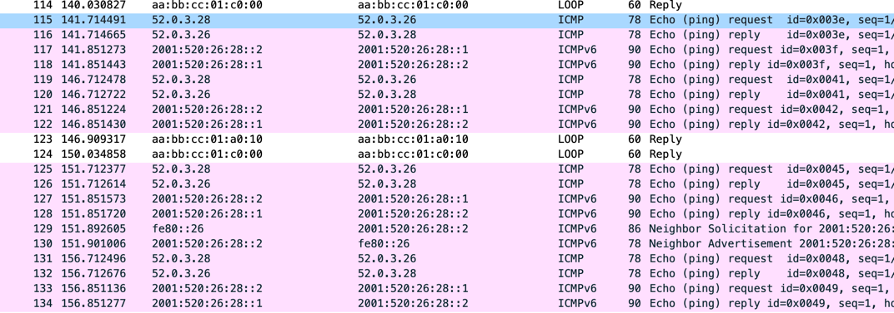

## PBR

### Цель:
Настроить политику маршрутизации в офисе Чокурдах. Распределить трафик между 2 линками.

### Описание домашнего задания:
В этой самостоятельной работе мы ожидаем, что вы самостоятельно:

1. Настроите политику маршрутизации для сетей офиса Чокурдах.
2. Распределите трафик между двумя линками с провайдером (только для IPv4).
3. Настроите отслеживание линка через технологию **IP SLA**.
4. Настройте для офиса Лабытнанги маршрут по-умолчанию.


В этой самостоятельной работе мы ожидаем, что вы самостоятельно:

1. Настроите политику маршрутизации для сетей офиса Чокурдах. 
- Распределите трафик между двумя линками с провайдером (только для IPv4). 
- Настроите отслеживание линка через технологию IP SLA.
2. Настройте для офиса Лабытнанги маршрут по-умолчанию.


## Выполнение

Начнем с самого простого – пункта 4.

#### Маршрут по умолчанию в Лабынтагах

<details>
<summary>Немного про форматы команд и различия между ними </summary>

Про различия между 
`ip default-gateway next_hop` и `ip route 0.0.0.0 0.0.0.0 next_hop` 

[табличка](https://ipwithease.com/difference-between-ip-default-gateway-and-ip-route-0-0-0-0/)
</details>

На R27 по умолчанию видим сообщение `Gateway of last resort is not set`:

```
Gateway of last resort is not set

      40.0.0.0/32 is subnetted, 1 subnets
C        40.0.0.27 is directly connected, Loopback0
      52.0.0.0/8 is variably subnetted, 2 subnets, 2 masks
C        52.0.5.0/24 is directly connected, Ethernet0/0
L        52.0.5.27/32 is directly connected, Ethernet0/0
```

Устанавливаем маршруты по умолчанию:
```
ip route 0.0.0.0 0.0.0.0 52.0.5.25
ipv6 route ::/0 2001:520:25:27::1
```

Наблюдаем появление статических маршрутов:

`S*    0.0.0.0/0 [1/0] via 52.0.5.25`

<details>

```
R27#show ip route
Codes: L - local, C - connected, S - static, R - RIP, M - mobile, B - BGP
       D - EIGRP, EX - EIGRP external, O - OSPF, IA - OSPF inter area
       N1 - OSPF NSSA external type 1, N2 - OSPF NSSA external type 2
       E1 - OSPF external type 1, E2 - OSPF external type 2
       i - IS-IS, su - IS-IS summary, L1 - IS-IS level-1, L2 - IS-IS level-2
       ia - IS-IS inter area, * - candidate default, U - per-user static route
       o - ODR, P - periodic downloaded static route, H - NHRP, l - LISP
       a - application route
       + - replicated route, % - next hop override
       
Gateway of last resort is 52.0.5.25 to network 0.0.0.0

S*    0.0.0.0/0 [1/0] via 52.0.5.25
      40.0.0.0/32 is subnetted, 1 subnets
C        40.0.0.27 is directly connected, Loopback0
      52.0.0.0/8 is variably subnetted, 2 subnets, 2 masks
C        52.0.5.0/24 is directly connected, Ethernet0/0
L        52.0.5.27/32 is directly connected, Ethernet0/0
```
</details>

и для IPv6: `S   ::/0 [1/0] via 2001:520:25:27::1`

<details>

```
R27#show ipv6 route
Codes: C - Connected, L - Local, S - Static, U - Per-user Static route
       B - BGP, HA - Home Agent, MR - Mobile Router, R - RIP
       H - NHRP, I1 - ISIS L1, I2 - ISIS L2, IA - ISIS interarea
       IS - ISIS summary, D - EIGRP, EX - EIGRP external, NM - NEMO
       ND - ND Default, NDp - ND Prefix, DCE - Destination, NDr - Redirect
       O - OSPF Intra, OI - OSPF Inter, OE1 - OSPF ext 1, OE2 - OSPF ext 2
       ON1 - OSPF NSSA ext 1, ON2 - OSPF NSSA ext 2, la - LISP alt
       lr - LISP site-registrations, ld - LISP dyn-eid, a - Application
       
S   ::/0 [1/0]
     via 2001:520:25:27::1
LC  2001:40:25:27::2/128 [0/0]
     via Loopback0, receive
C   2001:520:25:27::/64 [0/0]
     via Ethernet0/0, directly connected
L   2001:520:25:27::2/128 [0/0]
     via Ethernet0/0, receive
L   FF00::/8 [0/0]
     via Null0, receive
```
</details>

Для теста добавим два адреса (`40.0.0.27`, `2001:40:25:27::2`) на Loopback и попингуем с них в провайдера.
Помним, что провайдер (Триада) не знает, про эти подсети от можем только посмотреть, как уходят ICMP requests, через Wireshark.


### Тренировка: использование access-list
<details>

<summary> Попробуем разрешить трафик с VPC30 и запретить с VPC31 </summary>

_Вообще говоря ACL можно сравнить со стражем, который разрешает и запрещает проход для пакетов..._

Создаем **стандартный** access-list (про расширенный см. ниже):
```
R28(config)#access-list 1 permit host 5.0.0.30 log
R28(config)#access-list 1 deny host 5.0.0.31 log
```

Вешаем его на входящие пакеты интерфейса (`access-group`):
```
R28(config)#interface Ethernet 0/2
R28(config-if)#ip access-group 1 in
```

Проверяем:
```
R28#show access-lists
Standard IP access list 1
    20 deny   5.0.0.31 log (4 matches)
    10 permit 5.0.0.30 log (2 matches)
```
VPC30
```
VPCS> ping 5.0.0.1

84 bytes from 5.0.0.1 icmp_seq=1 ttl=255 time=0.548 ms
84 bytes from 5.0.0.1 icmp_seq=2 ttl=255 time=0.434 ms
^C
```

VPC31
```
VPCS> ping 5.0.0.1

*5.0.0.1 icmp_seq=1 ttl=255 time=0.444 ms (ICMP type:3, code:13, Communication administratively prohibited)
*5.0.0.1 icmp_seq=2 ttl=255 time=0.463 ms (ICMP type:3, code:13, Communication administratively prohibited)
*5.0.0.1 icmp_seq=3 ttl=255 time=0.439 ms (ICMP type:3, code:13, Communication administratively prohibited)
*5.0.0.1 icmp_seq=4 ttl=255 time=0.434 ms (ICMP type:3, code:13, Communication administratively prohibited)
^C
```

Если разрешать только для `5.0.0.30`, а остальное запрещать, то нужно использвать конструкцию `deny any`:
```
access-list 1 permit 5.0.0.30 log
access-list 1 deny any log
```
</details>
<details>

<summary>Различия между standart и extened ACL</summary>

**Standard ACLs:**  
These ACLs permit or deny packets based only on the source IPv4 address.   
```
Standard IP access list 1
10 permit 149.1.25.36
20 permit 149.1.25.37
```

**Extended ACLs:**  
These ACLs permit or deny packets based on the source IPv4 address and destination IPv4 address, protocol type, source and destination TCP or UDP ports, and more.
```
Extended IP access list:
10 deny ip host 149.1.63.45 any
20 deny ip any host 149.45.21.5
30 permit udp any range 20040 20079 any range 20040 20079
40 permit tcp any range 20040 20079 any range 20040 20079

! this will deny ip traffic from host 149.1.63.45 to anything else
! and deny traffic to ip address 149.45.21.5 from any where
```

</details>


### Policy Based Routing (PBR)

Далее настроим балансировку через PBR (при помощи `route-map` и `access-lists`).

Общая схема работы PBR:

1. Определяем `route-map <route-map-name> [permit | deny] [sequence-number]`
2. Определяем критерии отбора трафика через `match`
3. Определяем next-hop адрес `set next-hop <ip-address>`
4. Применяем на входящем интерфейсе – `ip policy route-map <route-map-name>` 
5. *Для применения к локальному трафику маршрутизатора `ip local policy <route-map-name>`

_Общая логика:_ берем входящие пакеты с Ethernet 0/2 смотрим на source адрес и в зависимости от source адреса выставляем next_hop.

В нашем случае это будет выглядеть следующим образом:

На R28 cоздаем `access-list`:
```
ip access-list extended VPC30
    permit ip host 5.0.0.30 any

ip access-list extended VPC31
    permit ip host 5.0.0.31 any
```
Помним, что в `route-map`, как и в `filter-list`, – запрет по умолчанию.

```
route-map RM-BALANCING permit 10
match ip address ACL-VPC30
set ip next-hop 52.0.3.26

route-map RM-BALANCING permit 20
match ip address ACL-VPC31
set ip next-hop 52.0.4.25
```


#### IP SLA

Будем запускать пинги раз в 5 секунд с маршрутизатора R28 на ip адреса интерфейсов R25 и R26 (настройки ниже).

На R28 выполняем следующие команды:
```
conf terminal

ip sla 1
 icmp-echo 52.0.3.26 source-ip 52.0.3.28
 frequency 5
exit
ip sla schedule 1 life forever start-time now

ip sla 2
 icmp-echo 52.0.4.25 source-ip 52.0.4.25
 frequency 5
exit
ip sla schedule 2 life forever start-time now

ip sla 3
 icmp-echo 2001:520:26:28::1 source-ip 2001:520:26:28::2
 frequency 5
exit
ip sla schedule 3 life forever start-time now

ip sla 4
 icmp-echo 2001:520:25:28::1 source-ip 2001:520:25:28::2
 frequency 5
exit
ip sla schedule 4 life forever start-time now
```

Проверка через wireshark:



Просмотр статистики:

```
R28#show ip sla statistics
IPSLAs Latest Operation Statistics

IPSLA operation id: 1
	Latest RTT: 1 milliseconds
Latest operation start time: 22:34:17 EET Mon Jun 27 2022
Latest operation return code: OK
Number of successes: 8
Number of failures: 1
Operation time to live: Forever
```


