## OSPF

### Цель:
Настроить OSPF офисе Москва.  
Разделить сеть на зоны.  
Настроить фильтрацию между зонами.  

### Описание/Пошаговая инструкция выполнения домашнего задания:

1. Маршрутизаторы R14-R15 находятся в зоне 0 - backbone.
2. Маршрутизаторы R12-R13 находятся в зоне 10. Дополнительно к маршрутам должны получать маршрут по умолчанию.
3. Маршрутизатор R19 находится в зоне 101 и получает только маршрут по умолчанию.
4. Маршрутизатор R20 находится в зоне 102 и получает все маршруты, кроме маршрутов до сетей зоны 101.
5. Настройка для IPv6 повторяет логику IPv4.

### Схема стенда
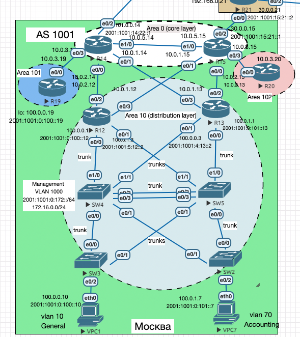

### Общая информация

<details> 

<summary> Минимальная настройка </summary>

```
router ospf 1
 router-id 15.15.15.15
exit

ipv6 router ospf 1
 router-id 15.15.15.15
exit
```


```
!
interface Loopback0
 ip ospf 10 area 0
 ipv6 ospf 10 area 0
 exit
!
interface Ethernet0/0
 ip ospf 10 area 0
 ipv6 ospf 10 area 0
 exit
!
```

</details>

<details>

<summary> Полезные команды </summary> 

```
sh ip route
sh ip protocols
sh ip route static

sh ipv6 route

show ip ospf neighbor
show ip route <ospf>
show ip int brief
show ip ospf database
show ip ospf interface 

clear ip ospf process  
```

</details>


<details>

<summary> Описание протокола </summary>

#### OSPF (Open Shortest Path First) 

`OSPF` представляет собой протокол внутреннего шлюза (`Interior Gateway Protocol` — `IGP`). 
Работает внутри одной автономной системы (АС).  
Протокол _состояния канала_ – знает _все_ о своих каналах.

Маршрутизатор формирует таблицу топологии с использованием результатов вычислений, основанных на алгоритме кратчайшего пути (`SPF`, `Shortest Path First`) Дейкстры.

#### _Типы таблиц:_

1. Таблица соседей – разная для всех маршрутизаторов `show ip ospf neighbor`
2. Таблица топологии – у всех разная `show ip ospf database`
3. Таблица с лучшими маршрутами `show ip route`

`LSDB` (`Link State Database`) – скапливается информация, обо всех парах соединённых в сети маршрутизаторов.
Это единственная одинаковая на всех устройствах табличка, строится на основе информации из `LSA` (см. ниже).

#### _Типы пакетов:_

1. `Hello` - обнаружение узлов, установка смежности. Рассказывает о состоянии канала:
есть интерфейс такой-то с такой-то емкостью, информация об этом идет в databases.
2. Дескриптор базы данных (`DBD`) - выполняется единожды, полная синхронизация баз данных. Выполняется раз в 30 минут.
3. Запрос состояния канала (`LSR`, `Link Status Request`) - запрос информации о каналах, которые интересуют
4. `LSU` - высылка обновления состояния канала (включает `LSA`, `Link State Advertisements`, объявление состояния канала).
`LSA` — это основа работы сетей на OSPF, на их основе создается карта сети.
5. Подтверждение `LSAck`.

Тоесть по таймеру каждые 30 мин выполняется DBD - LSR-запрос и получается LSU-ответ.<br>

#### _Роли маршрутизаторов:_

1. Внутренние и магистральные: 
- Внутренний - любой с интерфейсами внутри одной зоны
- Магистральный - находится в зоне 0

2. Граничные OSPF-маршрутизаторы:  

- `ABR` (`Area Border Router`) – на границе нескольких зон 
- `ASBR` (`Autonomous System Boundary Router`) – этот роутер может быть в любом месте, главное чтобы один из интерфейсов торчал во вне. 

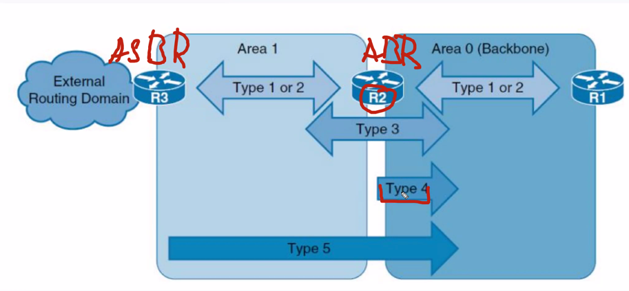

3. `DR` (`Designated Router`) и его `BDR` (`Backup DR`)

Проблемы из-за `full mesh`: с масштабированием, много служебного трафика.  

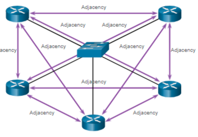

Поэтому выделяется `Designated Router` (`DR`) и получается топология звезда.
Чтобы обеспечить отказоустойчивость - вводится `Backup DR` (`BDR`).
BDR ничего не шлет в сеть, только принимает.

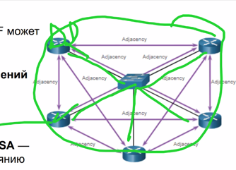

На практике используются LSA типов 1-5, поэтому опишем их  
Типы `LSA`:
1. используется внутри зоны
2. используются только DR 
3. LSA 3 - работают между 2-мя зонами. Cуммарная информация о зоне, формируются только ABR, может передаваться между разными зонами.  У одного роутера может быть несколько ролей
4. LSA 4 - говорит, что есть ASBR где-то там в зоне. «Я знаю того кто знает, о внешних маршрутах» (ASBR), информация о самом хранителе маршрутов. Передается через зоны.
5. LSA 5 - работает напролом через все зоны. «Лавинная рассылка внешних маршрутов» 

Важно понимать маршрутизатор с какой ролью создает LSA.


### Зоны (Areas):

Проблема – требуется постоянная синхронизация в `LSDB`, что создает нагрузку в случае больших сетей.
После разбивки на зоны получаются разные таблички `LSDB` меньшего размера. Меньше нагрузки на оборудование.

Рекомендуемое количество подключенных устройств в зоне не более 50-ти.


#### Area 0 (backbone, она же транзитная или магистральная)

В 3-х уровневой модели логично делать зону 0 на уровне ядра (тогда влезем в количество устройств),
Но ядро подключают и к зоне 1 (для дистрибуции).

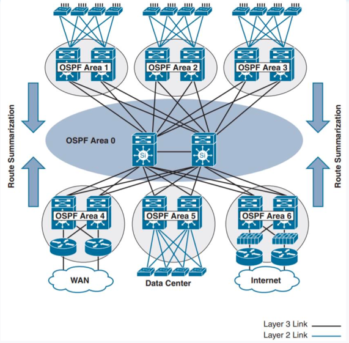

К ней подключаются зоны других типов, например **стабы**:

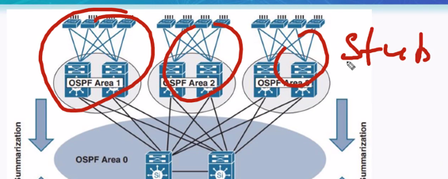

И не только stub-ы: **total stub**, **NSSA (Not so stubby area)**, **total NSSA**:

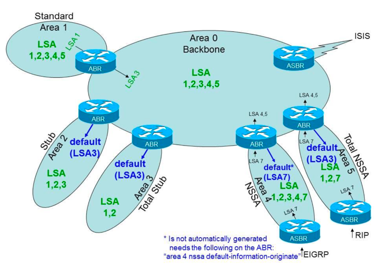

**Stub** - получает маршруты LSA1,2,3 + машрут по умолчанию. Тоесть  в стаб не идет информация от ASBR.
Для выхода из зоны используется default. Нет внешних маршрутов.

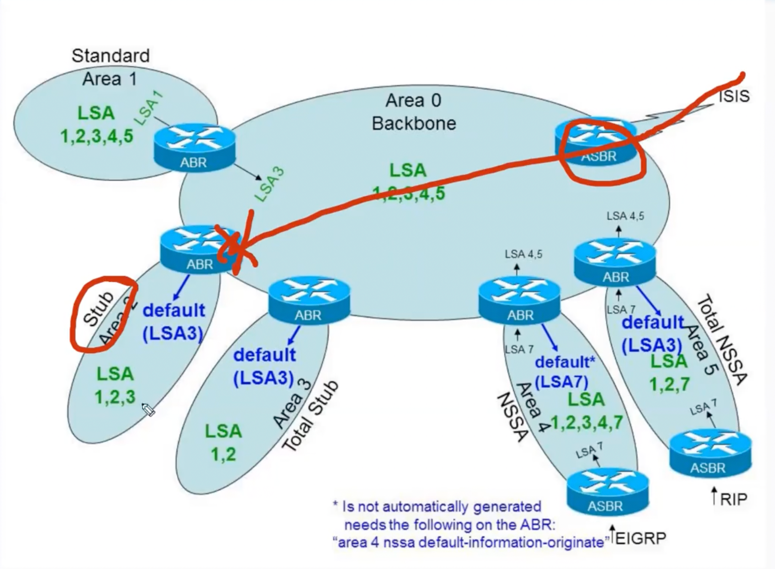

**Totally stub** – информация о других зонах (LSA 3) – блокируется, идет только default.

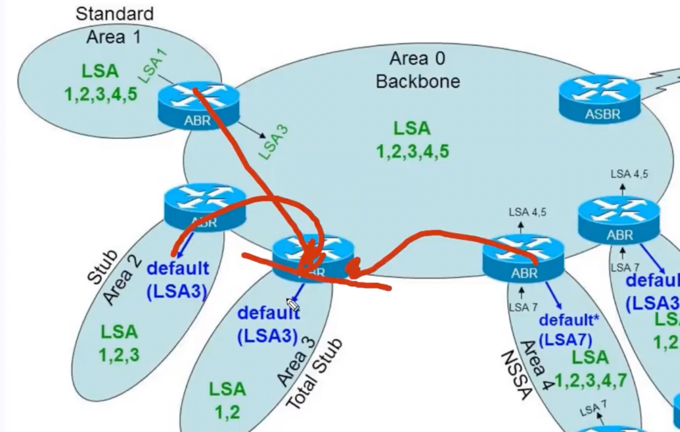

Особенность для Stub и Total Stub – нельзя поставить ASBR (LSA 5), тоесть через stub-зоны нельзя _самостоятельно_ выходить в Интернет.
Тупики, в которые идет default.

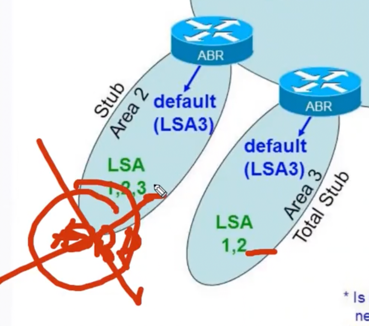

В **NSSA** можно подключать ASBR для получения новых маршрутов.

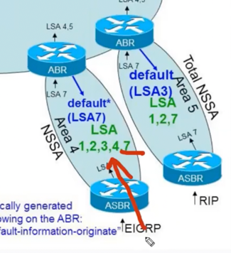

Внутри Area 0 распространяются LSA 7 конвертированные в LSA 5:
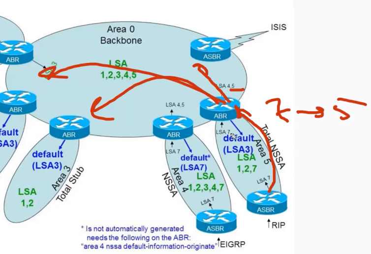


### Фильтрация 

Осуществляется по типу LSA:

- LSA 1-2  – общие команды, без вариаций
- LSA 3 – фильтры на основе префикс-листов, можно фильтровать только на ABR.
Не смотря на то что тут написано prefix - мы фильтруем именно LSA, но не сами префиксы.
Условно «вот это вот туда не анонсить!»
- По LSA 4 и 5 фильтров не существует:
  - LSA 4 - не фильтруется, так как служебный
  - LSA 5 - можно фильтровать на ASBR

</details>

  


### Выполнение

В Московском офисе у нас 3-х уровневая модель, поэтому:
- area 0 – будет имплементацией для Core layer 
- area 10 – будет реализован Distribution layer

Типичная конфигурация выглядит следующим образом (пример для R15):
```
router ospf 1
 router-id 15.15.15.15
 passive-interface default
 no passive-interface Ethernet0/0
 no passive-interface Ethernet0/1
 no passive-interface Ethernet0/3
 no passive-interface Ethernet1/0
!
```

```
interface Ethernet1/0
 no shutdown
 ip address 10.0.5.15 255.255.255.0
 ip ospf 1 area 0
 ipv6 address 2001:1001:14:15::2/64
!
```

В примере выше неиспользуемые интерфейсы переведены в passive-режим (hello-пакеты не отсылаются) для уменьшения служебного трафика между маршрутизаторами.

После базовой настройки подключение к area 10 выглядит след образом:

```
R15#configure terminal
R15(config)#int e0/1
R15(config-if)#ip ospf 1 area 10
R15(config-if)#end
```
После аналогичного конфигурирования нескольких маршрутизаторов (R12, R13, R14) можно видеть, что соседство установлено:

```
R15#show ip ospf neighbor

Neighbor ID     Pri   State           Dead Time   Address         Interface
14.14.14.14       1   FULL/BDR        00:00:36    10.0.5.14       Ethernet1/0
12.12.12.12       1   FULL/DR         00:00:39    10.0.1.12       Ethernet0/1
13.13.13.13       1   FULL/DR         00:00:35    10.0.2.13       Ethernet0/0
R15#
```

Заметим, что в таблице маршрутизации, маршруты внутри зоны маркируются меткой `O`:

```
R15#show ip route ospf
...
Gateway of last resort is not set

      10.0.0.0/8 is variably subnetted, 9 subnets, 2 masks
O        10.6.66.14/32 [110/11] via 10.0.5.14, 00:10:09, Ethernet1/0
```
Между зонами меткой `IA`:
```
R12#show ip route ospf

Gateway of last resort is not set

      10.0.0.0/8 is variably subnetted, 6 subnets, 2 masks
O IA     10.0.5.0/24 [110/20] via 10.0.2.14, 00:33:32, Ethernet0/2
                     [110/20] via 10.0.1.15, 00:04:18, Ethernet0/3
O IA     10.6.66.14/32 [110/11] via 10.0.2.14, 00:33:32, Ethernet0/2
```


### Анонсирование маршрутов по умолчанию

_Способ №1_

На R15 в настройках ospf делаем:
```
default-information originate
```

Задаем сам default:
```
R15(config)#ip route 0.0.0.0 0.0.0.0 30.0.0.21 name default_to_lamas
```

Проверяем:
```
R13#show ip route ospf
...
Gateway of last resort is 10.0.2.15 to network 0.0.0.0

O*E2  0.0.0.0/0 [110/1] via 10.0.2.15, 00:01:58, Ethernet0/2
      10.0.0.0/8 is variably subnetted, 6 subnets, 2 masks
O IA     10.0.5.0/24 [110/20] via 10.0.2.15, 02:59:04, Ethernet0/2
                     [110/20] via 10.0.1.14, 02:59:14, Ethernet0/3
O IA     10.6.66.14/32 [110/11] via 10.0.1.14, 02:59:14, Ethernet0/3
```

_Способ №2_

Принудительное распространение дефолта, даже если он не установлен:

```
R14(config-router)#default-information originate always
```

Видим, что теперь есть два маршрута по умолчанию:
```
R13#show ip route ospf

O*E2  0.0.0.0/0 [110/1] via 10.0.2.15, 00:54:31, Ethernet0/2
                [110/1] via 10.0.1.14, 00:54:41, Ethernet0/3
      10.0.0.0/8 is variably subnetted, 7 subnets, 2 masks
*** 
```

По умолчанию стоит E2 и внутренние косты не учитываются.
Если нужно учитывать внутренние косты, то нужно включить E1.


### Выделение total stub (блокировка маршрутов из других зон) 

Нужно R19 выделить в area 101 и получать только маршрут по умолчанию.

Сначала объединим устройства в `standard area`:
```
ip ospf 1 area 101
```
Видим, что на R19 распространились все маршруты, фильтрации нет:
```
R19#show ip route

Gateway of last resort is 10.0.3.14 to network 0.0.0.0

O*E2  0.0.0.0/0 [110/1] via 10.0.3.14, 00:00:06, Ethernet0/0
      10.0.0.0/8 is variably subnetted, 6 subnets, 2 masks
O IA     10.0.1.0/24 [110/20] via 10.0.3.14, 00:00:06, Ethernet0/0
O IA     10.0.2.0/24 [110/20] via 10.0.3.14, 00:00:06, Ethernet0/0
C        10.0.3.0/24 is directly connected, Ethernet0/0
L        10.0.3.19/32 is directly connected, Ethernet0/0
O IA     10.0.5.0/24 [110/20] via 10.0.3.14, 00:00:06, Ethernet0/0
O IA     10.6.66.14/32 [110/11] via 10.0.3.14, 00:00:06, Ethernet0/0
R19#
```

Тоесть получаются все маршруты (пакеты со всеми типами LSA).

Поменяем на интерфейсах соседей (R14, R19) тип area на **total stub**, чтобы внутрь проходил только маршрут по умолчанию:
```
area 101 stub no-summary
```

Теперь R19 получает от R14 только маршрут по умолчанию:

```
R19#show ip route
Gateway of last resort is 10.0.3.14 to network 0.0.0.0
O*IA  0.0.0.0/0 [110/11] via 10.0.3.14, 00:00:27, Ethernet0/0
      10.0.0.0/8 is variably subnetted, 2 subnets, 2 masks
C        10.0.3.0/24 is directly connected, Ethernet0/0
L        10.0.3.19/32 is directly connected, Ethernet0/0
```

Такая вот "фильтрация".
 
### Фильтрация на ABR/ASBR

Для теста фильтрации добавим на Loopback R19 IP-адреса (их и будем фильтровать):

```
R19(config)#int Loopback 0
R19(config-if)#ip address 100.0.0.19 255.255.255.255
R19(config-if)#ipv6 address 2001:1001:0:100::19/64
```

Смотрим на R20 (до фильтрации и включения OSPF):

<details>

<summary> почти пусто </summary>

```
R20#show ip route
Gateway of last resort is not set
      10.0.0.0/8 is variably subnetted, 2 subnets, 2 masks
C        10.0.3.0/24 is directly connected, Ethernet0/0
L        10.0.3.20/32 is directly connected, Ethernet0/0
```

```
R20#show ipv6 route
IPv6 Routing Table - default - 3 entries
C   2001:0:15:20::/64 [0/0]
     via Ethernet0/0, directly connected
L   2001:0:15:20::2/128 [0/0]
     via Ethernet0/0, receive
L   FF00::/8 [0/0]
     via Null0, receive
```

</details>

Включаем OSPF, проверяем появление маршрутов:

```
Gateway of last resort is 10.0.3.15 to network 0.0.0.0

O*E2  0.0.0.0/0 [110/1] via 10.0.3.15, 00:08:38, Ethernet0/0
      10.0.0.0/8 is variably subnetted, 6 subnets, 2 masks
O IA     10.0.1.0/24 [110/20] via 10.0.3.15, 00:08:38, Ethernet0/0
O IA     10.0.2.0/24 [110/20] via 10.0.3.15, 00:08:38, Ethernet0/0
C        10.0.3.0/24 is directly connected, Ethernet0/0
L        10.0.3.20/32 is directly connected, Ethernet0/0
O IA     10.0.5.0/24 [110/20] via 10.0.3.15, 00:08:38, Ethernet0/0
O IA     10.6.66.14/32 [110/21] via 10.0.3.15, 00:08:38, Ethernet0/0
      100.0.0.0/32 is subnetted, 1 subnets
O IA     100.0.0.19 [110/31] via 10.0.3.15, 00:00:08, Ethernet0/0
```

Добавляем фильтры на R15:

```
R15(config)#ip prefix-list DENY-AREA-101 seq 5 deny 100.0.0.19/32
R15(config)#ip prefix-list DENY-AREA-101 seq 100 permit 0.0.0.0/0 le 32

R15(config)#router ospf 1
R15(config-router)#area 102 filter-list prefix DENY-AREA-101 in
R15(config-router)#end
```


Проверяем, что `100.0.0.19` исчез из таблицы:
```
R20#show ip route
Gateway of last resort is 10.0.3.15 to network 0.0.0.0

O*E2  0.0.0.0/0 [110/1] via 10.0.3.15, 00:24:16, Ethernet0/0
      10.0.0.0/8 is variably subnetted, 6 subnets, 2 masks
O IA     10.0.1.0/24 [110/20] via 10.0.3.15, 00:24:16, Ethernet0/0
O IA     10.0.2.0/24 [110/20] via 10.0.3.15, 00:24:16, Ethernet0/0
C        10.0.3.0/24 is directly connected, Ethernet0/0
L        10.0.3.20/32 is directly connected, Ethernet0/0
O IA     10.0.5.0/24 [110/20] via 10.0.3.15, 00:24:16, Ethernet0/0
O IA     10.6.66.14/32 [110/21] via 10.0.3.15, 00:24:16, Ethernet0/0
```

В area 102 (R20) поступают все маршруты, кроме маршрутов до area 101 (R19).

Тоесть фильтрация работает.

#### Настройка OSPF для IPv6

В целом аналогично, за исключением [момента с фильтрацией](https://github.com/gervold/otus-network-engineer/commit/14f3f958d5b0f4219b090614dd2cdd04e716f20c)
(используется `distribute-list` вместо `area <area-num> filter-list`).

