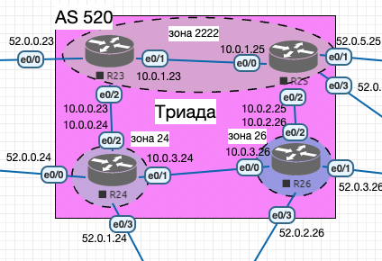
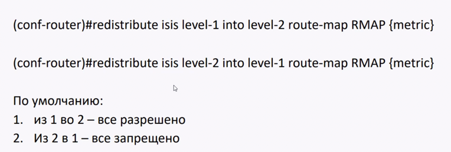

## IS-IS

### Цель:
Настроить IS-IS офисе Триада

#### Описание/Пошаговая инструкция выполнения домашнего задания:
Настроите IS-IS в ISP Триада.
- R23 и R25 находятся в зоне 2222.
- R24 находится в зоне 24.
- R26 находится в зоне 26. 
- Настройка осуществляется одновременно для IPv4 и IPv6.


### Схема стенда:

!


### Общая информация

<details>

<summary> Минимальная настройка </summary>

```
router isis
net 49.2222.0000.0000.0023.00
```

где 49 - указывает тип адреса (у нас – приватный), 2222 - номер зоны, 0000.0000.0023 - ID устройства, 00 - селектор (всегда ноль).


На интерфейсах выполнить:
```
(config-if)#ip router isis
(config-if)#ipv6 router isis
```
</details>

<details> 

<summary>Полезные команды </summary>

```
sh isis neighbors
sh ip route
sh isis topology
```

</details>

<details> 

<summary> Описание протокола </summary>

### IS-IS (Intermediate System to Intermediate System)

Как и OSPF это Link-State на основе Дейкстры.
Это тоже IGP протокол.
В крупных провайдерах любят IS-IS так как он **хорошо интегрируется с MPLS**.

OSPF - работает поверх IP.
**IS-IS - работает поверх Ethernet v.1**, из-за этого сложно использовать его для построения VPN.
Так как VPN - это по сути инкапсуляция «IP внутрь IP», а тут IP нет. Зато нет лишних заголовков.

В Wireshark можно посмотреть, что по IS-IS передается только маршрутная информация, дальше она заносится в таблицы роутеров.
После этого роутеры могут передавать данные по IP протоколу, как обычно.


Скорость сходимости у IS-IS выше, поэтому в больших сетях может быть лучше.
Из коробки **может работать с 200-250 устройствами**, в то время когда OSPF для 50-70 устройств.
IS-IS более масштабируем - в него проще добавить например метку для MPLS.

IS-IS часто работает с BGP и можно дожидаться поднятия BGP.

**Уровни IS-IS**

- L1 - внутри одной зоны
- L2 - между несколькими зонами. L2 можно сравнить с магистралью.
Можно сделать только L2 взаимодействие, но это неоптимально.


### Фильтрация 

Реализуется использованием редистрибъюции.




</details>


### Выполнение

Так как IS-IS любят в провайдерах, то настраиваем его в Триаде.

Выполняем на R23, R24, R25, R26 [минимальные настройки](https://github.com/gervold/otus-network-engineer/commit/3109b954ff82842463ddd75fcbbd7e592c9fbcbc), указываем разные зоны, проверяем.

Соседство установилось:
```
R23#show isis neighbors

System Id      Type Interface   IP Address      State Holdtime Circuit Id
R24            L2   Et0/2       10.0.0.24       UP    9        R24.02
R25            L1   Et0/1       10.0.1.25       UP    7        R25.01
R25            L2   Et0/1       10.0.1.25       UP    9        R25.01
```

Пути распространились:
```
R23#show ip route isis
Gateway of last resort is not set
      10.0.0.0/8 is variably subnetted, 6 subnets, 2 masks
i L1     10.0.2.0/24 [115/20] via 10.0.1.25, 00:07:48, Ethernet0/1
i L2     10.0.3.0/24 [115/20] via 10.0.0.24, 00:07:49, Ethernet0/2
```

```
R23#show ipv6 route isis
I2  2001:0:24:26::/64 [115/20]
     via FE80::24, Ethernet0/2
I1  2001:0:25:26::/64 [115/20]
     via FE80::25, Ethernet0/1
```

Если смотреть на R23, то появились две таблички `LSDB` одна для L1 связей (соседи по зоне), одна для L2 (из внешних зон):

```
R23#show isis topology

IS-IS TID 0 paths to level-1 routers
System Id            Metric     Next-Hop             Interface   SNPA
R23                  --
R25                  10         R25                  Et0/1       aabb.cc01.9000

IS-IS TID 0 paths to level-2 routers
System Id            Metric     Next-Hop             Interface   SNPA
R23                  --
R24                  10         R24                  Et0/2       aabb.cc01.8020
R25                  10         R25                  Et0/1       aabb.cc01.9000
R26                  20         R24                  Et0/2       aabb.cc01.8020
                                R25                  Et0/1       aabb.cc01.9000
```

