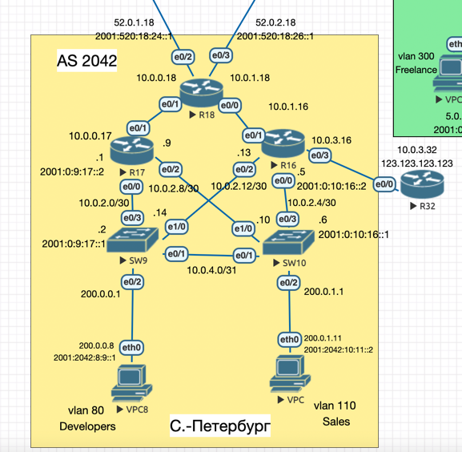
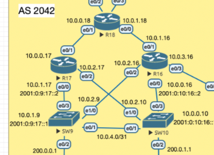

## EIGRP

#### Цель:
Настроить EIGRP в С.-Петербург;
Использовать named EIGRP

#### Описание/Пошаговая инструкция выполнения домашнего задания:
В офисе С.-Петербург настроить EIGRP.
- R32 получает только маршрут по умолчанию.
- R16-17 анонсируют только суммарные префиксы.
- Использовать EIGRP named-mode для настройки сети. 
- Настройка осуществляется одновременно для IPv4 и IPv6.


## Схема стенда


### Общая информация

<details> 

<summary> Минимальная настройка </summary>

R16:
```
!
router eigrp SPB-NET
 !
 address-family ipv4 unicast autonomous-system 2042
  !
  topology base
  exit-af-topology
  network 10.0.3.0 0.0.0.255
 exit-address-family
!
```

R32:
```
interface Loopback0
 no shutdown
 ip address 123.123.123.123 255.255.255.255
!

!
router eigrp SPB-NET
 !
 address-family ipv4 unicast autonomous-system 2042
  !
  topology base
  exit-af-topology
  network 10.0.3.0 0.0.0.255
  network 123.123.123.123 0.0.0.0
 exit-address-family
!
```

Редистрибъюция маршрута через topology base

</details>


<details> 

<summary>Полезные команды</summary>

```
sh ip route
sh ipv6 route
sh ip eigrp topology
sh ipv6 eigrp topology
sh eigrp protocols
sh ip eigrp neighbors
sh ipv6 eigrp neighbors
sh ip eigrp topology all-links
sh ipv6 eigrp topology all-links

```
</details>

<details>

<summary> Описание протокола </summary>

Enhanced Interior Gateway Routing Protocol (EIGRP)

Протокол маршрутизации, разработанный фирмой Cisco на основе протокола IGRP той же фирмы. 
Основной минус – работает только на Cisco устройствах.

EIGRP использует механизм DUAL (Diffusing Update ALgorithm) для выбора наиболее короткого маршрута. 

</details>


### Выполнение

Есть два вида настройки EIGRP:
- Стандартный EIGRP
- Именованный (named) EIGRP

Отличие именованного EIGRP в том, что он использует функцию семейства адресов (`address family`, `AF`) для унификации процесса настройки при реализации как `IPv4`, так и `IPv6`. И еще что-то.

Минимальная конфигурация – выше, остальные устройства конфигурируются аналогично.

Рассмотрим поближе, что стало видно после настройки EIGRP между R32 и R16: 

```
R32(config)#router eigrp SPB-NET
R32(config-router)#address-family ipv4 unicast autonomous-system 2042
R32(config-router-af)#network 123.123.123.123 0.0.0.0
R32(config-router-af)#network 10.0.3.32 0.0.0.255
R32(config-router-af)#end
```

В информации о протоколе видим, что указанные сети маршрутизируются по EIGRP:
```
R32#show ip protocol

  Routing for Networks:
    10.0.3.0/24
    123.123.123.123/32
```

Проверим, что сети стали доступны с R16:

```
R16(config)#router eigrp SPB-NET
R16(config-router)#address-family ipv4 unicast autonomous-system 2042
R16(config-router-af)#network 10.0.3.16 0.0.0.255
*Jul  9 11:58:40.296: %DUAL-5-NBRCHANGE: EIGRP-IPv4 2042: Neighbor 10.0.3.32 (Ethernet0/3) is up: new adjacency
R16(config-router-af)#end
```

```
R16#show ip eigrp neighbors
EIGRP-IPv4 VR(SPB-NET) Address-Family Neighbors for AS(2042)
H   Address                 Interface              Hold Uptime   SRTT   RTO  Q  Seq
                                                   (sec)         (ms)       Cnt Num
0   10.0.3.32               Et0/3                    14 00:00:23   14   100  0  2
```


На R16 видим полученный маршрут:

```
R16#show ip route
Gateway of last resort is not set
      10.0.0.0/8 is variably subnetted, 2 subnets, 2 masks
C        10.0.3.0/24 is directly connected, Ethernet0/3
L        10.0.3.16/32 is directly connected, Ethernet0/3
      123.0.0.0/32 is subnetted, 1 subnets
D        123.123.123.123 [90/1024640] via 10.0.3.32, 00:01:17, Ethernet0/3
```

<details>

<summary> настройки по умолчанию (router ID) </summary>

В этом случае за router ID будет выбран `10.0.3.16`: 
```
Routing Protocol is "eigrp 2042"
  Outgoing update filter list for all interfaces is not set
  Incoming update filter list for all interfaces is not set
  Default networks flagged in outgoing updates
  Default networks accepted from incoming updates
  EIGRP-IPv4 VR(SPB-NET) Address-Family Protocol for AS(2042)
    Metric weight K1=1, K2=0, K3=1, K4=0, K5=0 K6=0
    Metric rib-scale 128
    Metric version 64bit
    NSF-aware route hold timer is 240
    Router-ID: 10.0.3.16
    Topology : 0 (base)
      Active Timer: 3 min
      Distance: internal 90 external 170
      Maximum path: 4
      Maximum hopcount 100
      Maximum metric variance 1
      Total Prefix Count: 2
```
Сменим: 
```
R16(config-router)# address-family ipv4 unicast autonomous-system 2042
R16(config-router-af)#eigrp router-id 16.16.16.16
```
```
Routing Protocol is "eigrp 2042"
  Outgoing update filter list for all interfaces is not set
  Incoming update filter list for all interfaces is not set
  Default networks flagged in outgoing updates
  Default networks accepted from incoming updates
  EIGRP-IPv4 VR(SPB-NET) Address-Family Protocol for AS(2042)
    Metric weight K1=1, K2=0, K3=1, K4=0, K5=0 K6=0
    Metric rib-scale 128
    Metric version 64bit
    NSF-aware route hold timer is 240
    Router-ID: 16.16.16.16
    Topology : 0 (base)
      Active Timer: 3 min
      Distance: internal 90 external 170
      Maximum path: 4
      Maximum hopcount 100
      Maximum metric variance 1
      Total Prefix Count: 2
      Total Redist Count: 0
```

</details>

**При настройке IPv6** не будем указывать network, тогда 

<details>

<summary> show ip protocol </summary>

```
R32#show ipv6 protocol
IPv6 Routing Protocol is "connected"
IPv6 Routing Protocol is "application"
IPv6 Routing Protocol is "ND"
IPv6 Routing Protocol is "eigrp 2042"
EIGRP-IPv6 VR(SPB-NET) Address-Family Protocol for AS(2042)
  Metric weight K1=1, K2=0, K3=1, K4=0, K5=0 K6=0
  Metric rib-scale 128
  Metric version 64bit
  NSF-aware route hold timer is 240
  Router-ID: 32.32.32.32
  Topology : 0 (base)
    Active Timer: 3 min
    Distance: internal 90 external 170
    Maximum path: 16
    Maximum hopcount 100
    Maximum metric variance 1
    Total Prefix Count: 2
    Total Redist Count: 0

  Interfaces:
    Ethernet0/0
    Loopback0
  Redistribution:
    None
```

</details>

Автоматически будут распространены адреса со всех интерфейсов:
```
  Interfaces:
    Ethernet0/0
    Loopback0
```

В случае IPv4, где мы указывали `network` – будут только специфичные сети:
```
R32#show ip protocol
*** IP Routing is NSF aware ***
***
  Routing for Networks:
    10.0.3.0/24
    123.123.123.123/32
```

Установка для IPv6 происходит на Link-Local адресе:
```
R16#show ipv6 eigrp neighbors
EIGRP-IPv6 VR(SPB-NET) Address-Family Neighbors for AS(2042)
H   Address                 Interface              Hold Uptime   SRTT   RTO  Q  Seq
                                                   (sec)         (ms)       Cnt Num
0   Link-local address:     Et0/3                    13 00:01:11 1597  5000  0  2
    FE80::32
```

Проверка распространения тестового IPv6 адреса с R32:
```
R16#show ipv6 route eigrp
IPv6 Routing Table - default - 4 entries
***
D   2001:0:16:321::123/128 [90/1024640]
     via FE80::32, Ethernet0/3

```

Так же рекомендуется включить EIGRP только на необходимых интерфейсах, для этого можно **по умолчанию отключить EIGRP на всех интерфейсах** (`shutdown`) и 
далее руками включить необходимые.
Примерно так:
```
  af-interface default
   shutdown
  exit-af-interface
  !
  af-interface Ethernet0/1
   no shutdown
  exit-af-interface
  ... 
```

Заметим, что по умолчанию авто-суммаризация (она существует) отключена:
```
Automatic Summarization: disabled
```

### Суммаризация IP подсетей

Для демонстрации суммаризации маршрутов немного переделаем дизайн сети: удалим несколько "старых" /24 сетей и вместо них поставим `/30` подсети из 
`10.0.2.0/24` на R16, R17, SW9, SW10

Таким образом создадим условия для агрегации нескольких /30 маршрутов в один /24 на маршрутизаторах R16 и R17.

<details>

<summary> Было так </summary>

Переделали сети: 
- 10.0.0.0/24
- 10.0.1.0/24
- 10.0.2.0/24



</details>

Далее устраним недочеты с отсутствием IP адресов на свичах:

<details> 

<summary> Устраняем недочеты на S9, S10 </summary>

Для настройки EIGRP-связности между маршрутизаторами и коммутаторами назначим IP-адреса на портах.
Для нужно выполнить `no switchport` и после этого назначить IP адрес.

</details>


Теперь посмотрим на таблицу маршрутизации R18 до суммаризации:
```
R18#show ip route eigrp

Gateway of last resort is not set

      10.0.0.0/8 is variably subnetted, 9 subnets, 3 masks
D        10.0.2.0/30 [90/1536000] via 10.0.0.17, 00:02:49, Ethernet0/1
D        10.0.2.4/30 [90/1536000] via 10.0.1.16, 00:02:46, Ethernet0/0
D        10.0.2.8/30 [90/1536000] via 10.0.0.17, 00:02:49, Ethernet0/1
D        10.0.2.12/30 [90/1536000] via 10.0.1.16, 00:02:46, Ethernet0/0
D        10.0.3.0/24 [90/1536000] via 10.0.1.16, 00:02:49, Ethernet0/0
      123.0.0.0/32 is subnetted, 1 subnets
D        123.123.123.123 [90/1536640] via 10.0.1.16, 00:02:28, Ethernet0/0
```

Делаем суммаризацию на вышестоящем (в сторону провайдеров) интерфейсе `eth0/1`:

```
summary-address 10.0.2.0 255.255.255.0
```

Маршрутов стало меньше: 
выделенные 10.0.2.0/30, 10.0.2.4/30, 10.0.2.8/30, 10.0.2.12/30
схлопнулись в  10.0.2.0/24

Таблицы после суммаризации

```
R18#show ip route eigrp
***
Gateway of last resort is not set

      10.0.0.0/8 is variably subnetted, 6 subnets, 2 masks
D        10.0.2.0/24 [90/1536000] via 10.0.1.16, 00:00:10, Ethernet0/0
                     [90/1536000] via 10.0.0.17, 00:00:10, Ethernet0/1
D        10.0.3.0/24 [90/1536000] via 10.0.1.16, 00:10:31, Ethernet0/0
      123.0.0.0/32 is subnetted, 1 subnets
D        123.123.123.123 [90/1536640] via 10.0.1.16, 00:10:31, Ethernet0/0
```

На роутерах R16,R17, в выводе команды `show ip protocol`, появилась информация о суммаризации:
```
  Automatic Summarization: disabled
  Address Summarization:
    10.0.2.0/24 for Et0/1
      Summarizing 4 components with metric 131072000
  Maximum path: 4
  Routing for Networks:
    10.0.0.0/24
    10.0.2.0/30
    10.0.2.8/30
```

### Дефолтный маршрут для R32

Дефолтный маршрут в EIGRP можно сделать двумя способами:
- через [редистрибъюцию статического маршрута](https://www.ccexpert.us/directed-broadcast/default-routing-with-eigrp.html#:~:text=A%20default%20route%20can%20be%20injected%20into%20EIGRP%20in%20two%20primary%20ways%3A&text=Redistribute%20a%20default%20static%20route,router%20entry%20ip%20route%200.0.)
- через суммаризацию исходящих маршрутов в `0.0.0.0` и `::/0`.

Выберем второй путь.

Посмотрим на таблицы маршрутизации до внесения изменений:
```
R32#show ip route eigrp
***
Gateway of last resort is not set

      10.0.0.0/8 is variably subnetted, 8 subnets, 3 masks
D        10.0.0.0/24 [90/2048000] via 10.0.3.16, 00:03:53, Ethernet0/0
D        10.0.1.0/24 [90/1536000] via 10.0.3.16, 00:03:53, Ethernet0/0
D        10.0.2.0/30 [90/2048000] via 10.0.3.16, 00:03:53, Ethernet0/0
D        10.0.2.4/30 [90/1536000] via 10.0.3.16, 00:03:53, Ethernet0/0
D        10.0.2.8/30 [90/2048000] via 10.0.3.16, 00:03:53, Ethernet0/0
D        10.0.2.12/30 [90/1536000] via 10.0.3.16, 00:03:53, Ethernet0/0
```

```
R32#show ipv6 route eigrp
IPv6 Routing Table - default - 14 entries
***
D   2001:0:9:17::/64 [90/2560000]
     via FE80::16, Ethernet0/0
D   2001:0:10:16::/64 [90/1536000]
     via FE80::16, Ethernet0/0
D   2001:0:10:17::/64 [90/2560000]
     via FE80::16, Ethernet0/0
D   2001:0:16:9::/64 [90/1536000]
     via FE80::16, Ethernet0/0
D   2001:0:16:18::/64 [90/1536000]
     via FE80::16, Ethernet0/0
D   2001:0:17:18::/64 [90/2048000]
     via FE80::16, Ethernet0/0
D   2001:520:18:24::/64 [90/2048000]
     via FE80::16, Ethernet0/0
D   2001:520:18:26::/64 [90/2048000]
     via FE80::16, Ethernet0/0
D   2001:2024:0:200::18/128 [90/1536640]
     via FE80::16, Ethernet0/0
D   2001:2024:0:201::18/128 [90/1536640]
     via FE80::16, Ethernet0/0
```

На R16 сделаем суммаризацию следующим образом – объединим все маршруты направленные в сторону R32 командами ```summary-address 0.0.0.0 0.0.0.0``` и ```summary-address ::/0```:

```
R16(config)#router eigrp SPB-NET
R16(config-router)#address-family ipv4 unicast autonomous-system 2042
R16(config-router-af)#af-interface Ethernet 0/3
R16(config-router-af-interface)#summary-address 0.0.0.0 0.0.0.0
R16(config-router-af-interface)#exit
R16(config-router-af)#exit
R16(config-router)#address-family ipv6 unicast autonomous-system 2042
R16(config-router-af)#af-interface Ethernet 0/3
R16(config-router-af-interface)#summary-address ::/0
```

После чего видим, что появился `gateway`:

```
R32#show ip route eigrp
Gateway of last resort is 10.0.3.16 to network 0.0.0.0

D*    0.0.0.0/0 [90/1536000] via 10.0.3.16, 00:00:47, Ethernet0/0
```

```
R32#show ipv6 route eigrp
IPv6 Routing Table - default - 5 entries

D   ::/0 [90/1536000]
     via FE80::16, Ethernet0/0
```
Теперь все пути ведут на R16.

<details>

<summary> Проверка доступности</summary>

На всякий случай – проверим доступность, например SW9:
```
R32#trace 10.0.2.2
Type escape sequence to abort.
Tracing the route to 10.0.2.2
VRF info: (vrf in name/id, vrf out name/id)
  1 10.0.3.16 0 msec 1 msec 0 msec
  2 10.0.2.14 1 msec 0 msec *
```

</details>

### Редистрибъюция дефолтных маршрутов с бордера

Для обеспечения доступности пользовательских сетей сделаем редистребъюцию маршрутов по умолчанию на граничном маршрутизаторе R18.
Самый простой способ – сделать редистрибъюцию через статику (`redistribute static`):

```
router eigrp SPB-NET
 !
 address-family ipv4 unicast autonomous-system 2042
  !
  topology base
   redistribute static
  exit-af-topology
```

После чего на всех низлежащих маршрутизаторах появляются дефолты:
```
Gateway of last resort is 10.0.0.18 to network 0.0.0.0

D*EX  0.0.0.0/0 [170/1536000] via 10.0.0.18, 00:00:10, Ethernet0/1
      10.0.0.0/8 is variably subnetted, 11 subnets, 3 masks
```

Есть отдельный способ делать редистрибъюцию и для eBGP маршрутов.