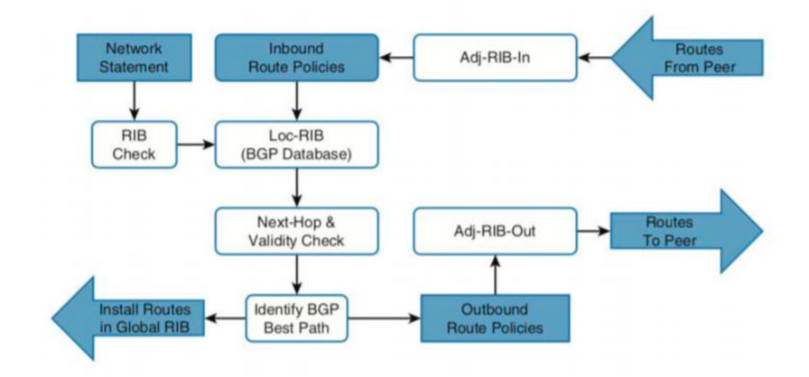
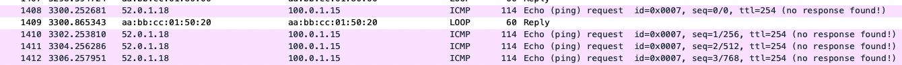
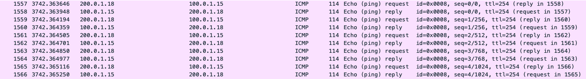
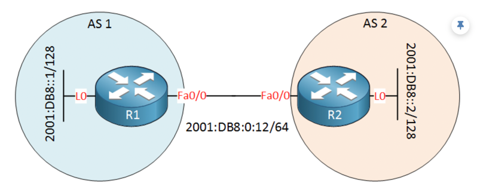
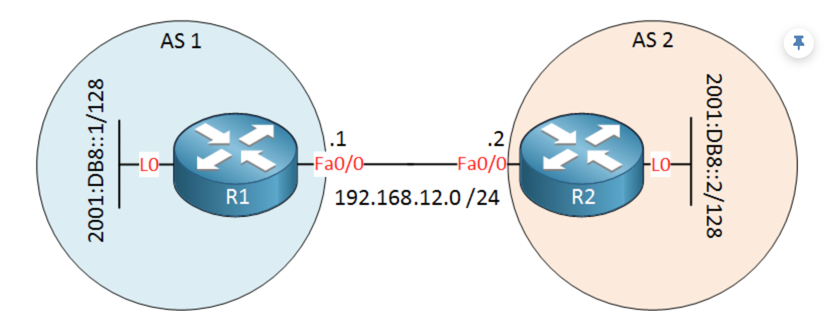

## BGP. Основы

### Цель
Настроить BGP между автономными системами<br>
Организовать доступность между офисами Москва и С.-Петербург<br>

В этой  самостоятельной работе мы ожидаем, что вы самостоятельно:

- Настроите eBGP между офисом Москва и двумя провайдерами - Киторн и Ламас.
- Настроите eBGP между провайдерами Киторн и Ламас.
- Настроите eBGP между Ламас и Триада.
- Настроите eBGP между офисом С.-Петербург и провайдером Триада.
- Организуете IP доступность между пограничным роутерами офисами Москва и С.-Петербург.


TL;DR<br>
[Примеры конфигов](https://github.com/gervold/otus-network-engineer/tree/main/labs/lab09/deploy/configs)


### Минимальная настройка

Анонс 100.0.0.0 с одной стороны:
```
router bgp 1001
 bgp router-id 101.0.0.14
 network 100.0.0.0 mask 255.255.255.0
 neighbor 101.0.0.22 remote-as 101
```

Прием анонсов с другой стороны:
```
router bgp 101
 bgp router-id 101.0.0.22
 neighbor 101.0.0.14 remote-as 1001
```

### Цепочки таблиц маршрутизации и команды



#### IPv4
```
show ip route
show ip route bgp
show ip bgp
show ip bgp summary
show ip bgp neighbors 30.0.0.15 advertised-routes
```

#### IPv6
```
show ipv6 route
show ipv6 route bgp
show bgp ipv6 unicast
show bgp ipv6 unicast summary
show bgp ipv6 unicast neighbors 2001:301:15:21::2 advertised-routes
```


### Проверка BGP-связности между Москвой и Питером

Маршруты со стороны Питера:
```
R18#show ip bgp
BGP table version is 5, local router ID is 52.0.1.18
Status codes: s suppressed, d damped, h history, * valid, > best, i - internal,
              r RIB-failure, S Stale, m multipath, b backup-path, f RT-Filter,
              x best-external, a additional-path, c RIB-compressed,
Origin codes: i - IGP, e - EGP, ? - incomplete
RPKI validation codes: V valid, I invalid, N Not found

     Network          Next Hop            Metric LocPrf Weight Path
 *>  100.0.0.0/24     52.0.1.24                              0 520 301 101 1001 i
 *>  100.0.1.0/24     52.0.1.24                              0 520 301 1001 i
 *>  200.0.0.0        0.0.0.0                  0         32768 i
 *>  200.0.1.0        0.0.0.0                  0         32768 i
```

Со стороны Москвы:
```
R14#show ip bgp
BGP table version is 8, local router ID is 101.0.0.14
Status codes: s suppressed, d damped, h history, * valid, > best, i - internal,
              r RIB-failure, S Stale, m multipath, b backup-path, f RT-Filter,
              x best-external, a additional-path, c RIB-compressed,
Origin codes: i - IGP, e - EGP, ? - incomplete
RPKI validation codes: V valid, I invalid, N Not found

     Network          Next Hop            Metric LocPrf Weight Path
 *>  100.0.0.0/24     0.0.0.0                  0         32768 i
 *>  200.0.0.0        101.0.0.22                             0 101 301 520 2042 i
 *>  200.0.1.0        101.0.0.22                             0 101 301 520 2042 i
```

Отмему, что R14 получает маршруты через стык между Киторн (AS101) и Ламас (AS301), так как сессия между Киторн (AS101) и Триада (AS520) не поднята, по условию.

```
R15#show ip bgp
BGP table version is 8, local router ID is 30.0.0.15
Status codes: s suppressed, d damped, h history, * valid, > best, i - internal,
              r RIB-failure, S Stale, m multipath, b backup-path, f RT-Filter,
              x best-external, a additional-path, c RIB-compressed,
Origin codes: i - IGP, e - EGP, ? - incomplete
RPKI validation codes: V valid, I invalid, N Not found

     Network          Next Hop            Metric LocPrf Weight Path
 *>  100.0.1.0/24     0.0.0.0                  0         32768 i
 *>  200.0.0.0        30.0.0.21                              0 301 520 2042 i
 *>  200.0.1.0        30.0.0.21                              0 301 520 2042 i
```

### Проверка доступности (ping) между Москвой и Питером

Проверим доступность между бордерами.  

```
R18#ping 100.0.1.15 source 200.0.0.18
Type escape sequence to abort.
Sending 5, 100-byte ICMP Echos to 100.0.1.15, timeout is 2 seconds:
Packet sent with a source address of 200.0.0.18
!!!!!
Success rate is 100 percent (5/5), round-trip min/avg/max = 1/1/1 ms
```
```
R18#traceroute 100.0.1.15 source 200.0.0.18
Type escape sequence to abort.
Tracing the route to 100.0.1.15
VRF info: (vrf in name/id, vrf out name/id)
  1 52.0.1.24 0 msec 1 msec 0 msec
  2 52.0.0.21 0 msec 0 msec 0 msec
  3 30.0.0.15 1 msec 1 msec *
```

<details>

<summary> Для Москвы – аналогично </summary>

```
R14#ping 200.0.0.18 source 100.0.0.14
Type escape sequence to abort.
Sending 5, 100-byte ICMP Echos to 200.0.0.18, timeout is 2 seconds:
Packet sent with a source address of 100.0.0.14
!!!!!
Success rate is 100 percent (5/5), round-trip min/avg/max = 1/1/2 ms
R14#
```

```
R15#ping 200.0.1.18 source 100.0.1.15
Type escape sequence to abort.
Sending 5, 100-byte ICMP Echos to 200.0.1.18, timeout is 2 seconds:
Packet sent with a source address of 100.0.1.15
!!!!!
Success rate is 100 percent (5/5), round-trip min/avg/max = 1/1/1 ms
```

</details>

Отмечу, что если не указывать source, то ICMP-ответы не найдут своего получателя,
так как путей до адреса бордера в таблицах маршрутизации нет.

Например 
```
R18#ping 100.0.1.15
Type escape sequence to abort.
Sending 5, 100-byte ICMP Echos to 100.0.1.15, timeout is 2 seconds:
.....
Success rate is 0 percent (0/5)
```



Так как R15 понятия не имеет, где находится сеть с адресом бордера `52.0.1.18`.

<details> 

<summary> R15# show ip route </summary>

```
R15#show ip route
Codes: L - local, C - connected, S - static, R - RIP, M - mobile, B - BGP
       D - EIGRP, EX - EIGRP external, O - OSPF, IA - OSPF inter area
       N1 - OSPF NSSA external type 1, N2 - OSPF NSSA external type 2
       E1 - OSPF external type 1, E2 - OSPF external type 2
       i - IS-IS, su - IS-IS summary, L1 - IS-IS level-1, L2 - IS-IS level-2
       ia - IS-IS inter area, * - candidate default, U - per-user static route
       o - ODR, P - periodic downloaded static route, H - NHRP, l - LISP
       a - application route
       + - replicated route, % - next hop override

Gateway of last resort is not set

      10.0.0.0/8 is variably subnetted, 6 subnets, 2 masks
C        10.0.1.0/24 is directly connected, Ethernet0/1
L        10.0.1.15/32 is directly connected, Ethernet0/1
C        10.0.2.0/24 is directly connected, Ethernet0/0
L        10.0.2.15/32 is directly connected, Ethernet0/0
C        10.0.3.0/24 is directly connected, Ethernet0/3
L        10.0.3.15/32 is directly connected, Ethernet0/3
      30.0.0.0/8 is variably subnetted, 2 subnets, 2 masks
C        30.0.0.0/24 is directly connected, Ethernet0/2
L        30.0.0.15/32 is directly connected, Ethernet0/2
      100.0.0.0/8 is variably subnetted, 2 subnets, 2 masks
C        100.0.1.0/24 is directly connected, Loopback1
L        100.0.1.15/32 is directly connected, Loopback1
B     200.0.0.0/24 [20/0] via 30.0.0.21, 00:42:16
B     200.0.1.0/24 [20/0] via 30.0.0.21, 00:42:16
```

</details>


Но про анонсируемые по BGP сети знает:
```
R15#show ip route bgp

B     200.0.0.0/24 [20/0] via 30.0.0.21, 00:45:38
B     200.0.1.0/24 [20/0] via 30.0.0.21, 00:45:38
```

Поэтому адрес спуфили:
```
R18#ping 100.0.1.15 source 200.0.1.18
Type escape sequence to abort.
Sending 5, 100-byte ICMP Echos to 100.0.1.15, timeout is 2 seconds:
Packet sent with a source address of 200.0.1.18
!!!!!
Success rate is 100 percent (5/5), round-trip min/avg/max = 1/1/1 ms
```




### Настройка IPv6 сессий

Для настройки передачи IPv6 префиксов используется MP-BGP с указанием `address-family`.

Возможность установить MP-BGP сессию двумя способами:
- IPv6 ребро через которое идут IPv6 префиксы
- IPv4 ребро через которые идут IPv6 префиксы

<details>
<summary>
Картинки
</summary>

IPv6 ребро через которое идут IPv6 префиксы


IPv4 ребро через которые идут IPv6 префиксы


</details>

Для указания специфичных настроек для IPv4 и IPv6 (например, ребер и сетей) используется 
клюяевое слово `address-family'. 

Пример конфигурации с использованием `address-family` для передачи IPv6 префиксов через IPv6 соседа (типичная конфигурация):

```
!
router bgp 1001
 bgp router-id 101.0.0.14
 bgp log-neighbor-changes
 neighbor 101.0.0.22 remote-as 101
 neighbor 2001:101:14:22::2 remote-as 101
  !
 address-family ipv4
   network 100.0.0.0 mask 255.255.255.0
   neighbor 101.0.0.21 activate
   no neighbor 2001:101:14:22::2 activate
 exit-address-family
 !
 address-family ipv6
  network 2001:1001:0:100::14/128
  neighbor 2001:101:14:22::2 activate
 exit-address-family
!
```

При помощи `no neighbor` и `activate` задаем ребро для передачи префиксов. 

<details> 

<summary>
Особенности случая, когда хотим распространять IPv6 префиксы через IPv4 соседа. 
</summary>

Про настройку можно почитать [тут](https://networklessons.com/bgp/multiprotocol-bgp-mp-bgp-configuration#MP-BGP_with_IPv4_adjacency_IPv6_prefixes).

При указании IPv4 соседа он и будет подставляться как nexthop, но в невалидном формате.
Примерно в таком – ` ::FFFF:192.168.0.21`.
Соответственно полученные маршруты не пройдут проверку валидности nexthop (см. таблицу выше) и не распространены. 


Для исправления этого можно настроить `route-map IPV6_NEXT_HOP in` подменяющую nexthop на валидный. 


```
R22#show bgp ipv6 unicast summary
BGP router identifier 101.0.0.22, local AS number 101
BGP table version is 2, main routing table version 2
4 network entries using 656 bytes of memory
4 path entries using 416 bytes of memory
3/1 BGP path/bestpath attribute entries using 432 bytes of memory
3 BGP AS-PATH entries using 72 bytes of memory
0 BGP route-map cache entries using 0 bytes of memory
0 BGP filter-list cache entries using 0 bytes of memory
BGP using 1576 total bytes of memory
BGP activity 8/0 prefixes, 8/0 paths, scan interval 60 secs

Neighbor        V           AS MsgRcvd MsgSent   TblVer  InQ OutQ Up/Down  State/PfxRcd
2001:101:14:22::1
                4         1001      39      39        2    0    0 00:31:49        1
192.168.0.21    4          301      43      42        2    0    0 00:31:44        3
R22#
R22#
R22#show bgp ipv6 unicast
BGP table version is 2, local router ID is 101.0.0.22
Status codes: s suppressed, d damped, h history, * valid, > best, i - internal,
              r RIB-failure, S Stale, m multipath, b backup-path, f RT-Filter,
              x best-external, a additional-path, c RIB-compressed,
Origin codes: i - IGP, e - EGP, ? - incomplete
RPKI validation codes: V valid, I invalid, N Not found

     Network          Next Hop            Metric LocPrf Weight Path
 *>  2001:1001:0:100::14/128
                       2001:101:14:22::1
                                                0             0 1001 i
 *   2001:1001:0:101::15/128
                       ::FFFF:192.168.0.21
                                                              0 301 1001 i
 *   2001:2024:0:200::18/128
                       ::FFFF:192.168.0.21
                                                              0 301 520 2042 i
 *   2001:2024:0:201::18/128
                       ::FFFF:192.168.0.21
                                                              0 301 520 2042 i
R22#
```

</details>

<details>
<summary>
Про AFI и SAFI аттрибуты
</summary>

MP-BGP is also used for MPLS VPN where we use MP-BGP to exchange the VPN labels.

To allow these new addresses, MBGP has some new features that the old BGP doesn’t have:

- Address Family Identifier (AFI): specifies the address family.
- Subsequent Address Family Identifier (SAFI): Has additional information for some address families.
- Multiprotocol Unreachable Network Layer Reachability Information (MP_UNREACH_NLRI): This is an attribute used to transport networks that are unreachable.
</details>


### Тест для IPv6

Не забываем source для того, чтобы подставить адрес Loopback-а (изветной сети). 

```
R18#ping 2001:1001:0:101::15 source 2001:2024:0:200::18
Type escape sequence to abort.
Sending 5, 100-byte ICMP Echos to 2001:1001:0:101::15, timeout is 2 seconds:
Packet sent with a source address of 2001:2024:0:200::18
!!!!!
Success rate is 100 percent (5/5), round-trip min/avg/max = 1/4/18 ms
R18#

R18#ping 2001:1001:0:101::15 source 2001:2024:0:201::18
Type escape sequence to abort.
Sending 5, 100-byte ICMP Echos to 2001:1001:0:101::15, timeout is 2 seconds:
Packet sent with a source address of 2001:2024:0:201::18
!!!!!
Success rate is 100 percent (5/5), round-trip min/avg/max = 1/1/1 ms
```

```
R15#ping 2001:2024:0:201::18 source 2001:1001:0:101::15
Type escape sequence to abort.
Sending 5, 100-byte ICMP Echos to 2001:2024:0:201::18, timeout is 2 seconds:
Packet sent with a source address of 2001:1001:0:101::15
!!!!!
Success rate is 100 percent (5/5), round-trip min/avg/max = 1/2/10 ms
R15#

R15#ping 2001:2024:0:200::18 source 2001:1001:0:101::15
Type escape sequence to abort.
Sending 5, 100-byte ICMP Echos to 2001:2024:0:200::18, timeout is 2 seconds:
Packet sent with a source address of 2001:1001:0:101::15
!!!!!
Success rate is 100 percent (5/5), round-trip min/avg/max = 1/1/1 ms
```

