## iBGP

### Цель:
- Настроить iBGP в офисе Москва
- Настроить iBGP в сети провайдера Триада
- Организовать полную IP связанность всех сетей 

### Описание/Пошаговая инструкция выполнения домашнего задания:
В этой  самостоятельной работе мы ожидаем, что вы самостоятельно:

- Настроите iBGP в офисом Москва между маршрутизаторами R14 и R15.
- Настроите iBGP в провайдере Триада.
- Настройте офиса Москва так, чтобы приоритетным провайдером стал Ламас.
- Настройте офиса С.-Петербург так, чтобы трафик до любого офиса распределялся по двум линкам одновременно.
- Все сети в лабораторной работе должны иметь IP связность.


### Общая информация

<details>

<summary>Минимальная настройка</summary>

Указываем тот же AS + `update-source`:

```
router bgp 1001
 bgp router-id 101.0.0.14
 neighbor 15.15.15.15 remote-as 1001
 neighbor 15.15.15.15 update-source Loopback0
```

</details>

<details>

<summary>Полезные команды</summary>

В основном, те же что и в лабе 9.

```
clear ip bgp *
show ip bgp summary
show ip bgp 
show ip route bgp

show ipv6 route
show ipv6 route bgp

и тд.
```

</details>

<details>

<summary>Общая информация</summary>

**Зачем вообще нужен iBGP?**

- Резервирование и синхронизация маршрутной информации между внутренними бордерами, перед передачей внешним (eBGP) соседям.
  OSPF/EIGRP/ISIS использовать не рекомендуется – они не могут работать с таким количеством маршрутов.
- Я транзитный провайдер (много роутеров) и мне нужно подключить клиента (передать full view)
- Управление точкой выхода исходящего трафика из AS


iBGP часто настраивают на Loopback-адресах, чтобы не привязываться к физическим.
В случае поломки физического линка все BGP-сессии на нем – разрываются.
В случае использования Loopback-адреса, для установки BGP сессии, – можно перестроиться на резервный физический интерфейс.
Тоесть надежность повышается.

**Основные моменты:**
- `next-hop` и `AS_PATH` внутри iBGP не изменяется. В iBGP `next-hop` указывает адрес выхода из АС.
- всегда `full mesh` и маршруты полученные от соседа не анонсируются дальше
- выставлен `multihop != 1`, так как часто используются Loopback-адреса.

<details> 
<summary>Full Mesh в iBGP</summary> 

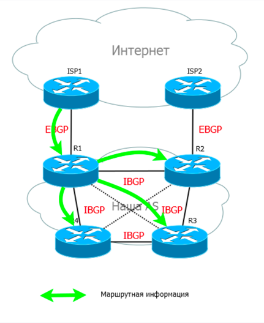

</details>

</details>


<details>

<summary> Про next-hop и IP-связанность в iBGP </summary>

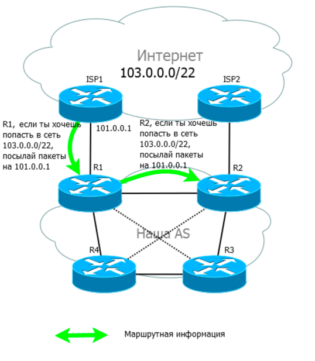

R2 может не знать о `101.0.0.1` и маршрут не будет добавлен.
Поэтому нужны либо статические правила, либо какой-либо IGP протокол.
Ниже см. про hext-hop-self

</details>


### Выполнение

#### Настройка iBGP в офисе Москвы между маршрутизаторами R14 и R15

Добавим IP адреса `14.14.14.14` и `15.15.15.15` на лупбеки R14 и R15:

```
R15(config)#int Loopback 0
R15(config-if)#ip address 15.15.15.15 255.255.255.255
R15(config-if)#ip ospf 1 area 0
R15(config-if)#end
```

Попробуем установить BGP соседство "в лоб":
```
router bgp 1001
 neighbor 15.15.15.15 remote-as 1001
 !
```

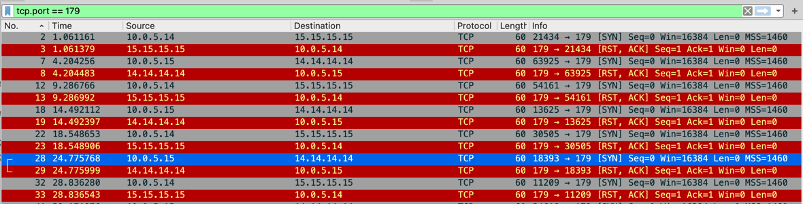

Видим, что BGP-сессия пытается установиться между соседями по IP адресам с интерфейса `Ethernet 1/0`, 
а не по IP адресам с Loopback-ов, которые мы и задавали в конфиге.

Для того, чтобы указать роутеру использовать адрес с другово интерфейса выполним команду `update-source Loopback0`.<br>

Для R14 будут следующие команды:
```
router bgp 1001
 neighbor 15.15.15.15 remote-as 1001
 neighbor 15.15.15.15 update-source Loopback0
 !
``` 

IP адреса поменялись на `Loopback`-адреса, сессия установилась:

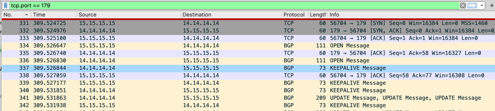

  
```
R14#show ip bgp summary
***
Neighbor        V           AS MsgRcvd MsgSent   TblVer  InQ OutQ Up/Down  State/PfxRcd
15.15.15.15     4         1001      10      10        5    0    0 00:04:19        3
101.0.0.22      4          101    1706    1699        5    0    0 1d01h           2
```


### Настройка iBGP в Триаде

Сначала настроим аналогично R14, R15, сделаем Full Mesh:
```
R23#show ip bgp summary
***
Neighbor        V           AS MsgRcvd MsgSent   TblVer  InQ OutQ Up/Down  State/PfxRcd
24.24.24.24     4          520       8       5        3    0    0 00:02:08        4
25.25.25.25     4          520       5       5        3    0    0 00:02:04        0
26.26.26.26     4          520       6       5        3    0    0 00:02:02        2
```

```
R26#show ip bgp su
R26#show ip bgp summary

Neighbor        V           AS MsgRcvd MsgSent   TblVer  InQ OutQ Up/Down  State/PfxRcd
23.23.23.23     4          520       6       7        3    0    0 00:03:20        0
24.24.24.24     4          520       9       7        3    0    0 00:03:21        4
25.25.25.25     4          520       6       7        3    0    0 00:03:21        0
52.0.2.18       4         2042       8       6        3    0    0 00:03:34        2
```

После проделывания ручной работы – осознаем проблему. Проблема в том, что для каждого нового члена Full Mesh необходимо дублировать настройки.<br>
Для того чтобы упростить подключение новых пиров – объединим их в `peer-group`.

Задание `peer-group` на R23:
```
R23(config-router)#neighbor triada peer-group
R23(config-router)#neighbor triada remote-as 520
R23(config-router)#neighbor triada update-source Loopback0
```
Подключение новых пиров на R23:
```
R23(config-router)#neighbor 24.24.24.24 peer-group triada
R23(config-router)#neighbor 25.25.25.25 peer-group triada
R23(config-router)#neighbor 26.26.26.26 peer-group triada
```

Количество строк в конфиге не изменилось, но теперь подключать новых пиров будет легче :)

Попробуем упростить настройки, разорвем Full Mesh.

<details> 

<summary> Про next-hop-self </summary>

Если мы наблюдаем проблемы с распространением анонсов и выбором их как `best`.<br>
Возможная проблема в том, что iBGP не изменяет hext-hop и iBGP соседи не всегда могут найти через кого выходить по eBGP на нужный префикс.<br>
Поэтому на всех маршрутизаторах, кроме Route Reflector выставляем `next-hop-self`.
В этом случае next-hop изменится и для 

```
neighbor 1.1.1.1 next-hop-self
```

[Пример](https://networklessons.com/bgp/bgp-next-hop-self): 

недоступность префикса `3.3.3.0/24`, так как `R1` не знает о полученном next-hop-е `192.168.23.3`.
Соответственно R1 не может положить префикс в свою таблицу маршрутизации.
Нормальным `next-hop`-ом будет `192.168.0.23.2`, для того чтобы его выставить и нужно использовать команду `next-hop-self`.

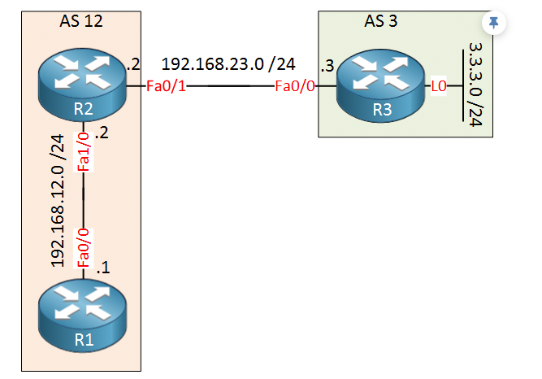

</details>

### Настройка Route Reflector в Триаде

`Route Reflector` – в какой-то степени аналог DR в OSPF (ниже понятно будет, что за DR).

<details>

<summary> Прикольные картинки про RR </summary>

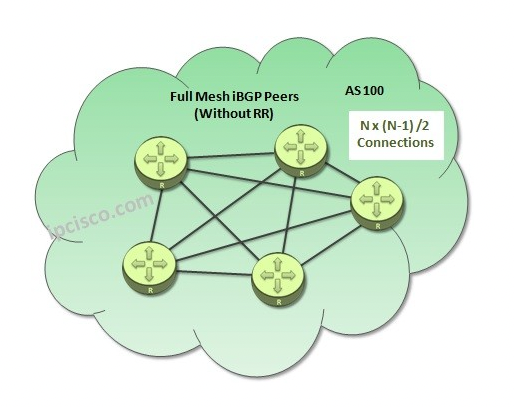

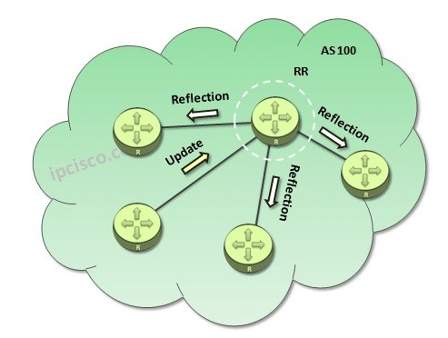
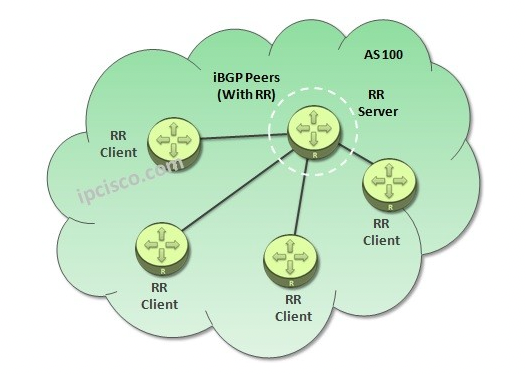

</details>


Настроим R23 как RR-server:
````
!
router bgp 520
 bgp router-id 23.23.23.23
 bgp log-neighbor-changes
 neighbor RR-TRIADA peer-group
 neighbor RR-TRIADA remote-as 520
 neighbor RR-TRIADA update-source Loopback0
 neighbor RR-TRIADA route-reflector-client
 neighbor 24.24.24.24 peer-group RR-TRIADA
 neighbor 25.25.25.25 peer-group RR-TRIADA
 neighbor 26.26.26.26 peer-group RR-TRIADA
!
````

Заметим, что тут нет `next-hop-self`, так как в этом случае RR стянет на себя трафик,
так как будет рефлектить полученные от пиров `updates` и подставлять им свой IP.

Настройка R24 (R25,R26 – аналогично):
```
!
router bgp 520
 bgp router-id 24.24.24.24
 neighbor 23.23.23.23 remote-as 520
 neighbor 23.23.23.23 update-source Loopback0
 neighbor 23.23.23.23 next-hop-self
!
```

После проделанного мы имеем синхронизированные таблицы на всех маршрутизаторах:

<details>

<summary> одинаковые наборы префиксов </summary>

```
R23#show ip bgp
     Network          Next Hop            Metric LocPrf Weight Path
 *>i 100.0.0.0/24     24.24.24.24              0    100      0 301 1001 i
 *>i 100.0.1.0/24     24.24.24.24              0    100      0 301 1001 i
 * i 200.0.0.0        26.26.26.26              0    100      0 2042 i
 *>i                  24.24.24.24              0    100      0 2042 i
 * i 200.0.1.0        26.26.26.26              0    100      0 2042 i
 *>i                  24.24.24.24              0    100      0 2042 i
```

```
R24#show ip bgp
     Network          Next Hop            Metric LocPrf Weight Path
 *>  100.0.0.0/24     52.0.0.21                              0 301 1001 i
 *>  100.0.1.0/24     52.0.0.21                              0 301 1001 i
 *>  200.0.0.0        52.0.1.18                0             0 2042 i
 *>  200.0.1.0        52.0.1.18                0             0 2042 i
```

````
R25#show ip bgp
     Network          Next Hop            Metric LocPrf Weight Path
 *>i 100.0.0.0/24     24.24.24.24              0    100      0 301 1001 i
 *>i 100.0.1.0/24     24.24.24.24              0    100      0 301 1001 i
 *>i 200.0.0.0        24.24.24.24              0    100      0 2042 i
 *>i 200.0.1.0        24.24.24.24              0    100      0 2042 i
````

```
R26#show ip bgp

     Network          Next Hop            Metric LocPrf Weight Path
 *>i 100.0.0.0/24     24.24.24.24              0    100      0 301 1001 i
 *>i 100.0.1.0/24     24.24.24.24              0    100      0 301 1001 i
 * i 200.0.0.0        24.24.24.24              0    100      0 2042 i
 *>                   52.0.2.18                0             0 2042 i
 * i 200.0.1.0        24.24.24.24              0    100      0 2042 i
 *>                   52.0.2.18                0             0 2042 i
```
</details>


### Настройка приоритетного провайдера Ламас для офиса в Москве

Представим ситуацию, что трафик у одиного провайдера – дороже или хуже по качеству, чем у другово.
В нашем случае Ламас – "качественный" провайдер, а Киторн – "некачественный".<br>
Принимаем решение пустить трафик через провайдера Ламас, а Киторн оставим, как резервный канал. 

#### Начальные условия

Для илюстрации перенаправления проанонсируем с АС Киторн префикс `101.101.101.101`.

C R14 трафик идет на этот префикс напрямую:
```
R14#show ip route bgp

      100.0.0.0/8 is variably subnetted, 4 subnets, 2 masks
B        100.0.1.0/24 [200/0] via 15.15.15.15, 11:24:36
      101.0.0.0/8 is variably subnetted, 3 subnets, 2 masks
B        101.101.101.101/32 [20/0] via 101.0.0.22, 00:00:40
B     200.0.0.0/24 [200/0] via 15.15.15.15, 00:18:58
B     200.0.1.0/24 [200/0] via 15.15.15.15, 00:18:58
R14#

R14#trace 101.101.101.101
Type escape sequence to abort.
Tracing the route to 101.101.101.101
VRF info: (vrf in name/id, vrf out name/id)
  1 101.0.0.22 1 msec 1 msec *
```


#### Исходящий трафик

**Local Preference** – используется для управления исходящим трафиком за пределы АС. 
Можно выбирать роутер, через который трафик будет покидать АС.

LP работает внутри АС, между АС он не передается.<br>
На Cisco по умолчанию = 100, чем больше, тем больше приоритет.<br>

<details>

<summary> иллюстрация работы LP </summary>

LP – указывает маршрутизаторам внутри автономной системы как выйти за её пределы.
Выбирается та точка выхода у которой значение атрибута больше.

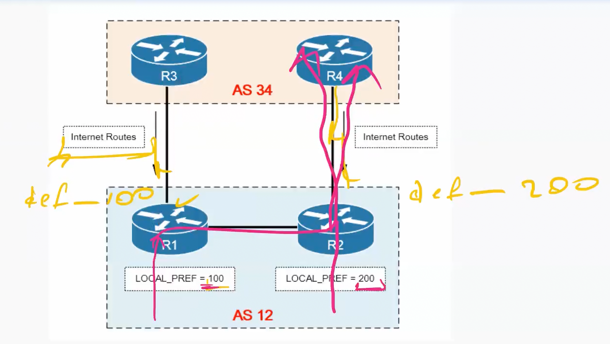

</details>

Для того, что бы изменить значение Local Preference, можно использовать два варианта: 
- `bgp default local-preference` 
- `route-map` 

Выберем первый. Увеличим LP на R15 (сделаем R15 предпочтительной точкой выхода):
```
R15(config)#router bgp 1001
R15(config-router)#bgp default local-preference 200
```

Видим, что маршруты к `101.101.101.101` пошли через iBGP соседа `15.15.15.15`:
```
R14#show ip route bgp
***
      100.0.0.0/8 is variably subnetted, 4 subnets, 2 masks
B        100.0.1.0/24 [200/0] via 15.15.15.15, 11:47:50
      101.0.0.0/8 is variably subnetted, 3 subnets, 2 masks
B        101.101.101.101/32 [200/0] via 15.15.15.15, 00:01:31
B     200.0.0.0/24 [200/0] via 15.15.15.15, 00:42:12
B     200.0.1.0/24 [200/0] via 15.15.15.15, 00:42:12
```

Трассировка подтверждает, что исходящий трафик пошел через Ламас (`30.0.0.21`):

```
R14#trace 101.101.101.101 source 100.0.0.14
Type escape sequence to abort.
Tracing the route to 101.101.101.101
VRF info: (vrf in name/id, vrf out name/id)
  1 10.0.5.15 1 msec 1 msec 0 msec
  2 30.0.0.21 0 msec 1 msec 0 msec
  3 192.168.0.22 1 msec 1 msec *
```

С другой стороны, по стыку между R14 и R22 все равно будет течь трафик – входящий.

Выполнив пинг с R14 в сторону Киторн (R22) можно видеть:

```
R14#ping 101.101.101.101 source 100.0.0.14
Type escape sequence to abort.
Sending 5, 100-byte ICMP Echos to 101.101.101.101, timeout is 2 seconds:
Packet sent with a source address of 100.0.0.14
!!!!!
Success rate is 100 percent (5/5), round-trip min/avg/max = 1/1/1 ms
```

Запросы – на стыке между R14, R15, далее Ламас и Киторн (R22):


Ответы – на стыке между R14,R22 (напрямую):
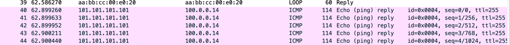

Тоесть мы начали наблюдать ассиметрию BGP маршрутов для входящего и исходящего трафиков:

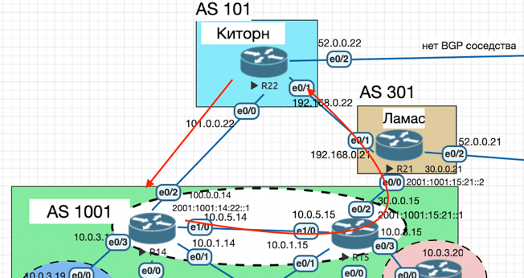

#### Входящий трафик (Prepend)

Для того чтобы полностью перенаправить трафик через Ламас попробуем выставить `prepend` от R14 в сторону R22.

Смотрим на маршруты к AS1001, до настройки препенда:
```
R22#show ip bgp

     Network          Next Hop            Metric LocPrf Weight Path
 *   100.0.0.0/24     192.168.0.21                           0 301 1001 i
 *>                   101.0.0.14               0             0 1001 i
 *   100.0.1.0/24     192.168.0.21                           0 301 1001 i
 *>                   101.0.0.14                             0 1001 i
 *>  101.101.101.101/32
                       0.0.0.0                  0         32768 i
 *   200.0.0.0        101.0.0.14                             0 1001 301 520 2042 i
 *>                   192.168.0.21                           0 301 520 2042 i
 *   200.0.1.0        101.0.0.14                             0 1001 301 520 2042 i
 *>                   192.168.0.21                           0 301 520 2042 i
R22#
```

Настраиваем препенд при помощи `route-map`:

```
route-map AS-PREP permit 10
 set as-path prepend 1001 1001 1001 1001 1001
!
```
```
neighbor 101.0.0.22 route-map AS-PREP out
```


Смотрим на изменение в `best`-путях (выбраны самые короткие, которые через Ламас):
```
R22#show ip bgp

     Network          Next Hop            Metric LocPrf Weight Path
 *>  100.0.0.0/24     192.168.0.21                           0 301 1001 i
 *                    101.0.0.14               0             0 1001 1001 1001 1001 1001 1001 i
 *>  100.0.1.0/24     192.168.0.21                           0 301 1001 i
 *                    101.0.0.14                             0 1001 1001 1001 1001 1001 1001 i
 *>  101.101.101.101/32
                       0.0.0.0                  0         32768 i
 *   200.0.0.0        101.0.0.14                             0 1001 1001 1001 1001 1001 1001 301 520 2042 i
 *>                   192.168.0.21                           0 301 520 2042 i
 *   200.0.1.0        101.0.0.14                             0 1001 1001 1001 1001 1001 1001 301 520 2042 i
 *>                   192.168.0.21                           0 301 520 2042 i
```

Теперь весь трафик от Киторна будет идти через Ламас (`via 192.168.0.21`):
```
R22#show ip route bgp

      100.0.0.0/24 is subnetted, 2 subnets
B        100.0.0.0 [20/0] via 192.168.0.21, 00:01:54
B        100.0.1.0 [20/0] via 192.168.0.21, 00:01:54
B     200.0.0.0/24 [20/0] via 192.168.0.21, 00:13:16
B     200.0.1.0/24 [20/0] via 192.168.0.21, 00:13:16
```

Для достоверности, сделаем трассировку от Киторна в Москву (на R14):
```
R22#trace 100.0.0.14 source 101.101.101.101
Type escape sequence to abort.
Tracing the route to 100.0.0.14
VRF info: (vrf in name/id, vrf out name/id)
  1 192.168.0.21 0 msec 1 msec 0 msec
  2 30.0.0.15 1 msec 0 msec 0 msec
  3 10.0.5.14 1 msec 0 msec *
```

Маршруты стали симметричны.


### Настройка балансировки в СПБ

Настроим офис Санкт-Петербурга так, чтобы трафик до любого офиса распределялся по двум линкам одновременно.

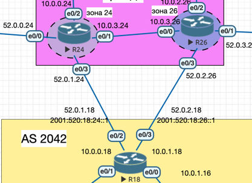

Балансировку будем выполнять при помощи команды: `maximum-paths`.
Посмотрим маршруты до:

```
R18#show ip bgp

     Network          Next Hop            Metric LocPrf Weight Path
 *   100.0.0.0/24     52.0.1.24                              0 520 301 1001 i
 *>                   52.0.2.26                              0 520 301 1001 i
 *   100.0.1.0/24     52.0.1.24                              0 520 301 1001 i
 *>                   52.0.2.26                              0 520 301 1001 i
 *   101.101.101.101/32
                       52.0.2.26                              0 520 301 101 i
 *>                   52.0.1.24                              0 520 301 101 i
 *>  200.0.0.0        0.0.0.0                  0         32768 i
 *>  200.0.1.0        0.0.0.0                  0         32768 i
```

Вводим ``` maximum-paths 2 ``` и смягчающую ограничения `bgp bestpath as-path multipath-relax`.

Проверяем, видим по два маршрута на исходящий трафик:

```
R18#show ip bgp

     Network          Next Hop            Metric LocPrf Weight Path
 *m  100.0.0.0/24     52.0.1.24                              0 520 301 1001 i
 *>                   52.0.2.26                              0 520 301 1001 i
 *m  100.0.1.0/24     52.0.1.24                              0 520 301 1001 i
 *>                   52.0.2.26                              0 520 301 1001 i
 *m  101.101.101.101/32
                       52.0.2.26                              0 520 301 101 i
 *>                   52.0.1.24                              0 520 301 101 i
 *>  200.0.0.0        0.0.0.0                  0         32768 i
 *>  200.0.1.0        0.0.0.0                  0         32768 i
```

```
R18#show ip route bgp

      100.0.0.0/24 is subnetted, 2 subnets
B        100.0.0.0 [20/0] via 52.0.2.26, 00:01:23
                   [20/0] via 52.0.1.24, 00:01:23
B        100.0.1.0 [20/0] via 52.0.2.26, 00:01:23
                   [20/0] via 52.0.1.24, 00:01:23
      101.0.0.0/32 is subnetted, 1 subnets
B        101.101.101.101 [20/0] via 52.0.2.26, 00:01:23
                         [20/0] via 52.0.1.24, 00:01:23
```

### Все сети в лабораторной работе должны иметь IP связность.

Пропингуем с VPC1 (Москва) VPC8 (Питер) и обратно.
 
После нескольких фиксов (см. коммиты) – связь была установлена.

```
VPCS> show ip

NAME        : VPCS[1]
IP/MASK     : 200.0.0.8/24
GATEWAY     : 200.0.0.1
DNS         :
MAC         : 00:50:79:66:68:08
LPORT       : 20000
RHOST:PORT  : 127.0.0.1:30000
MTU         : 1500

VPCS> ping 100.0.0.10

84 bytes from 100.0.0.10 icmp_seq=1 ttl=56 time=1.524 ms
84 bytes from 100.0.0.10 icmp_seq=2 ttl=56 time=1.679 ms
84 bytes from 100.0.0.10 icmp_seq=3 ttl=56 time=1.547 ms
84 bytes from 100.0.0.10 icmp_seq=4 ttl=56 time=1.745 ms
84 bytes from 100.0.0.10 icmp_seq=5 ttl=56 time=1.704 ms
```

```
Checking for duplicate address...
PC1 : 100.0.0.10 255.255.255.0 gateway 100.0.0.1
PC1 : 2001:1001:0:100::10/64

VPCS> ping 200.0.0.8

84 bytes from 200.0.0.8 icmp_seq=1 ttl=56 time=2.459 ms
84 bytes from 200.0.0.8 icmp_seq=2 ttl=56 time=1.623 ms
84 bytes from 200.0.0.8 icmp_seq=3 ttl=56 time=1.665 ms
```

<details>

<summary> и еще немного </summary>

```
PC1 : 100.0.1.7 255.255.255.0 gateway 100.0.1.1
PC1 : 2001:1001:0:101::7/64

VPCS> ping 200.0.0.8

84 bytes from 200.0.0.8 icmp_seq=1 ttl=56 time=2.200 ms
84 bytes from 200.0.0.8 icmp_seq=2 ttl=56 time=1.752 ms
84 bytes from 200.0.0.8 icmp_seq=3 ttl=56 time=1.818 ms
^C

VPCS> ping 200.0.1.11

84 bytes from 200.0.1.11 icmp_seq=1 ttl=57 time=2.622 ms
84 bytes from 200.0.1.11 icmp_seq=2 ttl=57 time=1.633 ms
84 bytes from 200.0.1.11 icmp_seq=3 ttl=57 time=1.613 ms
84 bytes from 200.0.1.11 icmp_seq=4 ttl=57 time=1.627 ms
```

</details>