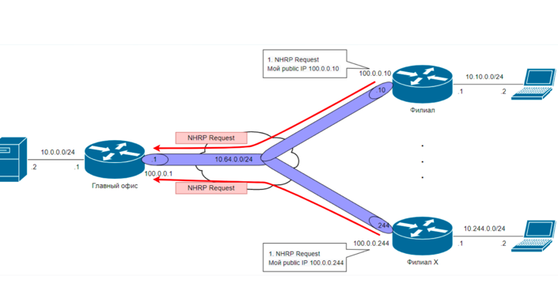
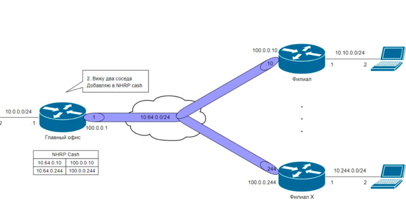
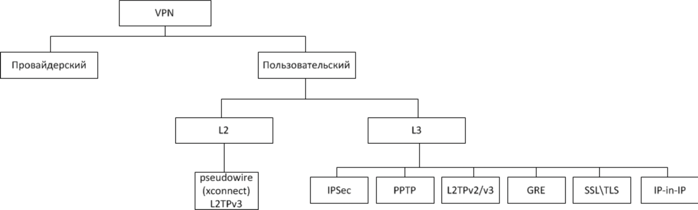
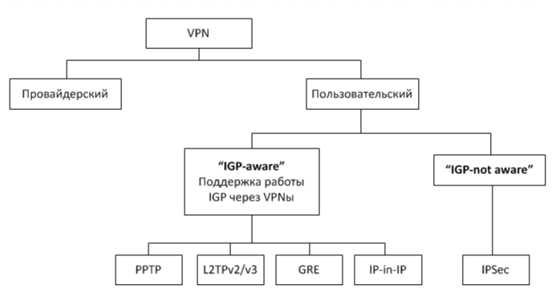
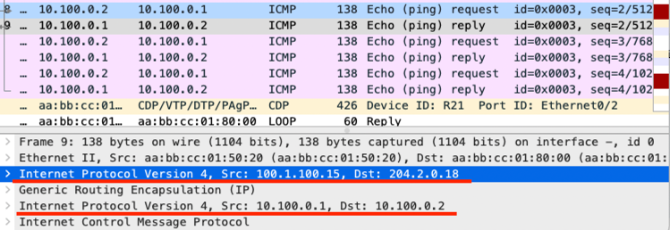
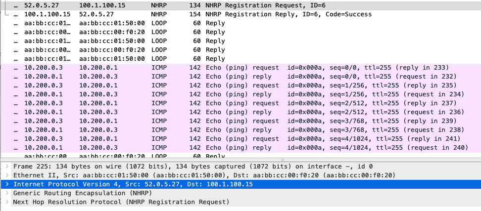

## Настройка VPN. GRE. DmVPN

### Цель:  
- Настроить GRE между офисами Москва и С.-Петербург
- Настроить DMVPN между офисами Москва и Чокурдах, Лабытнанги

### Описание/Пошаговая инструкция выполнения домашнего задания:
В этой самостоятельной работе мы ожидаем, что вы самостоятельно:

- Настроите GRE между офисами Москва и С.-Петербург.
- Настроите DMVMN между Москва и Чокурдах, Лабытнанги.
- Все узлы в офисах в лабораторной работе должны иметь IP связность.

<details>

<summary> Описание </summary>

`VPN` (Virtual Private Network) — обобщённое название технологий, позволяющих обеспечить одно или несколько сетевых соединений (логическую сеть) поверх другой сети.

VPN не работает с `IS-IS`, так как IS-IS работает поверх канального уровня модели OSI, а не поверх IP.


`GRE` (Generic Routing Encapsulation) – протокол инкапсуляции для создания тоннелей. Сам по себе GRE не обеспечивает никакой безопасности передаваемых данных – это site-to-site VPN тоннель в чистом виде. Используется обычно такой тоннель, когда есть специфичные задачи, связанные с маршрутизацией и нет требований к безопасности. Не стоит забывать, что чистый GRE тоннель – не нагружает оборудование, а нагрузка при шифровании большого объёма данных весьма существенна.

`DMVPN` (Dynamic Multipoint Virtual Private Network – динамическая многоточечная виртуальная частная сеть) — технология для создания виртуальных частных сетей, разработанная Cisco Systems (Соответственно DMVPN отлично работает с EIGRP). Является дальнейшим развитием VPN, и основывается на совместной работе протоколов разрешения шлюза NHRP, протокола туннелирования mGRE, шифрования IPSec и протоколов динамической маршрутизации: OSPF, ODR, RIP, EIGRP, BGP.

`NHRP` (Next Hop Resolution Protocol) – Позволяет динамически установить соединения. Формирует таблицу соответствия реальных адресов и виртуальных. Таблица хранится на HUB маршрутизаторе
. Как только Spoke регистрируется на HUB, его данные попадают в таблицу NHRP и могут анонсироваться другим Spoke.

<details>

<summary> Про NHRP и HUB-SPOKE </summary>





</details>

<details> 

<summary> Типы VPN </summary>

[Источник схем](https://habr.com/ru/post/246281/)

Распределение по модели OSI:


Схема VPN-ов относительно возможности пропуска мультикаста и работы протоколов маршрутизации: 


</details>


</details>

### GRE между офисами Москва и С.-Петербург

Перед созданием туннелей проверим IP связность:

```
R18#ping 100.1.100.14 source 204.2.0.6
Type escape sequence to abort.
Sending 5, 100-byte ICMP Echos to 100.1.100.14, timeout is 2 seconds:
Packet sent with a source address of 204.2.0.6
!!!!!
Success rate is 100 percent (5/5), round-trip min/avg/max = 1/1/1 ms

R18#ping 100.1.100.15 source 204.2.0.6
Type escape sequence to abort.
Sending 5, 100-byte ICMP Echos to 100.1.100.15, timeout is 2 seconds:
Packet sent with a source address of 204.2.0.6
!!!!!
Success rate is 100 percent (5/5), round-trip min/avg/max = 1/1/1 ms
```

Далее настроим маршрутизаторы в Москве:

R15
```
conf t
!
interface tunnel 100
 tunnel mode gre ip
 ip address 10.100.0.1 255.255.255.252
 tunnel destination 204.2.0.18
 tunnel source 100.1.100.15
 ip mtu 1400
 ip tcp adjust-mss 1360 
 exit
exit
```

R14:

<details>

```
conf t
!
interface tunnel 101
 tunnel mode gre ip
 ip address 10.100.1.1 255.255.255.252
 tunnel destination 204.2.0.18
 tunnel source 100.1.100.14
 ip mtu 1400
 ip tcp adjust-mss 1360
 
 exit
exit
```

</details>

И Питере:

R18
```
conf t
!
interface tunnel 100
 tunnel mode gre ip
 ip address 10.100.0.2 255.255.255.252
 tunnel destination 100.1.100.15
 tunnel source 204.2.0.18
 ip mtu 1400
 ip tcp adjust-mss 1360
 exit
exit


interface tunnel 101
 tunnel mode gre ip
 ip address 10.100.1.2 255.255.255.252
 tunnel destination 100.1.100.14
 tunnel source 204.2.0.18
 ip mtu 1400
 ip tcp adjust-mss 1360
 exit
exit

```

Проверим корректность создания туннелей:

```
R18#show ip int brief
Interface                  IP-Address      OK? Method Status                Protocol
Ethernet0/0                10.0.1.18       YES TFTP   up                    up
Ethernet0/1                10.0.0.18       YES TFTP   up                    up
Ethernet0/2                52.0.1.18       YES TFTP   up                    up
Ethernet0/3                52.0.2.18       YES TFTP   up                    up
Loopback1                  204.2.0.18      YES TFTP   up                    up
Loopback2                  200.0.1.18      YES TFTP   administratively down down
NVI0                       10.0.1.18       YES unset  up                    up
Tunnel100                  10.100.0.2      YES TFTP   up                    up
Tunnel101                  10.100.1.2      YES TFTP   up                    up```
```
```
R18#ping 10.100.0.1
Type escape sequence to abort.
Sending 5, 100-byte ICMP Echos to 10.100.0.1, timeout is 2 seconds:
!!!!!
Success rate is 100 percent (5/5), round-trip min/avg/max = 1/1/1 ms
```

Если посмотреть через промежуточного провайдера Ламас (R21), то можно видеть инкапсуляцию в виде двойного IP заголовка:



### Настроить DMVPN между офисами Москва и Чокурдах, Лабытнанги

Проверка связности:

```
R15#ping 52.0.5.27 source 100.1.100.15
Type escape sequence to abort.
Sending 5, 100-byte ICMP Echos to 52.0.5.27, timeout is 2 seconds:
Packet sent with a source address of 100.1.100.15
!!!!!
Success rate is 100 percent (5/5), round-trip min/avg/max = 1/1/1 ms
```

На R28 пропишем недостающую статику:
```
ip route 100.1.100.14 255.255.255.255 52.0.4.25
ip route 100.1.100.15 255.255.255.255 52.0.3.26
```

```
R15#ping 52.0.3.28 source 100.1.100.15
Type escape sequence to abort.
Sending 5, 100-byte ICMP Echos to 52.0.3.28, timeout is 2 seconds:
Packet sent with a source address of 100.1.100.15
!!!!!
Success rate is 100 percent (5/5), round-trip min/avg/max = 1/1/1 ms

R15#ping 52.0.4.28 source 100.1.100.15
Type escape sequence to abort.
Sending 5, 100-byte ICMP Echos to 52.0.4.28, timeout is 2 seconds:
Packet sent with a source address of 100.1.100.15
!!!!!
Success rate is 100 percent (5/5), round-trip min/avg/max = 1/1/1 ms
```

Объединять в виртуальную сеть будем следующим образом (для роутеров указаны connected-интерфейсы и роли):

Офис в Москве - `HUB`:
```
R14: 100.1.100.14
R15: 100.1.100.15 
```

Лабынтаги - `SPOKE`:
```
R27: 52.0.5.27
```

Чокурдах - `SPOKE`:
```
R28: 52.0.4.28, 52.0.3.28
```

Настроим R15 с ролью `HUB`:

```
interface Tunnel200
 no shutdown
 ip address 10.200.0.1 255.255.255.0
 no ip redirects
 ip mtu 1400
 ip nhrp map multicast dynamic
 ip nhrp network-id 200
 ip tcp adjust-mss 1360
 tunnel source 100.1.100.15
 tunnel mode gre multipoint
 tunnel key 200
!
```

`tunnel key` необходимо задать так как в Лабытнангах оба тунеля приземляются в один интерфейс.

R14 настраиваем аналогично.

Настроим R27 с ролью `SPOKE`:

```
interface Tunnel200
 no shutdown
 ip address 10.200.0.3 255.255.255.0
 no ip redirects
 ip mtu 1400
 ip nhrp map multicast 100.1.100.15
 ip nhrp map 10.200.0.1 100.1.100.15
 ip nhrp network-id 200
 ip nhrp nhs 10.200.0.1
 ip tcp adjust-mss 1360
 tunnel source Ethernet0/0
 tunnel mode gre multipoint
 tunnel key 200
!
interface Tunnel201
 no shutdown
 ip address 10.201.0.3 255.255.255.0
 no ip redirects
 ip mtu 1400
 ip nhrp map multicast 100.1.100.14
 ip nhrp map 10.201.0.1 100.1.100.14
 ip nhrp network-id 201
 ip nhrp nhs 10.201.0.1
 ip tcp adjust-mss 1360
 tunnel source Ethernet0/0
 tunnel mode gre multipoint
 tunnel key 201
!
```

На обоих интерфейсах указывается один и тот же адрес источника.


Проверяем:

```
R27#ping 10.200.0.1
Type escape sequence to abort.
Sending 5, 100-byte ICMP Echos to 10.200.0.1, timeout is 2 seconds:
!!!!!
Success rate is 100 percent (5/5), round-trip min/avg/max = 1/1/1 ms
```

Можно наблюдать `NHRP`-обращение к `HUB` и далее привычный `ICMP`:



Аналогично настраиваем R28:

<details>

```
interface Tunnel200
 no shutdown
 ip address 10.200.0.4 255.255.255.0
 no ip redirects
 ip mtu 1400
 ip nhrp map multicast 100.1.100.15
 ip nhrp map 10.200.0.1 100.1.100.15
 ip nhrp network-id 200
 ip nhrp holdtime 600
 ip nhrp nhs 10.200.0.1
 ip nhrp shortcut
 ip tcp adjust-mss 1360
 tunnel source Ethernet0/0
 tunnel mode gre multipoint
 tunnel key 200
!
interface Tunnel201
 no shutdown
 ip address 10.201.0.4 255.255.255.0
 no ip redirects
 ip mtu 1400
 ip nhrp map multicast 100.1.100.14
 ip nhrp map 10.201.0.1 100.1.100.14
 ip nhrp network-id 200
 ip nhrp holdtime 600
 ip nhrp nhs 10.201.0.1
 ip nhrp shortcut
 ip tcp adjust-mss 1360
 tunnel source Ethernet0/1
 tunnel mode gre multipoint
 tunnel key 201
!
```

</details>

Для проверки корректности так же можно использовать команду:

```
R15#show ip nhrp
10.200.0.3/32 via 10.200.0.3
   Tunnel200 created 00:09:52, expire 00:07:12
   Type: dynamic, Flags: unique registered used nhop
   NBMA address: 52.0.5.27
10.200.0.4/32 via 10.200.0.4
   Tunnel200 created 00:10:04, expire 00:07:14
   Type: dynamic, Flags: unique registered used nhop
   NBMA address: 52.0.3.28
```

```
R15#ping 10.200.0.3
Type escape sequence to abort.
Sending 5, 100-byte ICMP Echos to 10.200.0.3, timeout is 2 seconds:
!!!!!
Success rate is 100 percent (5/5), round-trip min/avg/max = 1/1/2 ms

R15#ping 10.200.0.4
Type escape sequence to abort.
Sending 5, 100-byte ICMP Echos to 10.200.0.4, timeout is 2 seconds:
!!!!!
Success rate is 100 percent (5/5), round-trip min/avg/max = 1/1/1 ms
R15#
```

```
R28#ping 10.200.0.1
Type escape sequence to abort.
Sending 5, 100-byte ICMP Echos to 10.200.0.1, timeout is 2 seconds:
!!!!!
Success rate is 100 percent (5/5), round-trip min/avg/max = 1/1/1 ms

R28#ping 10.200.0.3
Type escape sequence to abort.
Sending 5, 100-byte ICMP Echos to 10.200.0.3, timeout is 2 seconds:
!!!!!
Success rate is 100 percent (5/5), round-trip min/avg/max = 1/1/2 ms

R28#ping 10.200.0.4
Type escape sequence to abort.
Sending 5, 100-byte ICMP Echos to 10.200.0.4, timeout is 2 seconds:
!!!!!
Success rate is 100 percent (5/5), round-trip min/avg/max = 1/1/2 ms
```

Для резервирования, через второго московского бордера (R14), полностью аналогично построим туннель `201` между R14, R27, R28.

