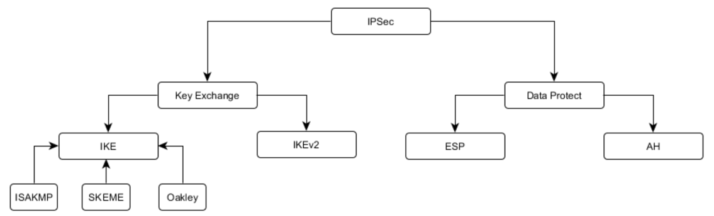
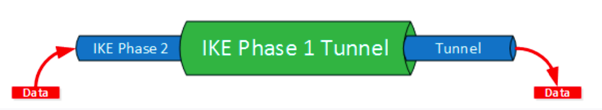
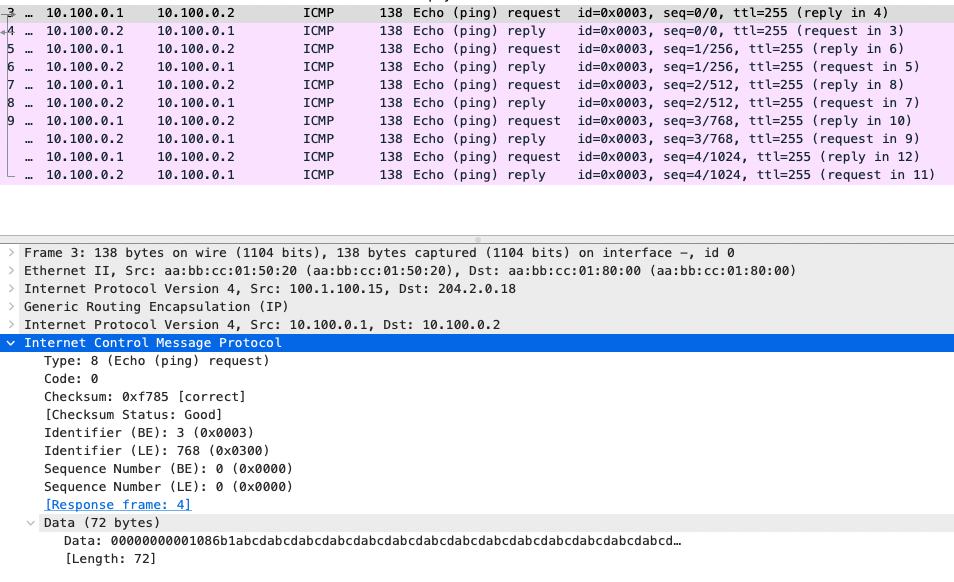
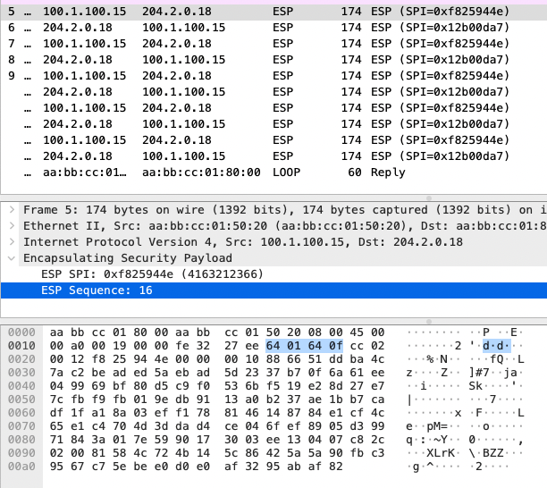
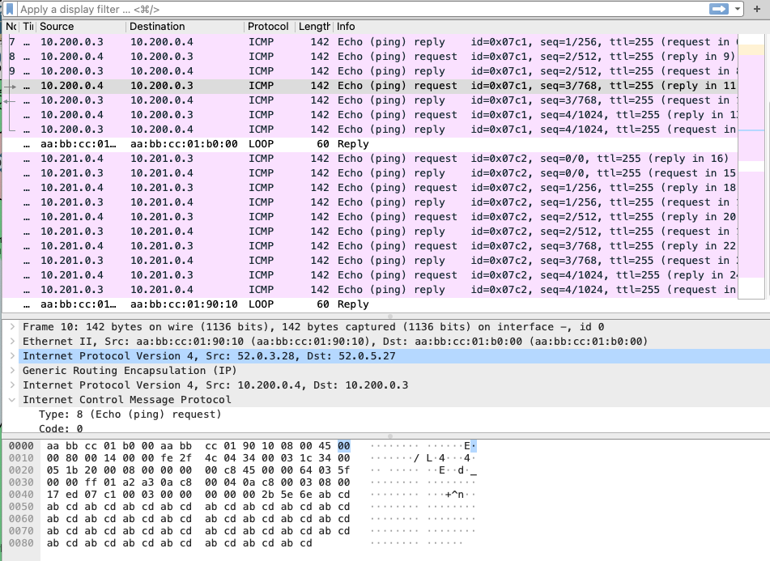
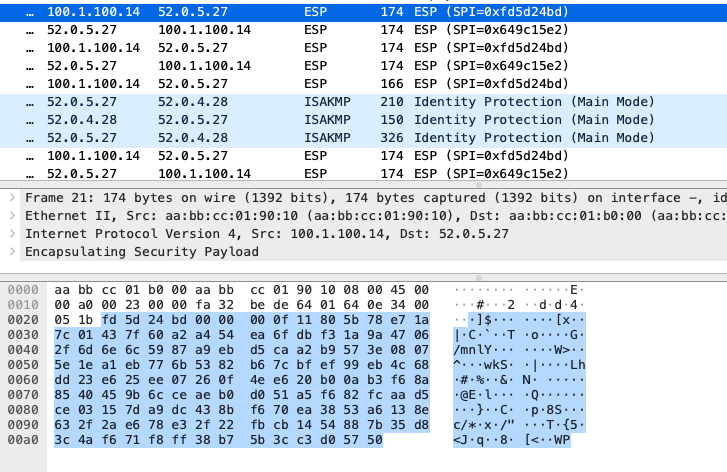

## IPSec over GRE, DmVPN

### Цель:
- Настроить GRE поверх IPSec между офисами Москва и С.-Петербург
- Настроить DMVPN поверх IPSec между офисами Москва и Чокурдах, Лабытнанги

### Описание/Пошаговая инструкция выполнения домашнего задания:

В этой самостоятельной работе мы ожидаем, что вы самостоятельно:

- Настроите GRE поверх IPSec между офисами Москва и С.-Петербург.
- Настроите DMVPN поверх IPSec между Москва и Чокурдах, Лабытнанги.
- Все узлы в офисах в лабораторной работе должны иметь IP связность.


<details> 

<summary> Описание </summary>  

`GRE` не обеспечивает шифрование. 
Если хотим делать шифрование, то делаем GRE поверх IPSec или DMVPN поверх IPSec.

`IPsec` (сокращение от IP Security) — набор протоколов для обеспечения защиты данных, передаваемых по межсетевому протоколу IP. Позволяет осуществлять подтверждение подлинности (аутентификацию), проверку целостности и/или шифрование IP-пакетов. IPsec также включает в себя протоколы для защищённого обмена ключами в сети Интернет. В основном, применяется для организации VPN-соединений.

Состав IPSec:



Фазы `IKE`.

Туннель устанавливается в два этапа (фазы):
1. `Phase 1` – согласование метода идентификации, алгоритм шифрования, алгоритм хеширования и группа Diffie Hellman
2. `Phase 2` – генерируются ключи для шифрования данных. 2 фаза может начать работу только после установления первой фазы.



<details>

<summary> IPSec в RFC: </summary>

- RFC 2401 	IPSec
- RFC 2402 	AH
- RFC 2406 	ESP
- RFC 2409 	IKE

</details>

`AH` (`Authentication Header`) – протокол заголовка идентификации. 
Обеспечивает **целостность** путём проверки того, что ни один бит в защищаемой части пакета не был изменён во время передачи.  
Использование AH может вызвать проблемы, например, при прохождении пакета через NAT устройство. 
NAT меняет IP адрес пакета, чтобы разрешить доступ в Интернет с закрытого локального адреса. 
Т.к. пакет в таком случае изменится, то контрольная сумма AH станет неверной. 
Также стоит отметить, что AH разрабатывался только для обеспечения целостности. 
Он не гарантирует конфиденциальности путём шифрования содержимого пакета.

`ESP` (`Encapsulating Security Protocol`) – инкапсулирующий протокол безопасности, который обеспечивает **и целостность и конфиденциальность**. 
В режиме транспорта ESP заголовок находится между оригинальным IP заголовком и заголовком TCP или UDP. 
В режиме туннеля заголовок ESP размещается между новым IP заголовком и полностью зашифрованным оригинальным IP пакетом.

`ISAKMP` (`Internet Security Association and Key Management Protocol`) — протокол, используемый для первичной настройки соединения, взаимной аутентификации конечными узлами друг друга и обмена секретными ключами.

</details>

<details> 

<summary> Полезные команды </summary>
 
```
sh crypto isakmp peers
sh crypto session
sh crypto isakmp policy 
```

</details>

### Выполнение

### Настроите GRE поверх IPSec между офисами Москва и С.-Петербург.

На R18 подняты `Tunnel100` и `Tunnel101`.
Будем настраивать IPSec на них.

R15:

```
crypto isakmp policy 10
 encr aes
 authentication pre-share
 group 2
crypto isakmp key OLOLOLO address 204.2.0.18     
!
!
crypto ipsec transform-set GRE-IPSEC esp-3des esp-sha-hmac 
 mode transport
!
crypto ipsec profile PROTECT-GRE
 set transform-set GRE-IPSEC 
!

interface Tunnel 100
 tunnel protection ipsec profile PROTECT-GRE
 exit
exit
```

На R18 настройки симметричны (за исключением адреса противоположной точки).

До применения профиля шифрования:



После применения профиля шифрования:



Аналогично настраивается и шифрование тоннеля Tunnel 101.


### Настроите DMVPN поверх IPSec между Москва и Чокурдах, Лабытнанги.

В целом настраиваем аналогично R14, R15, R28, R27, с применением того же профиля (см. коммиты).

Посмотрим, как выглядит трафик между Чокхурдах и Лабынтаги до применения профилей:

```
R28#ping 10.200.0.3
Type escape sequence to abort.
Sending 5, 100-byte ICMP Echos to 10.200.0.3, timeout is 2 seconds:
!!!!!
Success rate is 100 percent (5/5), round-trip min/avg/max = 1/3/7 ms

R28#ping 10.201.0.3
Type escape sequence to abort.
Sending 5, 100-byte ICMP Echos to 10.201.0.3, timeout is 2 seconds:
!!!!!
Success rate is 100 percent (5/5), round-trip min/avg/max = 1/1/1 ms
```



Видна инкапсуляция заголовков и нешифрованные данные.

После применения IPsec профиля трафик приобретает следующий вид:




Видно, что было применено шифрование.

### Команды для дебага и проверки правильности работы

```
R15#sh crypto isakmp peers
Peer: 52.0.3.28 Port: 500 Local: 100.1.100.15
 Phase1 id: 52.0.3.28
Peer: 52.0.5.27 Port: 500 Local: 100.1.100.15
 Phase1 id: 52.0.5.27
Peer: 204.2.0.18 Port: 500 Local: 100.1.100.15
 Phase1 id: 204.2.0.18
R15#
```

<details>

<summary> и еще </summary>

```
R15#sh crypto isakmp policy

Global IKE policy
Protection suite of priority 10
	encryption algorithm:	AES - Advanced Encryption Standard (128 bit keys).
	hash algorithm:		Secure Hash Standard
	authentication method:	Pre-Shared Key
	Diffie-Hellman group:	#2 (1024 bit)
	lifetime:		86400 seconds, no volume limit
```

```
R15#sh crypto session
Crypto session current status

Interface: Tunnel100
Session status: UP-ACTIVE
Peer: 204.2.0.18 port 500
  Session ID: 0
  IKEv1 SA: local 100.1.100.15/500 remote 204.2.0.18/500 Active
  Session ID: 0
  IKEv1 SA: local 100.1.100.15/500 remote 204.2.0.18/500 Active
  IPSEC FLOW: permit 47 host 100.1.100.15 host 204.2.0.18
        Active SAs: 4, origin: crypto map

Interface: Tunnel200
Session status: UP-ACTIVE
Peer: 52.0.3.28 port 500
  Session ID: 0
  IKEv1 SA: local 100.1.100.15/500 remote 52.0.3.28/500 Active
  IPSEC FLOW: permit 47 host 100.1.100.15 host 52.0.3.28
        Active SAs: 2, origin: crypto map

Interface: Tunnel200
Session status: UP-ACTIVE
Peer: 52.0.5.27 port 500
  Session ID: 0
  IKEv1 SA: local 100.1.100.15/500 remote 52.0.5.27/500 Active
  IPSEC FLOW: permit 47 host 100.1.100.15 host 52.0.5.27
        Active SAs: 2, origin: crypto map
```

</details>