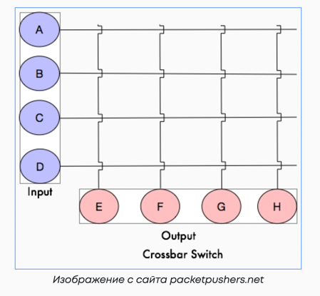
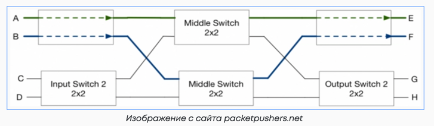
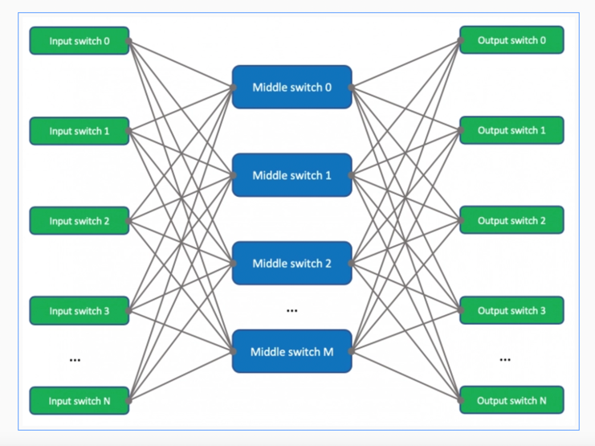
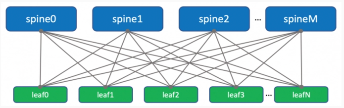
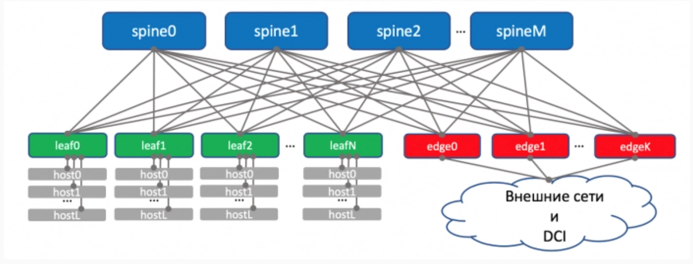
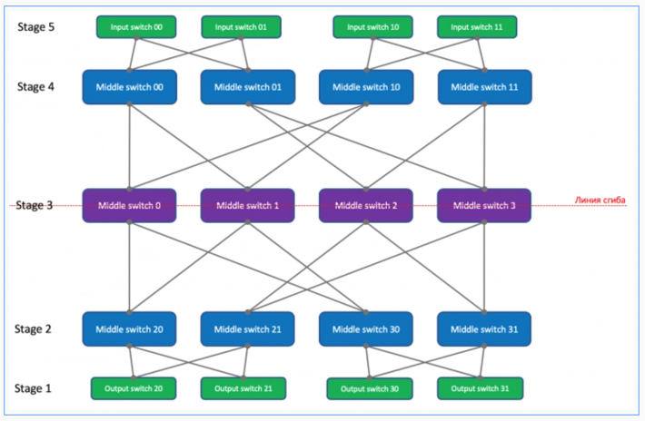
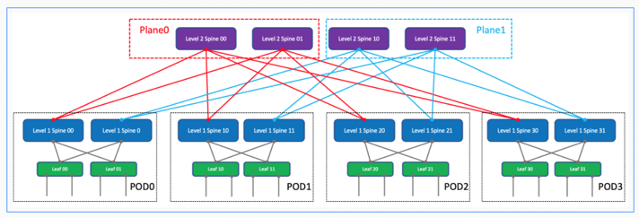

## Сети Клоза

Конспект на основе статьи:
https://nag.ru/material/36318

Про гиперскейлеры
https://www.osp.ru/os/2021/02/13055934

Про использование BGP в Дата Центрах
https://datatracker.ietf.org/doc/html/rfc7938

**Сетью Клоза** называют сеть с раздельными входами и выходами и с дополнительным уровнем коммутации между ними.

Ключевое преимущество сетей Клоза состоит в том, что они имеют гораздо меньшее количество точек коммутации по сравнению с перекрёстным коммутатором.

Было:  

Стало:  

Сеть Клоза определяется тремя целыми числами n, m, и r. 
Число n равно количеству линий, подключённых к каждому из r КЭ (коммутационных элементов) входящего каскада. 
Каждый КЭ входящего каскада имеет m выходов, и средний каскад также содержит m КЭ.

**Блокировка** в сетях Клоза – это невозможность скомутировать две точки, в момент коммутации другой пары.

**Фабрика коммутации** – промежуточный уровень, задача которого доставить пакет от входного порта к выходному,
убрав при этом необходимость полносвязной топологии.

Датацентры сейчас строятся на основе сетей Клоза.  
Пример **сети Клоза с трех уровневой топологией**:

3-stage: Input Switch - Middle Switch - Output

### Leaf-Spine

Более привычный вид Leaf-Spine - ещё он называется Folded Clos - потому что словно действительно сложен пополам.

Таким образом, между любой парой машин будет существовать большое количество равноценных путей (по количеству спайнов) с всегда одинаковым числом хопов - 3 для сети, изображённой выше.

 Выход же во внешний мир или в другие ДЦ обычно реализуется через отдельные коробки, которые с точки зрения фабрики выглядят как Leaf-коммутаторы, однако гораздо более функциональные. 
 Называются они **Edge-Leaf**.
 

Впрочем, привычная **операторам** реализация границы датацентра всё же имеет право на жизнь. 
В этом случае функции Edge выполняют спайны. 

### 3-Tier
Классическая архитектура построения сетей: Access, Aggregation, Core

### Fat Tree

Архитектура организации сетей для организации Дата Центров и суперкомпьютеров.
Она же Leaf-Spine архитектура.

### 5 уровневая сеть Клоза

Пятиуровневая сеть Клоза будет выглядеть так: Input Switch - Middle Switch 1 - Middle Switch 2 - Middle Switch 3 - Output Switch. Вот она повёрнутая на 90 градусов:

Если её сложить по линии центральных Middle Switch, получается такая трёхуровневая сеть (folded clos):

После сворачивания сети Клоза мы получили 4 обособленные группы - их называют POD"ами - Point Of Delivery. В каждой из них свой набор спайнов - это спайны первого уровня.
POD - это универсальная единица при строительстве датацентров - как кубик лего.
Можно сказать, при заказе дополнительных мощностей, просто закупают новый POD и подключают его к новой фабрике.
### Протокол маршрутизации – BGP

Итак, IGP не рассматривается как протокол для больших датацентров в принципе. 
BGP - на сегодня стандарт, но со своими ограничениями. Главное из них - это возможность блэкхола трафика при агрегации маршрутов. 

