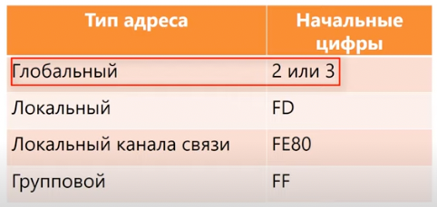
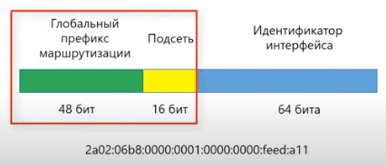
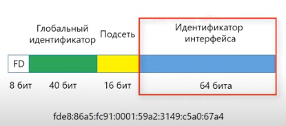
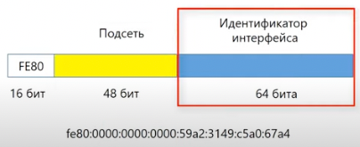
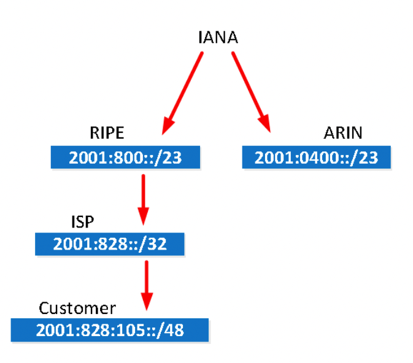

## Формат IPv6 адресов

### Правила сокращения

- пропуск ведщих нулей – замена на `0:`
- пропуск группы нулей – замена на `::` 

Пример:

```python
import ipaddress as ip
ip.ip_address('2001::0:1:db8:0').exploded
'2001:0000:0000:0000:0000:0001:0db8:0000'
```

```python
ip.ip_address('2001:0000:0000:1234::db8:0000').compressed
'2001::1234:0:0:db8:0'
```

### Типы адресов

- unicast
- multicast
- anycast

Broadcast адресов нет, вместо них multicast специального вида.

### Область действия:
- global unicast address – действуют в Internet, распределяются IANA
- unique local address – не маршрутизируются, могут использоваться в организации, аналоги private в IPv4
- link-local address - не маршрутизируются вообще, через маршрутизатор не пройдут, внутри VLAN могут использоваться

Спец. префиксы:


Состав глобального адреса:


Структура локального IPv6

Глобальный идентификатор организации следует выбирать по правилам, чтобы не было одинаковых ID у разных организаций.  
[RFC 4193 (про выбор global ID)](https://datatracker.ietf.org/doc/html/rfc4193)



Структура локального адреса канала связи



### Адреса специального вида:
- ::/128 – текущий хост (все нули и максимальная маска). Используется например для получения адреса по DHCP.
- ::/0 – маршрут по умолчанию
- ::1/128 – loopback (аналог 127.0.0.1)
- ff02::1 – групповой адрес всех узлов в канале связи (т.к. нет broadcast)
- ff02::2 – групповой адрес всех маршрутизаторов в канале связи (т.к. нет broadcast)

### Выдача префиксов



### Автоматическое назначение IPv6 адресов

Вручную или через алгоритм **EUI-64**

SLAAC (Stateless Address Auto Configuration)  
[Про SLAAC rfc4862](https://datatracker.ietf.org/doc/html/rfc4862)


**Stateful**

В IPv4 автоконфигурация возможна только с использованием DHCP сервера. В IPv6 эту возможность оставили: можно конфигурировать сеть с помощью DHCPv6 сервера и клиента.

**Stateless**

Кроме stateful-конфигурации в IPv6 имеется также stateless автоконфигурация, которая позволяет хостам автоматически получать IPv6 адреса в сети без DHCP сервера через использование NDP.

### Конфигурирование

VPC

```
VPCS> ip 2001::5:0:0:30
PC1 : 2001::5:0:0:30/64
```

```
VPCS> show ipv6

NAME              : VPCS[1]
LINK-LOCAL SCOPE  : fe80::250:79ff:fe66:6806/64
GLOBAL SCOPE      : 2001::5:0:0:30/64
DNS               :
ROUTER LINK-LAYER : aa:bb:cc:01:c0:30
MAC               : 00:50:79:66:68:06
LPORT             : 20000
RHOST:PORT        : 127.0.0.1:30000
MTU:              : 1500
```

или через `startup-config`


Router

Вначале нужно включить использование IPv6 `ipv6 unicast-routing`

```
R28(config)#interface Ethernet 0/2
R28(config-if)#ipv6 address 2001::5:0:0:1/64
R28(config-if)#ipv6 address FE80::1 link-local
R28(config-if)#end
```

Тест
```
R28>ping 2001::5:0:0:30
Type escape sequence to abort.
Sending 5, 100-byte ICMP Echos to 2001::5:0:0:30, timeout is 2 seconds:
!!!!!
Success rate is 100 percent (5/5), round-trip min/avg/max = 1/4/17 ms

R28>ping ipv6 2001::5:0:0:30
Type escape sequence to abort.
Sending 5, 100-byte ICMP Echos to 2001::5:0:0:30, timeout is 2 seconds:
!!!!!
Success rate is 100 percent (5/5), round-trip min/avg/max = 1/1/1 ms
```

```
PC1 : 2001::5:0:0:30/64

VPCS> ping 2001::5:0:0:1

2001::5:0:0:1 icmp6_seq=1 ttl=64 time=0.454 ms
2001::5:0:0:1 icmp6_seq=2 ttl=64 time=0.413 ms
2001::5:0:0:1 icmp6_seq=3 ttl=64 time=0.474 ms
2001::5:0:0:1 icmp6_seq=4 ttl=64 time=0.470 ms
2001::5:0:0:1 icmp6_seq=5 ttl=64 time=0.418 ms
```