### Интернет-провайдеры — торговцы воздухом? Что такое "до N Мбит/с" здорового человека.

##### Конспект факультативной лекции от Юры

Анонс:

_Основываясь на многолетнюю практику работы в провайдере я могу достоверно утверждать, что большинство тех, кто там работает, плохо понимает, что за мегабиты в секунду они продают. А многие клиенты вообще считают, что это развод, потому что они не видят разницы в этих "скоростях". Я собираюсь рассказать о том, что такое "скорость Интернета", где в сети теряются пакеты, какая ключевая роль протокола TCP в регулировании этих "скоростей"._ 

[github Юры](https://github.com/lupus23ua)

### Описание архитектуры сети провайдера:

Вход в сеть провайдера – граничный маршрутизатор (Border Gateway). BG получает, по BGP, и хранит маршруты до всех префиксов Интернета (full view), а так же анонсирует префиксы своих клиентов. Есть два направления для анонсов и, соответственно, направления входящего трафика:
- от провайдеров (Backbone ISPs) (дорого)
- через пиринговые стыки с IX-ами (дешево или бесплатно)

Из-за того, что маршруты могут ходить в разные стороны – имеет место несимметричность маршрутов.

Далее идет реализация класической трехуровневой модели сети:

1. Коммутаторы ядра (Core Switches)

2. Коммутаторы распределения (Distribution Switches)

3. Коммутаторы на здании (Access Switches) 

Схема одно здание = один VLAN. В итоге получается много-много VLAN-ов (см. Ринет). 
Лучше было бы сделать по другому (как-то).

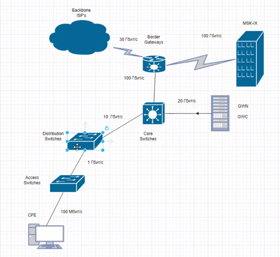

**BRAS**

К ядру сети подключен – [BRAS](https://ru.wikipedia.org/wiki/%D0%9C%D0%B0%D1%80%D1%88%D1%80%D1%83%D1%82%D0%B8%D0%B7%D0%B0%D1%82%D0%BE%D1%80_%D1%88%D0%B8%D1%80%D0%BE%D0%BA%D0%BE%D0%BF%D0%BE%D0%BB%D0%BE%D1%81%D0%BD%D0%BE%D0%B3%D0%BE_%D1%83%D0%B4%D0%B0%D0%BB%D1%91%D0%BD%D0%BD%D0%BE%D0%B3%D0%BE_%D0%B4%D0%BE%D1%81%D1%82%D1%83%D0%BF%D0%B0) (Маршрутизатор широкополосного удаленного доступа) 
BRAS - держит настройки клиентов и выполняет кучу функций в тч биллинг.  
Для пользователей BRAS - это default gateway:
- GWN = gateway native, для физиков свои правила
- GWC = gateway commercial, для комерсов свои правила

Функции BRAS:

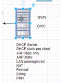

- DHCP Server
- DHCP static per client
- ARP reply only
- ARP static
- LAN unregistered
- NAT
- Firewall
- Billing
- RKN ([Ревизор](https://habr.com/ru/post/282087/))
- Policing/Shaping

В реализации рассматриваемого оператора работает следующая логика:
- Датаграммы от пользователя, по VLAN, доносятся до BRAS и по DHCP выдается IP.
- BRAS - не арпает.
- Для защиты привязали клиенту MAC-адрес.
- MAC привязан к IP.
- Если MAC не зареган, то попадает в LAN unregistered.

Внутри оператора есть **iBGP** (у некоторых OSPF/ISIS).
iBGP используется потому, что очень много VLAN-ов, но это приводит к жопе с multicast.

_Напомню, multicast-трафик (он же «многоадресный трафик») предназначен для передачи данных определённой группе устройств.
По умолчанию коммутатор передаёт multicast-трафик как broadcast (широковещательный), т.е. на все порты без исключения._ 

_Заметка про IPTV и мультикаст_  
_IPTV имеет проблемы:_
- _с мультикастом, если кубики в изображении_
- _с юникастом, если заморозка изображения._

#### Про железо и стоимость

Примерно:  
- Border Gateway к Backbone провайдерам: 30 Гбит/с, Cisco **router**
- Border Gateway к пирам: 100 Гбит/с, Cisco L3-свич (кстати, Arista это форк от Cisco)
- Core Switches: 100 Гбит/с свичи, хорошие
- BRAS: 20 Гб/c, [Блэйд-сервер](https://ru.wikipedia.org/wiki/%D0%91%D0%BB%D0%B5%D0%B9%D0%B4-%D1%81%D0%B5%D1%80%D0%B2%D0%B5%D1%80) на FreeBSD
- Distribution Switches: если повезет, то Cisco, Extreme, Arista, если не повезет, то Mikrotik
- Access Switches: 1 Гб/10 Гб, на домах (чаще на чердаке) висят какие-нибудь T-Link, DLink, etc
- [CRE](https://ru.wikipedia.org/wiki/Customer_Premises_Equipment) (customer premises equipment, оборудование end user-а, "последняя миля"): 100 Мб/ 1 Гб

В целом бывает оборудование:
- c цискоообразным CLI: Cisco, Arista (кстати, это форк от Cisco), Huawei, Extreme
- само по себе: Juniper, Mikrotik
- на дистрибутивах Linux (+ bird/frr): [Mellanox](https://network.nvidia.com/related-docs/case_studies/CS_Qrator.pdf)

В дистрибуции могут быть радиолинии (может быть на клиента, может быть между дистрибуцией и аксессом).
В качестве радио чаще всего используется wi-fi в 100-200-300 Мбит/с.
Если радио, то могут быть проблемы с погодой.

#### Стоимость

Основную стоимость составляют оборудование, которое уже "зашло в дома" – свичи дистрибуции.
Ядро и бордеры – составляют малую часть стоимости провайдера.

### Про мониторинг сети и дебаг

#### Про дебаг

В провайдере проблемы можно поделить на три типа (похоже на уровни):
- проблемы с Интернетом (выше провайдера)
- проблема каналки (проблема внутри провайдера, до core-гейтвея)
- проблема юзера (частая – wifi отвалился)

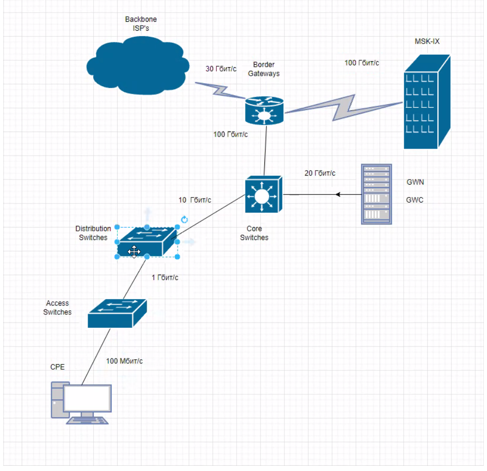

Пример страшной проблемы:
[Head of line blocking](https://en.wikipedia.org/wiki/Head-of-line_blocking#:~:text=Head%2Dof%2Dline%20blocking%20)

Описание: где-то есть стык у которого downlink = 1 Gb, а uplink = 10 Gb.
Получается ожидание 10 Gb канала, пока не отдадутся данные в 1 Gb канал. 
Возможное решение – покупка оборудования с большим буфером, типа Extreme, Cisco, Arista.

_Направление трафика, внутри провайдера, считается относительно ядра:_
- _Uplink - то что идет в ядро_
- _Downlink - то что идет из ядра_

#### Про мониторинг

Дежурная смена смотрит в "кукушку", например на Zabbix, и другие места. 
Если аварийщик видит красное – выезжает.

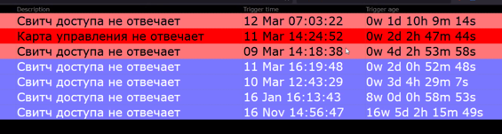

### Про мегабайты трафика и их контроль

#### Откуда берутся мегабиты за которые платят?

Рассмотрим трафик от нашего end-user до сервиса в Интернете.  
Макс. разрешенная скорость нашего юзера, согласно тарифу, – 60 Мбит/с. Канал юзера – 1 Гбит/с.
Макс. скорость с которой сервис может отдавать трафик 10 Гб/с.

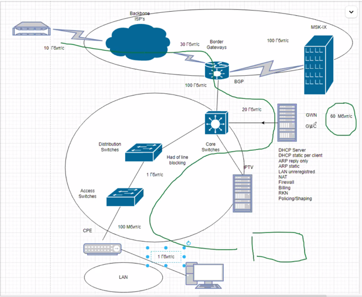

Что происходит? 
Сервис начинает отдавать юзеру трафик с макс. скоростью. 
Трафик заворачивается через BRAS, на котором срабатывается в соответствии с политиками.

**Полисинг** - все что больше 60 Мбит/сек будет отбрасываться.  
**Шейпинг** - это тот же полисинг ток с буфером (не такой жесткий).

Получается бутылочное горлышко.

**TCP**

Чтобы не перегружать сеть и балансировать скорость был разработан протокол [TCP](https://ru.wikipedia.org/wiki/Transmission_Control_Protocol).

При установке соединения договариваются друг с другом о количестве байт которое можно передать без подтверждения.

- TCP передает поток байт 
- TCP сегментирует поток байт
- Регулирует пересылку

**Метод скользящего окна**. 
Получил подтверждение и после этого высылает следующую пачку.

Следит за двумя вещами

1. RTT (отличается от пинга тем, что можно отослать одно подтверждение на много сегментов), еще смотрит на jitter.
2. Потери, а пакеты могут теряться потому что не влезают в буффер

TCP использует спец алгоритмы прогнозирования на разные виды пинга и битрейта

Transmission Control Protocol нащупывает бутылочное горлышко и управляет передачей трафика.

Если больше 5% потерь то алгоритмы начинают не понимать проблемы шейпинга от проблем физики (например плохого вайфая).

Окно двигается экспоненциально - расширяется и замедляется.

TCP работает хорошо на скорости до 100 Мб (он старый и был разработан в 70-е).
Поэтому для обслуживания гигабита однопоточный TCP это невозможно, нужно несколько потоков. 

Для разгона TCP можно настроить Джамба фреймы, путем увеличения **MTU** до 9000.
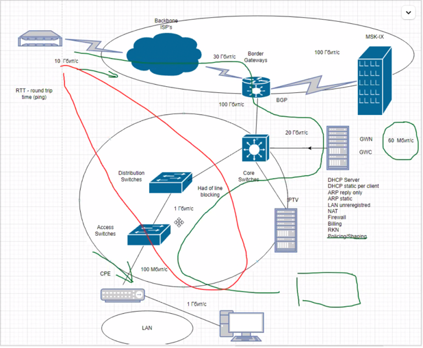

#### Сколько продавать трафика? Мониторинг нагрузки на трафик.

[Тулза для мониторинга – MRTG (Multi Router Traffic Grapher)](https://ru.wikipedia.org/wiki/MRTG)  
Через MRTG обычно смотрят 5-тное среднее. 
Можно наблюдать разные графики нагрузки на порты
- на портах свичей доступа
- на портах core-свичей

Например, на core-свичах можно видеть зависимость от времени суток (ночью – меньше):

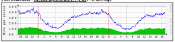

А на свичах доступа такая зависимость не всегда так четко прослеживается:
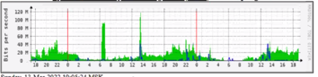
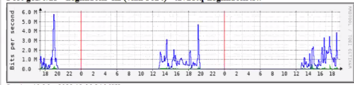

_Сколько можно продавать трафика пользователям?_
_Например, если у тебя есть линк в 1 Gb на коммутаторе доступа, то значит ли это, что можно продать трафика 
10 пользователям по 100 Mb?_

Ответ – **нет**. 
Можно продать сколько угодно, при условии, что нагрузка на всех портах core-коммутаторов не превышает 70%.
Если это условие выполняется, то продаем честные мегабиты.

#### Утилиты для диагностики

Online-сервисы для отслеживания утилизации интерфейса, наподобие
[https://www.speedtest.net/](https://www.speedtest.net/)
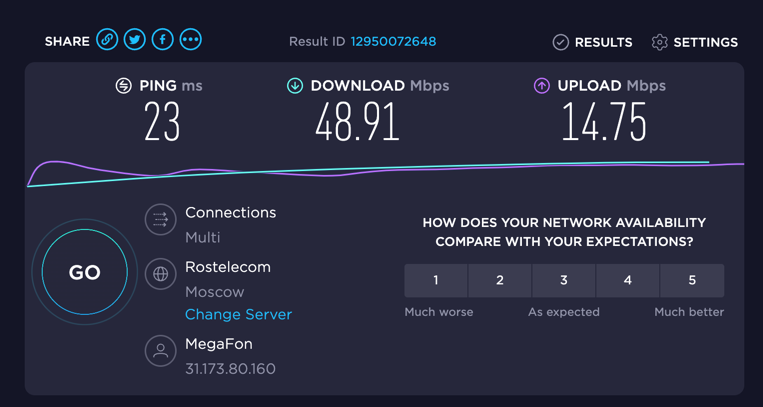

Для Windows есть утилита [Networx](https://networx.ru.uptodown.com/windows).

Для UNIX есть [fping](https://ru.wikipedia.org/wiki/Fping) 

Наверняка есть куча всего еще.

### Про ТСПУ

Подключаются как ответвление к core-коммутаторам (на схеме – слева).
На них дублируется весь трафик, если они сочтут необходимым, то они могут разрывать соединения отсылкой TCP RST
(для противодействия эти RST можно зафильтровывать).

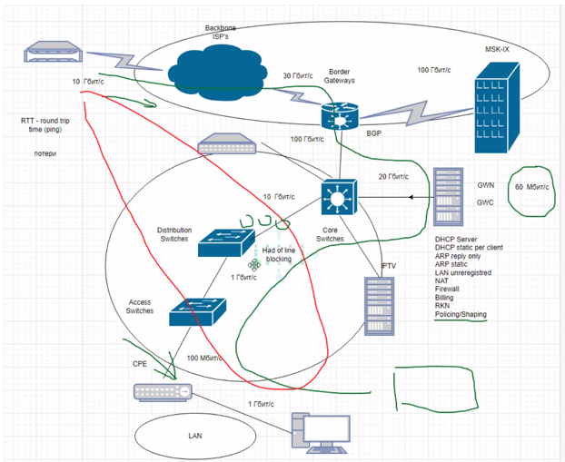

[RDP.ru](https://www.rdp.ru/) cделали ТСПУ на основе BRAS серверов на интеле.

DPI системы – оч. быстрые, так как работают на ассемблере.  
TLS --> фильтрация по SNI (сейчас делается замедление твитора).

Все это можно реализовывать на [ASIC](https://ru.wikipedia.org/wiki/%D0%98%D0%BD%D1%82%D0%B5%D0%B3%D1%80%D0%B0%D0%BB%D1%8C%D0%BD%D0%B0%D1%8F_%D1%81%D1%85%D0%B5%D0%BC%D0%B0_%D1%81%D0%BF%D0%B5%D1%86%D0%B8%D0%B0%D0%BB%D1%8C%D0%BD%D0%BE%D0%B3%D0%BE_%D0%BD%D0%B0%D0%B7%D0%BD%D0%B0%D1%87%D0%B5%D0%BD%D0%B8%D1%8F).
ASIC - спец. программируемая микросхема (на ней строятся все циски).
    
Программа для обхода DPI [GoodbyDPI](https://github.com/ValdikSS/GoodbyeDPI)
и [описание](https://habr.com/ru/post/335436/).