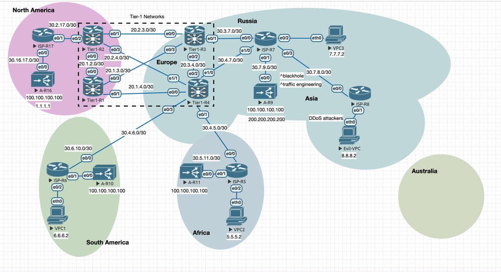

### Отказоустойчивая BGP Anycast сеть с управлением трафиком через механизм Community

Один и тот же префикс `100.100.100.0/24` должен анонсироваться с разных машрутизаторов.
Трафик на этот префикс должен идти через ближайшего провайдера.

#### Общая структура стенда: 
- Маршрутизаторы R1-R4 эмитируют Tier-1 операторов.
- Маршрутизаторы R5-R8 эмитируют региональных операторов подключенных к Tier-1.
- Anycast AS присутствует в разных регионах и подключена к разным провайдерам.
- Пользователи должны быть подключены к региональным операторам, VPC - эмитируют end-users.

#### Управление трафиком: 
- сделать BGP Community, при помощи которых можно управлять трафиком.

#### Защита от DDoS:
- Настроить обработку Blackhole Community.

